# Abeyance Memory — Low-Level Design & Implementation Specification

**Version:** 1.0  
**Date:** 2026-03-09  
**Status:** Authoritative — Abeyance Memory Single Source of Truth  
**Classification:** Product Confidential  
**Parent Document:** PRODUCT_SPEC.md §4  
**Supersedes:** Abeyance Memory brainstorm ideas document (archived)

> This document specifies the complete architecture, low-level design, and implementation plan for Abeyance Memory — Pedk.ai's core differentiator. Every design decision is derived from what telecom operations actually require, not from algorithmic novelty.

---

## Table of Contents

1. [Purpose & Scope](#1-purpose--scope)
2. [What Abeyance Memory Is — From the Customer's World](#2-what-abeyance-memory-is--from-the-customers-world)
3. [Why It Is Not a Vector Database](#3-why-it-is-not-a-vector-database)
4. [Architecture Overview](#4-architecture-overview)
5. [The Fragment Model](#5-the-fragment-model)
6. [The Enrichment Chain](#6-the-enrichment-chain)
7. [Temporal-Semantic Embedding Design](#7-temporal-semantic-embedding-design)
8. [The Shadow Topology — Protecting the Moat](#8-the-shadow-topology--protecting-the-moat)
9. [The Snap Engine](#9-the-snap-engine)
10. [The Accumulation Graph](#10-the-accumulation-graph)
11. [The Decay Engine](#11-the-decay-engine)
12. [Long-Horizon Retrieval](#12-long-horizon-retrieval)
13. [Value Attribution Methodology](#13-value-attribution-methodology)
14. [Low-Level Software Design](#14-low-level-software-design)
15. [Embedding Space Visualisation](#15-embedding-space-visualisation)
16. [Implementation Phases & Task Backlog](#16-implementation-phases--task-backlog)

---

## 1. Purpose & Scope

### The One-Sentence Brief

Abeyance Memory exists to close the gap between what a telecom customer's network actually is and what they think it is — the Dark Graph — by holding disconnected, unresolved technical evidence in a latent intelligence buffer until the missing contextual link appears, days, weeks, or months later.

### Success Criteria

Abeyance Memory succeeds if and only if it discovers Dark Graph divergences (dark nodes, dark edges, phantom CIs, identity mutations) that no real-time scanner, rule-based correlator, or human analyst could find — because the evidence was separated in time, separated in data modality, or separated across operational team boundaries.

### What This Document Covers

This is the complete low-level design for Abeyance Memory. It specifies:

- The data model (what is stored and how)
- The enrichment pipeline (how raw evidence becomes telecom-aware intelligence)
- The embedding design (how fragments are represented, including the temporal dimension)
- The Shadow Topology (how PedkAI protects its competitive moat when discoveries are shared with customer CMDBs)
- The snap engine (how fragments connect across time and modality)
- The accumulation graph (how weak signals compound into strong hypotheses)
- The decay engine (what fades and what doesn't)
- The value attribution methodology (how PedkAI demonstrates ongoing contribution even after discoveries are integrated)
- The software architecture (classes, schemas, APIs, database design)
- Embedding space visualisations (for demos and investor presentations)

### What This Document Does Not Cover

- Evidence Fusion Methodology (see PRODUCT_SPEC §5 — `FusionMethodologyFactory`)
- Causal Inference (see PRODUCT_SPEC §8 — Granger Causality and roadmap)
- Operator Feedback Loop (see PRODUCT_SPEC §7 — behavioural observation pipeline)
- Synthetic Data (see PRODUCT_SPEC §10 — Sleeping-Cell-KPI-Data)

### Two-Speed Intelligence Design Principle

Abeyance Memory operates as a two-speed system:

1. **Immediate Operational Intelligence (Day 1):** Fragment storage, 
   enrichment, and multi-dimensional indexing (time × topology × event-type)
   enable instant incident reconstruction, blast-radius queries, and 
   cross-domain event-timeline generation. This requires no learning 
   period — it works from the moment data is ingested.

2. **Long-Horizon Learning Intelligence (Months–Years):** The snap engine,
   accumulation graph, and decay engine continuously discover hidden 
   relationships. This intelligence compounds over time, building the 
   Shadow Topology flywheel and the competitive moat.

Both layers share the same fragment store and enrichment chain. The 
immediate layer is the product's commercial entry point; the learning 
layer is the moat builder. Implementation phases must deliver the 
immediate layer first.

These systems interact with Abeyance Memory but are specified elsewhere.

---

## 2. What Abeyance Memory Is — From the Customer's World

### The Daily Reality of a Tier-1 NOC

A Tier-1 telecom NOC is a room full of engineers managing a network they only partially understand. Every day, they:

- Receive tickets describing symptoms ("customer complaints, slow data, sector 3, site NW-1847")
- Investigate using vendor element managers (Ericsson ENM, Nokia NetAct)
- Find nothing obviously wrong in individual domain views
- Escalate across teams (RAN → transport → core → back to RAN)
- Eventually find the root cause, often through experience and intuition
- Fix the problem, write a resolution note, close the ticket
- Move on — and the institutional knowledge of *why* it happened disappears

The causal chain — that a vendor upgrade two months ago silently degraded a parameter, that it only manifests under Thursday evening load, that three other sites got the same upgrade — is never captured anywhere. Not in the CMDB. Not in ServiceNow. Not in BMC. The engineer who fixed it carries it in their head until they change jobs.

**Abeyance Memory is the system that captures, holds, and reconnects that lost institutional knowledge.**

### The Four Sources of Lost Knowledge

| Source | What Gets Lost | How It Gets Lost | Abeyance Memory's Role |
|--------|---------------|------------------|----------------------|
| **Ticket Resolution Notes** | The real root cause, workarounds, related CIs the engineer checked | Written in free text, never structured, never cross-referenced | Captures the text, extracts entities, holds for future correlation |
| **Self-Clearing Alarms** | Early warnings that auto-resolve before investigation | Acknowledged, auto-cleared, forgotten — but the underlying condition persists | Captures the alarm, enriches with topology, holds for pattern emergence |
| **Cross-Domain Observations** | A RAN engineer notices transport symptoms but can't investigate | Outside their domain, no ticket raised, mentioned in passing on a call | Captures from ticket text, call logs, operational notes |
| **Change-Induced Latent Faults** | A firmware upgrade silently degrades a parameter | No alarm fires, degradation is gradual, manifests weeks or months later | Captures the change record, correlates with later symptom fragments |

### The Snap Moment

Three weeks after ingesting a ticket fragment about a timeout on subnet 10.42.16.0/24, a new alarm fires from a previously-unknown entity on that subnet. The fragments were born at different times, in different data systems, observed by different teams. But they describe the same underlying network truth. Abeyance Memory snaps them together into a corroborated Dark Graph hypothesis — a dark edge linking two entities that no active scanner could have discovered.

That is the product. Everything in this document serves that moment.

---

## 3. Why It Is Not a Vector Database

A VC noted: *"Abeyance Memory is the best part of PedkAI. I hope it is not simply a vector database masquerading as proprietary tech."*

This section answers that concern directly.

### What a Vector Database Does

A vector database stores items as numerical vectors (embeddings) and retrieves items that are mathematically similar to a query vector. This is cosine similarity search — a well-understood, commodity capability offered by pgvector, Pinecone, FAISS, Weaviate, and dozens of others. Any engineer can implement it in a weekend.

### What Abeyance Memory Does That a Vector Database Cannot

| Capability | Vector Database | Abeyance Memory |
|-----------|:-:|:-:|
| Store a fragment and find similar ones | ✅ | ✅ |
| Resolve fragments through network topology so different engineering vocabularies converge | ❌ | ✅ |
| Fingerprint the operational moment (change windows, vendor upgrades, traffic cycle) so context shapes matching | ❌ | ✅ |
| Include temporal position as a first-class embedding dimension | ❌ | ✅ |
| Accumulate weak evidence across 3+ fragments into strong hypotheses using domain-appropriate evidence fusion | ❌ | ✅ |
| Apply telecom-specific decay (change records age differently from alarms, unresolved tickets age slowest) | ❌ | ✅ |
| Maintain a Shadow Topology that enriches future discoveries while protecting competitive moat | ❌ | ✅ |
| Compound intelligence via a flywheel where every validated snap improves future snap accuracy | ❌ | ✅ |
| Attribute ongoing business value to discoveries long after they're integrated into CMDB | ❌ | ✅ |

### The Three Failure Modes of Simple Vector Search

These are real failure modes that will occur in production telecom environments and that simple cosine similarity search cannot handle:

**Failure Mode 1 — Multi-Fragment Accumulation**: Fragment A (ticket: timeout on a subnet) means nothing alone. Fragment B (config change on a router two hops away, three weeks later) means nothing alone. Fragment C (sleeping cell on a connected cell site, two months after A) means nothing alone. But A + B + C together reveal an undocumented dependency chain. No pairwise cosine similarity score will find this — because no two fragments are individually similar enough. You need to accumulate partial evidence across multiple fragments and recognise when a *set* of weak signals constitutes a strong hypothesis.

**Failure Mode 2 — Cross-Domain Semantic Gap**: The RAN engineer writes "high BLER on cell 8842-A." The transport engineer writes "CRC errors on S1 bearer towards ENB-4421." The IP engineer writes "packet loss on VLAN 342, next-hop 10.42.16.1." The NOC manager writes "customer complaints, area NW-1847, intermittent." These are four descriptions of one problem — a failing transport link. They share zero vocabulary. Their raw embeddings won't be close. Without topology-aware enrichment, they are invisible to each other.

**Failure Mode 3 — Temporal Pattern Significance**: Two fragments 30 days apart might be highly significant if they bracket a maintenance window. Two fragments 2 days apart might be meaningless noise. A firmware upgrade ticket from 3 months ago is routine — until sites served by that equipment start showing anomalous behaviour. The significance of stored fragments changes retroactively based on what arrives later. A vector database stores things at ingestion time with a fixed representation. It cannot re-evaluate significance.

### The Moat in One Paragraph

The algorithms inside Abeyance Memory are individually well-known (embeddings, graph traversal, Noisy-OR, Bayesian parameter tuning). The defensibility is not in any single algorithm. It is in the *composition* — how they are wired together through telecom domain knowledge that takes years to accumulate. The enrichment chain encodes operational reality. The Shadow Topology compounds with every discovery. The scoring calibration is per-customer and proprietary. A competitor cloning the vector search gets the easy part. Replicating the telecom-aware intelligence composition requires the domain expertise, the customer deployments, and the accumulated validated snap data that only PedkAI possesses.

---

## 4. Architecture Overview

### Abeyance Memory Within the PedkAI Stack

Abeyance Memory lives in **Layer 2 (Living Context Graph)** of PedkAI's 5-layer architecture. It receives data from Layer 1 (Omniscient Data Fabric) and feeds hypotheses to Layer 3 (Intelligence Engines).

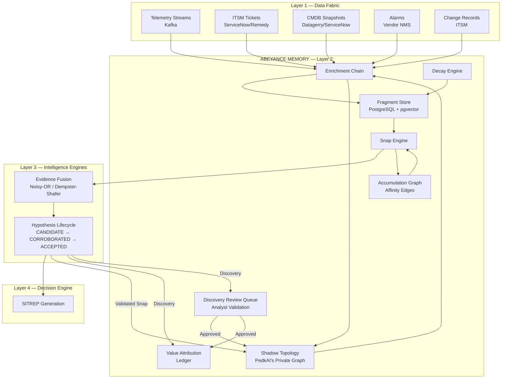

### Internal Data Flow

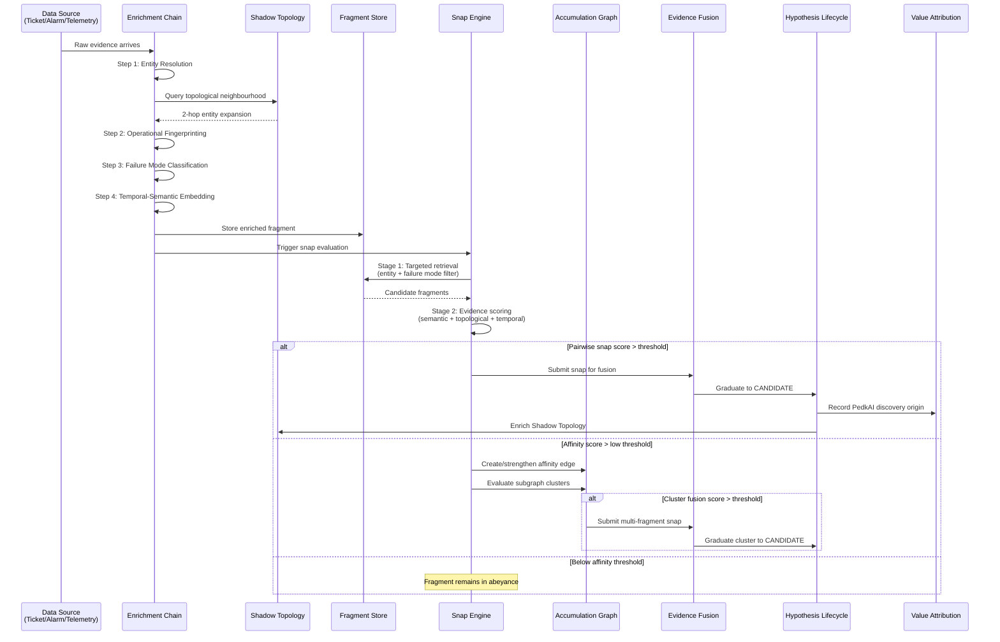

---

## 5. The Fragment Model

### What a Fragment Is

A fragment is any piece of evidence that enters Abeyance Memory. It is the atomic unit of stored intelligence. Every fragment, regardless of source, is normalised into a common structure that captures three faces of the evidence:

- **Face 1 — What it says**: the raw content
- **Face 2 — What it touches**: the network entities involved, resolved through topology
- **Face 3 — What was happening around it**: the operational context at the time

### Fragment Schema

```mermaid
erDiagram
    ABEYANCE_FRAGMENT {
        uuid fragment_id PK
        uuid tenant_id FK
        enum source_type "TICKET_TEXT | ALARM | TELEMETRY_EVENT | CLI_OUTPUT | CHANGE_RECORD | CMDB_DELTA"
        enum enrichment_state "RAW | RESOLVED | FINGERPRINTED | CLASSIFIED | EMBEDDED"
        text raw_content "Original text or structured payload"
        text content_hash "SHA-256 for deduplication"
        jsonb extracted_entities "CIs, IPs, subnets, interfaces, error codes"
        jsonb topological_neighbourhood "2-hop entity expansion from Shadow Topology"
        jsonb operational_fingerprint "Change windows, vendor upgrades, traffic state"
        jsonb failure_mode_tags "Dark Graph divergence type signatures with confidence"
        jsonb temporal_context "Time-of-day bucket, day-of-week, cycle position, change proximity"
        vector enriched_embedding "1536-dim: semantic + topological + temporal"
        vector raw_embedding "768-dim: raw content only (for same-domain matching)"
        uuid topology_snapshot_version "Shadow Topology PIT reference"
        string llm_model_version "Version of extractor/embedder used"
        timestamp event_timestamp "When the original event occurred"
        timestamp ingestion_timestamp "When PedkAI captured it"
        float base_relevance "Starting relevance score (source-type dependent)"
        float current_decay_score "Computed decay score (updated daily)"
        int near_miss_count "Number of affinity-threshold near-misses"
        enum snap_status "ABEYANCE | SNAPPED | EXPIRED | COLD"
        uuid snapped_hypothesis_id FK "NULL until snapped"
        uuid parent_fragment_id FK "Recursive link for sub-fragments (e.g. resolution notes)"
        text source_ref "Ticket ID, alarm ID, telemetry stream ref"
        text source_engineer_id "Engineer who generated the source evidence"
    }

> [!IMPORTANT]
> **Deduplication Invariant**
> The `content_hash` + `tenant_id` must be unique. If a duplicate arrives, the system MUST NOT create a new fragment, but instead MAY "warm" the existing fragment by resetting its `current_decay_score` to `base_relevance`.

    ABEYANCE_FRAGMENT ||--o{ FRAGMENT_ENTITY_REF : contains
    
    FRAGMENT_ENTITY_REF {
        uuid ref_id PK
        uuid fragment_id FK
        uuid entity_id FK "Reference to NetworkEntityORM"
        text entity_identifier "Human-readable: LTE-8842-A, TN-NW-207"
        enum entity_domain "RAN | TRANSPORT | CORE | IP | VNF | SITE"
        int topological_distance "Hops from directly-referenced entity"
    }
```

### Source Type Characteristics

Each source type carries different properties that affect how the fragment behaves in Abeyance Memory:

| Source Type | Typical Content | Entity Richness | Temporal Significance | Base Relevance | Decay τ (days) |
|-------------|----------------|:-:|:-:|:-:|:-:|
| `TICKET_TEXT` — resolved, root cause found | Resolution notes with identified fix | HIGH (CIs explicitly named) | MEDIUM (fix timestamp clear) | 0.6 | 120 |
| `TICKET_TEXT` — resolved, "no fault found" | Inconclusive investigation notes | MEDIUM (CIs checked but cause unknown) | HIGH (unresolved = future evidence) | 0.9 | 270 |
| `TICKET_TEXT` — resolved, "could not reproduce" | Intermittent fault description | MEDIUM | VERY HIGH (most likely to snap later) | 0.95 | 270 |
| `ALARM` — self-cleared | Alarm payload, auto-clear timestamp | HIGH (source entity explicit) | HIGH (transient events are early warnings) | 0.7 | 90 |
| `ALARM` — manually cleared | Alarm + operator action | HIGH | MEDIUM | 0.5 | 60 |
| `TELEMETRY_EVENT` — KPI anomaly | Statistical deviation from baseline | MEDIUM (cell-level, needs expansion) | MEDIUM | 0.6 | 60 |
| `CHANGE_RECORD` | Planned change ticket, affected CIs | VERY HIGH (CIs listed in change) | VERY HIGH (changes cause latent faults) | 0.8 | 365 |
| `CLI_OUTPUT` | Raw command output pasted in ticket | LOW (needs NLP extraction) | LOW (timestamp often unclear) | 0.7 | 180 |
| `CMDB_DELTA` | Detected change in CMDB state | HIGH (CI + attribute explicit) | HIGH (CMDB changes signal something happened) | 0.7 | 90 |

> **Design principle**: Fragments from inconclusive investigations ("no fault found", "could not reproduce") receive the *highest* base relevance and the *slowest* decay. These are precisely the cases where the real cause was not identified — making them the highest-value abeyance candidates. The knowledge the engineer couldn't find is the knowledge Abeyance Memory is designed to eventually supply.

### Fragmentation Strategy

To prevent overloading the embedding model and to maintain high precision, evidence is fragmented according to source-specific rules:

| Source Type | Fragmentation Rule | Metadata Preservation |
| :--- | :--- | :--- |
| **`TICKET_TEXT`** | Split into `TICKET_DESCRIPTION` (initial) and `RESOLUTION_NOTES` (final). | Both share `source_ref`. `RESOLUTION_NOTES` links to `TICKET_DESCRIPTION` via `parent_fragment_id`. |
| **`ALARM`** | Single fragment per alarm ID. | |
| **`TELEMETRY`** | One fragment per anomaly burst (windowed evidence). | |
| **`CLI_OUTPUT`** | One fragment per command execution block. | |

> [!CAUTION]
> **Anti-Pattern**: Do not embed the entire ticket history as one fragment. The signal from the resolution note is often buried under 50 lines of automated updates. Extracted resolution notes MUST be isolated.

---

## 6. The Enrichment Chain

### Overview

The enrichment chain transforms raw evidence into telecom-aware intelligence. It runs at ingestion time, before the fragment is stored. Each step adds a layer of domain knowledge that a generic vector database cannot possess.

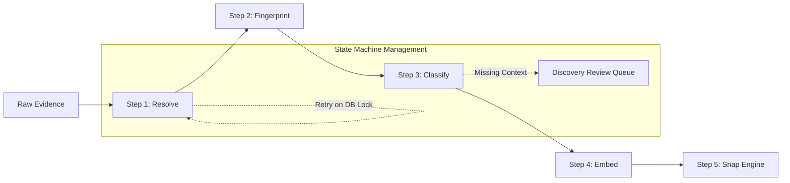

### Enrichment State Transitions

| State | Activity | Failure Condition | Recovery |
| :--- | :--- | :--- | :--- |
| **`RAW`** | Ingestion into landing zone. | Malformed payload. | Drop & Log. |
| **`ENTITIES_RESOLVED`** | Shadow Topology 2-hop expansion. | Topology Service Unavailable. | Retry (Exp. Backoff). |
| **`FINGERPRINTED`** | ITSM/KPI context overlay. | Missing Fingerprint Data. | Progress with "Temporal-Only" flag. |
| **`CLASSIFIED`** | Divergence Taxonomy tagging. | Low Classifier Confidence. | Route to DRQ. |
| **`EMBEDDED`** | Vector construction. | LLM Provider Timeout. | Retry (Circuit Breaker). |
| **`READY`** | Final validation check. | Integrity Check Failure. | Re-process from RAW. |

### Step 1: Entity Resolution

**Input**: Raw content (text, alarm payload, structured telemetry)

**Process**:

1. **Extract explicit entity references** from the raw content. For unstructured text (tickets, CLI output), use PedkAI's LLM abstraction layer with a structured extraction prompt:

```
Given this NOC ticket resolution note, extract all network entity references:
- Cell IDs (format: technology-siteID-sector, e.g., LTE-8842-A)
- Site IDs (format: SITE-region-number, e.g., SITE-NW-1847)
- IP addresses and subnets
- Interface identifiers
- Equipment serial numbers / MAC addresses
- Vendor-specific identifiers (Ericsson ENM names, Nokia NetAct names)
- Error codes and alarm identifiers
- Any other infrastructure references

Return as structured JSON.
```

For structured sources (alarms, telemetry), entity extraction is deterministic — parse the payload schema.

2. **Resolve through the Shadow Topology** (§8). For every extracted entity, query the Shadow Topology for its **2-hop neighbourhood** — every entity within two relationship hops. This expansion is what bridges cross-domain vocabulary:

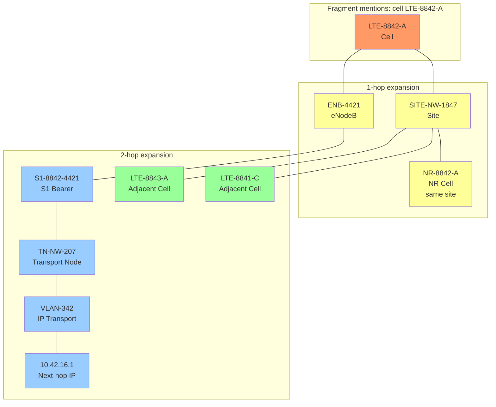

Now a transport-domain fragment mentioning TN-NW-207 or VLAN-342 will share entity references with this RAN-domain fragment — even though the original text had zero vocabulary overlap. **The topology is the bridge.**

**Output**: Populated `extracted_entities` (directly referenced) and `topological_neighbourhood` (expanded) JSONB fields, plus `FRAGMENT_ENTITY_REF` rows for each entity at each topological distance.

### Step 2: Operational Fingerprinting

**Input**: Fragment timestamp + enriched entity set

**Process**: Query operational data sources to characterise the operational moment:

| Fingerprint Dimension | Source | Query | Value |
|-----------------------|--------|-------|-------|
| **Change Window Proximity** | ITSM change records | Any change tickets affecting entities in the topological neighbourhood within ±48 hours? | Distance in hours to nearest change; change ticket ID; change type (planned/emergency) |
| **Vendor Upgrade Recency** | Vendor upgrade calendar / change records | When was the last firmware/software upgrade applied to entities in the neighbourhood? | Days since last upgrade; upgrade type; vendor |
| **Traffic Cycle Position** | KPI time-series (TimescaleDB) | Where in the diurnal cycle was this event? What was the traffic load relative to baseline? | Time-of-day bucket (off-peak/shoulder/peak); load ratio vs 7-day baseline |
| **Concurrent Alarm Density** | Alarm history | How many other alarms were active on entities in the topological neighbourhood within ±1 hour? | Count; dominant alarm types; domain distribution |
| **Open Incident Context** | ITSM incidents | Were there any open incidents (unresolved) involving overlapping entities? | Incident IDs; priority; affected service |

**Output**: Populated `operational_fingerprint` JSONB field.

**Example**:
```json
{
  "change_proximity": {
    "nearest_change_hours": 36,
    "change_ticket_id": "CHG-2026-NW-4821",
    "change_type": "planned",
    "affected_entity": "TN-NW-207",
    "change_description": "Firmware upgrade to v14.2.1"
  },
  "vendor_upgrade": {
    "days_since_upgrade": 36,
    "vendor": "Nokia",
    "upgrade_target": "TN-NW-207",
    "upgrade_version": "SR OS 14.2.1"
  },
  "traffic_cycle": {
    "time_bucket": "off_peak",
    "hour_utc": 3,
    "day_of_week": "Thursday",
    "load_ratio_vs_baseline": 0.12
  },
  "concurrent_alarms": {
    "count_1h_window": 0,
    "dominant_types": [],
    "note": "No concurrent alarms — isolated event"
  },
  "open_incidents": []
}
```

### Step 3: Failure Mode Classification

**Input**: Extracted entities + operational fingerprint + raw content

**Process**: Classify the fragment against the Dark Graph divergence taxonomy. A fragment may match multiple divergence types with different confidence levels. Classification uses rule-based heuristics derived from telecom operational patterns (not ML — these are domain rules):

| Divergence Type | Detection Heuristic | Confidence Factors |
|-----------------|--------------------|--------------------|
| **Dark Node** | Entity in telemetry/alarm but not in CMDB | CMDB lookup miss = high confidence |
| **Phantom Node** | Entity in CMDB generating zero telemetry for >30 days | Telemetry silence duration increases confidence |
| **Dark Edge** | Two entities accessed together in ticket resolution but no CMDB relationship | Co-access frequency; topological plausibility |
| **Phantom Edge** | CMDB relationship exists but zero traffic/telemetry correlation | Traffic analysis; relationship type |
| **Identity Mutation** | Entity telemetry shows different serial/MAC/model than CMDB | Hardware attribute mismatch specificity |
| **Dark Attribute** | KPI pattern inconsistent with recorded configuration (e.g., frequency band, sector orientation) | Statistical deviation from configuration-predicted behaviour |

**Output**: Populated `failure_mode_tags` JSONB field.

**Example**:
```json
{
  "tags": [
    {
      "divergence_type": "DARK_EDGE",
      "confidence": 0.6,
      "rationale": "Ticket references cell LTE-8842-A and transport node TN-NW-207 together, but CMDB records no direct relationship. Topological expansion shows 2-hop path exists.",
      "candidate_entities": ["LTE-8842-A", "TN-NW-207"]
    },
    {
      "divergence_type": "DARK_ATTRIBUTE",
      "confidence": 0.3,
      "rationale": "Timeout error may indicate parameter mismatch post-upgrade on TN-NW-207",
      "candidate_entities": ["TN-NW-207"]
    }
  ]
}
```

### Step 4: Temporal-Semantic Embedding

**Input**: All outputs from Steps 1–3

**Process**: Compute two embeddings per fragment:

**Raw Embedding (768-dim)**: Embed the raw content only, using PedkAI's LLM abstraction layer. This is used for same-domain matching where vocabulary overlap is expected.

**Enriched Embedding (1536-dim)**: This is the core Abeyance Memory embedding. It encodes everything — and critically, it includes the temporal dimension as a first-class component.

The enriched embedding is a concatenation of four sub-vectors, each capturing a different face of the fragment's identity:

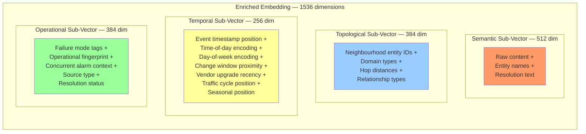

**Critical — The Temporal Sub-Vector (256 dimensions)**:

Time is not a simple scalar. In telecom operations, time has structure. The temporal sub-vector encodes:

| Temporal Dimension | Encoding | Why It Matters |
|-------------------|----------|----------------|
| **Absolute timestamp position** | Normalised epoch position (0–1 scale over the deployment's data range) | Enables "how far apart in time" similarity |
| **Time-of-day** | Sinusoidal encoding: `[sin(2π·hour/24), cos(2π·hour/24)]` | 3am events are operationally different from 3pm events; sinusoidal encoding ensures 23:00 is close to 01:00 |
| **Day-of-week** | Sinusoidal encoding: `[sin(2π·day/7), cos(2π·day/7)]` | Weekend traffic patterns differ from weekday; Monday maintenance windows are common |
| **Change window proximity** | Gaussian-shaped signal: `exp(-distance_hours² / 2σ²)`, σ=24h | Fragments near change windows cluster together because changes cause faults |
| **Vendor upgrade recency** | Exponential decay from last upgrade: `exp(-days_since / 30)` | Post-upgrade fragments should cluster; relevance decays as upgrade stabilises |
| **Traffic cycle position** | Load ratio vs 7-day baseline (0–2 scale) | Off-peak anomalies are structurally different from peak-hour congestion |
| **Seasonal position** | Sinusoidal encoding: `[sin(2π·day_of_year/365), cos(2π·day_of_year/365)]` | Annual patterns (holidays, events, weather) affect network behaviour |

The sinusoidal encoding is critical: it ensures that time wraps cyclically (11pm is close to 1am, December is close to January) rather than having artificial boundaries. This is standard positional encoding adapted from transformer architectures but applied to operational time cycles.

**Embedding Construction Process**:

1. Construct a text representation for each sub-vector:
   - **Semantic**: raw content + entity names in natural language
   - **Topological**: structured description of the entity neighbourhood ("cell LTE-8842-A at site SITE-NW-1847, connected to eNodeB ENB-4421, transport via TN-NW-207, IP next-hop 10.42.16.1")
   - **Operational**: failure mode tags + fingerprint in natural language ("possible dark edge between RAN and transport domain; occurred 36 hours after planned firmware upgrade on Nokia transport node; off-peak traffic, no concurrent alarms")

2. Embed each text representation via PedkAI's LLM layer, truncated/projected to the specified sub-vector dimension.

3. Compute the temporal sub-vector directly as a numerical vector from the encoding formulas above (no LLM needed for temporal — it's pure maths).

4. Concatenate: `enriched_embedding = [semantic ‖ topological ‖ temporal ‖ operational]`

5. L2-normalise the concatenated vector for cosine similarity compatibility.

**Output**: Populated `enriched_embedding` and `raw_embedding` vector fields.

> **Why four sub-vectors instead of one combined embedding?** Because the snap engine (§9) needs to weight these dimensions differently depending on the failure mode being evaluated. Dark edge discovery weights topological proximity heavily. Identity mutation detection weights entity identity matching. Change-induced fault detection weights temporal proximity to change windows. Keeping the sub-vectors separable allows dynamic weighting without re-embedding.

---

## 7. Temporal-Semantic Embedding Design

### The Role of Time in Abeyance Memory

Time is not a filter or a penalty. Time is a *dimension of meaning*. Two fragments that occurred at 3am on successive Thursdays are more operationally related than two fragments 4 hours apart on different days — because the former likely share a traffic pattern context.

### Temporal Encoding Detail

The temporal sub-vector is constructed as follows:

```
temporal_vector = [
    norm_timestamp,                          # 1 dim  — absolute position
    sin(2π · hour/24), cos(2π · hour/24),    # 2 dims — time of day (cyclic)
    sin(2π · dow/7),   cos(2π · dow/7),      # 2 dims — day of week (cyclic)
    change_proximity_gaussian,                # 1 dim  — distance to nearest change window
    vendor_upgrade_decay,                     # 1 dim  — recency of vendor upgrade
    traffic_load_ratio,                       # 1 dim  — load vs baseline
    sin(2π · doy/365), cos(2π · doy/365),    # 2 dims — seasonal position (cyclic)
    ...                                       # remaining dims: zero-padded or reserved
]
```

The remaining dimensions (to reach 256) are reserved for per-customer temporal features that emerge from deployment-specific operational patterns. For example, a customer with a known weekly maintenance window on Wednesday nights can encode "distance to Wednesday maintenance" as an additional cyclic feature.

### Visualisation: Fragment Similarity in Embedding Space

The following conceptual diagram illustrates how enriched embeddings cause operationally related fragments to cluster — even when their raw text is dissimilar.

```
EMBEDDING SPACE (2D projection via t-SNE)

    ○ = Ticket fragment    □ = Alarm fragment    △ = Change record    ◇ = Telemetry event

                        CLUSTER A: "Transport link degradation near SITE-NW-1847"
                        ┌─────────────────────────────────────────┐
                        │                                         │
                        │    ○ "high BLER on cell 8842-A"         │
                        │         (RAN vocabulary)                │
                        │                                         │
                        │    □ "CRC errors on S1 bearer           │
                        │         to ENB-4421"                    │
                        │         (Transport vocabulary)          │
                        │                                         │
                        │    ◇ "packet loss on VLAN 342"          │
                        │         (IP vocabulary)                 │
                        │                                         │
                        │    △ "firmware upgrade TN-NW-207"       │
                        │         (Change record)                 │
                        │                                         │
                        └─────────────────────────────────────────┘

    Without topology enrichment, these 4 fragments would scatter across the space
    (different vocabulary, different domains, different source types).
    
    With enrichment, they cluster because:
    - All share topological neighbourhood (SITE-NW-1847, TN-NW-207)
    - All carry compatible failure mode tags (DARK_EDGE, RAN-Transport)
    - All occur within temporal proximity of the firmware upgrade
    
                        CLUSTER B: "Sleeping cell, southern region"
                        ┌─────────────────────────────────────────┐
                        │    ○ "no fault found, site S-4221"      │
                        │    ◇ "zero-user anomaly, cell 4221-B"   │
                        │    □ "self-cleared: RF power alarm"     │
                        └─────────────────────────────────────────┘

    These fragments cluster in a different region — same principle,
    different entities, different failure mode (SLEEPING_CELL).


    UNCLUSTERED (in Abeyance, waiting):
    
        ○ "intermittent timeout, core router CR-EAST-17"
            — no topological neighbours in abeyance yet
            — sitting alone, decaying slowly
            — will snap if future evidence touches CR-EAST-17's neighbourhood
```

---

## 8. The Shadow Topology — Protecting the Moat

### The Problem

When Abeyance Memory discovers a dark edge or dark node and the hypothesis is validated, the natural next step is to update the customer's CMDB (ServiceNow, BMC, Datagerry). This is the value delivery — the customer's CMDB becomes more accurate.

But this creates a competitive paradox: **if PedkAI directly enriches the master CMDB, every competitor gains access to the hard work PedkAI did.** The moat dissolves into the CMDB's accuracy. Any competitor's tool now operates on a more accurate CMDB — accuracy that PedkAI created.

The customer must get the value. PedkAI must retain the advantage. Both must be true simultaneously.

### The Solution: Shadow Topology

PedkAI maintains its own internal topology graph — the **Shadow Topology** — that is strictly private and never directly exposed to external systems.

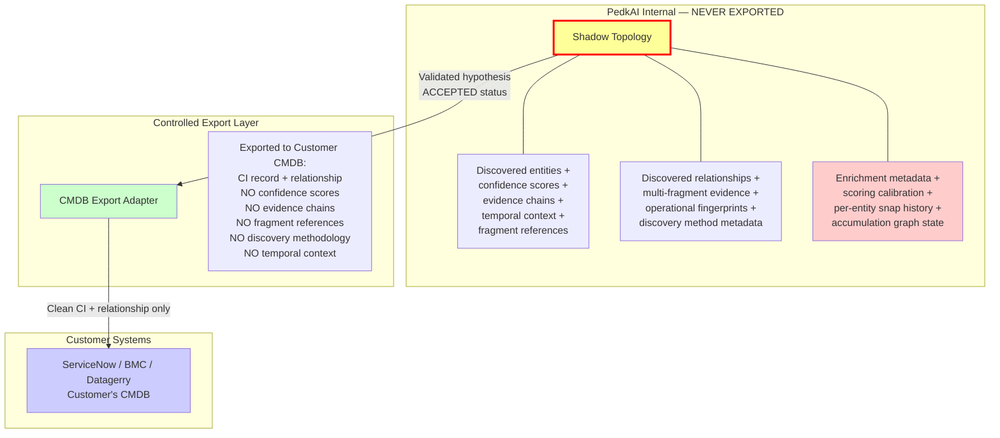

### What the Shadow Topology Contains (Private to PedkAI)

| Data Element | Purpose | Why It Must Stay Private |
|-------------|---------|------------------------|
| **Confidence Scores** | Per-discovery confidence from Evidence Fusion | Reveals PedkAI's scoring methodology — a competitor studying CMDB confidence values could reverse-engineer the fusion logic |
| **Evidence Chains** | Which fragments, from which sources, across which time span, contributed to the discovery | Reveals Abeyance Memory's snap patterns — the core IP |
| **Fragment References** | Links back to the specific abeyance fragments that snapped | Reveals what PedkAI considers "interesting" — a competitor could build a targeted clone |
| **Temporal Context** | When evidence appeared, how long it sat in abeyance, what triggered the snap | Reveals the temporal dynamics that make Abeyance Memory work |
| **Accumulation Graph State** | Which fragments have affinity edges, which clusters are forming | Reveals emerging hypotheses before they're confirmed — future discoveries |
| **Scoring Calibration** | Per-entity, per-failure-mode weight tuning from validated snaps | The most valuable proprietary asset — per-customer calibration from production data |
| **Discovery Method** | Which enrichment steps, which scoring profile, which fusion methodology led to the discovery | The recipe itself |

### What the Customer's CMDB Receives (Controlled Export)

When a hypothesis reaches `ACCEPTED` status and is approved for CMDB export:

1. **The CI record**: Entity identifier, type, attributes, domain — everything the CMDB needs to represent the entity accurately
2. **The relationship record**: From-entity, to-entity, relationship type, direction — the Dark Edge or corrected attribute
3. **A PedkAI reference tag**: A unique identifier linking this CMDB record back to PedkAI's Shadow Topology — **but not the evidence chain or scoring data behind it**
4. **A discovery timestamp**: When PedkAI identified this divergence
5. **A human-readable summary**: "PedkAI identified an undocumented dependency between cell LTE-8842-A and transport node TN-NW-207 based on cross-domain operational evidence" — enough for the operator to understand, not enough for a competitor to replicate

### The Reference Tag — The Accounting Link

The PedkAI reference tag is critical for two purposes:

**Purpose 1 — Value Attribution (§13)**: The tag links every CMDB record that PedkAI created or corrected back to PedkAI's internal ledger. This enables ongoing value measurement: every future incident, MTTR improvement, or licence saving that involves a PedkAI-tagged entity is attributable to PedkAI.

**Purpose 2 — Topology Enrichment**: The Shadow Topology uses its own discovery records — not the CMDB's copy — for future fragment enrichment. When the enrichment chain (Step 1) expands an entity's topological neighbourhood, it queries the Shadow Topology, which contains both CMDB-declared relationships *and* PedkAI-discovered relationships. This means PedkAI's enrichment gets richer with every discovery, while the CMDB only gets the clean CI/relationship export.

### The Flywheel Effect on the Shadow Topology

Every validated snap enriches the Shadow Topology. Every enrichment improves future fragment enrichment. This creates a compounding advantage:

```
Month 1:  Shadow Topology ≈ CMDB snapshot (starting point)
          Enrichment chain has no PedkAI discoveries to leverage
          Fragment matching relies on CMDB-declared topology only

Month 3:  Shadow Topology = CMDB + 47 validated dark edges + 12 dark nodes
          Enrichment chain now expands entities through discovered relationships
          A RAN fragment can now reach a transport entity via a PedkAI-discovered edge
          that the CMDB doesn't know about — even though PedkAI told the CMDB about it,
          the CMDB copy doesn't carry the scoring metadata that makes it useful for enrichment

Month 6:  Shadow Topology = CMDB + 183 discoveries + cross-referencing metadata
          The enrichment is materially better than Month 1
          Fragments that would not have clustered at Month 1 now cluster 
          because their topological neighbourhoods overlap via discovered edges

Month 12: Shadow Topology is a superset of the CMDB
          Even though every discovery has been exported to the CMDB,
          the Shadow Topology carries the evidence chains, scoring calibration,
          and accumulation metadata that make it an intelligence asset, not just a database
```

**This is the moat's compounding mechanism.** A competitor entering at Month 12 sees an accurate CMDB (thanks to PedkAI's exports). But they don't have 12 months of Shadow Topology enrichment, scoring calibration, or validated snap data. Their fragment enrichment is 12 months behind. Their snap accuracy is 12 months behind. The gap widens over time.

### Shadow Topology Schema

```mermaid
erDiagram
    SHADOW_ENTITY {
        uuid entity_id PK
        uuid tenant_id FK
        text entity_identifier "Human-readable: LTE-8842-A"
        enum origin "CMDB_DECLARED | PEDKAI_DISCOVERED | PEDKAI_CORRECTED"
        uuid discovery_hypothesis_id FK "NULL if CMDB_DECLARED"
        timestamp first_seen "When PedkAI first encountered this entity"
        timestamp last_evidence "Most recent evidence timestamp"
        jsonb attributes "All known attributes (CMDB + discovered)"
        jsonb cmdb_attributes "What the CMDB says (for divergence tracking)"
        float enrichment_value "How much this entity has contributed to snap enrichment"
    }

    SHADOW_RELATIONSHIP {
        uuid relationship_id PK
        uuid tenant_id FK
        uuid from_entity_id FK
        uuid to_entity_id FK
        text relationship_type "serves | connects_to | depends_on | backed_by"
        enum origin "CMDB_DECLARED | PEDKAI_DISCOVERED"
        uuid discovery_hypothesis_id FK "NULL if CMDB_DECLARED"
        float confidence "Evidence fusion confidence at time of discovery"
        timestamp discovered_at
        jsonb evidence_summary "Fragment IDs and snap metadata — NEVER EXPORTED"
        boolean exported_to_cmdb "Has this been pushed to customer CMDB?"
        timestamp exported_at
        text cmdb_reference_tag "PedkAI tag written to CMDB record"
    }

    SHADOW_ENTITY ||--o{ SHADOW_RELATIONSHIP : from
    SHADOW_ENTITY ||--o{ SHADOW_RELATIONSHIP : to

    CMDB_EXPORT_LOG {
        uuid export_id PK
        uuid tenant_id FK
        uuid relationship_id FK "or entity_id"
        enum export_type "NEW_CI | NEW_RELATIONSHIP | ATTRIBUTE_CORRECTION"
        timestamp exported_at
        jsonb exported_payload "What was sent to CMDB (sanitised)"
        jsonb retained_payload "What was kept in Shadow Topology (proprietary)"
        text cmdb_reference_tag
    }
```

### Implementation Tasks for Shadow Topology

| Task ID | Task | Priority | Detail |
|---------|------|:--------:|--------|
| **T-AM-01** | Implement Shadow Topology data model (PostgreSQL tables: `shadow_entity`, `shadow_relationship`, `cmdb_export_log`) | 🔴 Critical | Foundation for all enrichment |
| **T-AM-02** | Build CMDB snapshot import adapter — initial population of Shadow Topology from customer CMDB export | 🔴 Critical | Day 1 requires CMDB baseline |
| **T-AM-03** | Build Shadow Topology query API — 2-hop neighbourhood expansion for enrichment chain | 🔴 Critical | Used by Enrichment Step 1 on every fragment |
| **T-AM-04** | Build CMDB Export Adapter — controlled export of validated discoveries to customer CMDB with reference tagging | 🟡 High | Sanitisation logic: strip evidence chains, scoring, fragment refs |
| **T-AM-05** | Implement Shadow Topology enrichment on validated snap — add discovered entity/relationship to Shadow graph | 🟡 High | The flywheel trigger |
| **T-AM-06** | Implement `enrichment_value` tracking — measure how much each Shadow entity contributes to successful future snaps | 🟢 Medium | Analytics for demonstrating flywheel effect |

---

## 9. The Snap Engine

### Overview

The snap engine is the heart of Abeyance Memory. It evaluates whether a newly arrived fragment connects to one or more stored fragments to form a Dark Graph hypothesis. It runs in three stages.

### Stage 1: Targeted Retrieval

**Purpose**: Reduce the candidate set from all stored fragments to only those that *could* plausibly snap with the new fragment. This is a structured query, not a vector scan.

**Query Logic**:

```sql
-- Pseudocode: targeted retrieval for new fragment F
SELECT af.*
FROM abeyance_fragment af
JOIN fragment_entity_ref fer ON af.fragment_id = fer.fragment_id
WHERE af.tenant_id = :tenant_id
  AND af.snap_status = 'ABEYANCE'
  AND af.current_decay_score > 0.1
  AND (
    -- Entity overlap: any entity in F's topological neighbourhood
    -- also appears in the candidate's neighbourhood
    fer.entity_id IN (:new_fragment_entity_ids)
    OR
    -- Failure mode compatibility: candidate's failure mode tags
    -- overlap with new fragment's tags
    af.failure_mode_tags @> ANY(:new_fragment_failure_mode_types)
  )
ORDER BY af.current_decay_score DESC
LIMIT 200;  -- cap candidates for scoring efficiency
```

**Performance**: GIN indexes on `extracted_entities`, `failure_mode_tags`, and `fragment_entity_ref.entity_id` make this query fast even at scale. Typical retrieval: <50ms for 1M stored fragments.

### Stage 2: Evidence Scoring

**Purpose**: Score each candidate fragment against the new fragment. The score combines multiple dimensions, weighted by the failure mode being evaluated.

**Scoring Formula**:

snap_score(F_new, F_stored) = 
    [ (w_sem × cosine_sim(enriched_embedding_new, enriched_embedding_stored))
    + (w_topo × topological_proximity(F_new, F_stored))
    + (w_entity × entity_overlap_jaccard(F_new, F_stored))
    + (w_oper × operational_context_similarity(F_new, F_stored))
    ] × temporal_weight(F_new, F_stored)

### Signal Normalisation Guarantee

To prevent dimension bias, every scoring component MUST be clamped and normalised before weighting:

| Component | Normalisation Method | Range |
| :--- | :--- | :--- |
| **Semantic** | L2-normalised Cosine Similarity | `[0, 1]` |
| **Topological** | `1 / (1 + hops)` | `[0.33, 1.0]` |
| **Entity** | Intersection / Union (Jaccard) | `[0, 1]` |
| **Operational** | Min-Max Scaled Euclidean Distance | `[0, 1]` |

Where:

| Component | How Computed | What It Measures |
|-----------|-------------|-----------------|
| `cosine_sim(enriched)` | pgvector `<=>` operator on enriched embeddings | Overall semantic + topological + temporal + operational similarity |
| `topological_proximity` | Shortest path length in Shadow Topology between nearest entities of each fragment; inverted and normalised (1/hops, capped) | How close in the network graph the fragments' entities are |
| `entity_overlap_jaccard` | Jaccard similarity of full entity neighbourhood sets | How many specific network entities both fragments reference |
| `operational_context_sim` | Cosine similarity of operational fingerprint vectors (change proximity, traffic state, alarm density) | Were the fragments born in similar operational conditions? |
| `temporal_weight` | Context-aware temporal function (see below) | How temporally related are the fragments in operational terms? |

**Context-Aware Temporal Weighting**:

```
temporal_weight(F_new, F_stored) = 
    exp(-age_days / τ_base)                           # Base decay
  × (1 + γ × shared_change_proximity(F_new, F_stored)) # Change window bonus
  × diurnal_alignment(F_new, F_stored)                  # Same time-of-day bonus
```

- `τ_base`: source-type-dependent (from §5 table)
- `γ`: change proximity bonus factor (default 0.5; calibrated per deployment)
- `shared_change_proximity`: if both fragments are near the *same* change window, this is high
- `diurnal_alignment`: cosine similarity of the two fragments' time-of-day sinusoidal encodings; fragments from the same operational period (both 3am, both Thursday) score higher

**Weight Profiles by Failure Mode**:

The weights `w_sem`, `w_topo`, `w_entity`, `w_oper` are not fixed — they depend on the failure mode being evaluated. Each candidate pair may be evaluated under multiple failure mode profiles:

| Failure Mode | w_sem | w_topo | w_entity | w_oper | Rationale |
|-------------|:-----:|:------:|:--------:|:------:|-----------|
| **Dark Edge** | 0.2 | 0.35 | 0.25 | 0.2 | Topological proximity is the strongest signal — entities must be plausibly connected |
| **Dark Node** | 0.3 | 0.15 | 0.35 | 0.2 | Entity identity match dominates — the same unknown entity referenced from multiple sources |
| **Identity Mutation** | 0.15 | 0.2 | 0.45 | 0.2 | Entity attribute matching is critical — same logical function, different physical identity |
| **Phantom CI** | 0.25 | 0.2 | 0.3 | 0.25 | Entity identity + operational context (zero telemetry over time) |
| **Dark Attribute** | 0.3 | 0.15 | 0.25 | 0.3 | Semantic content + operational context (post-change parameter drift) |

The snap score is computed under each compatible failure mode profile. The highest score determines which failure mode the potential snap represents.

### Stage 3: Snap Decision

**Thresholds**:

| Threshold | Value | Meaning |
|-----------|:-----:|---------|
| **Snap Threshold** | 0.75 (default; calibrated per deployment) | Score above this → immediate snap → hypothesis created |
| **Affinity Threshold** | 0.40 (default; calibrated per deployment) | Score above this but below snap → affinity edge created in Accumulation Graph |
| **Near-Miss Threshold** | 0.55 (default) | Score in this range → fragment's `near_miss_count` incremented, `base_relevance` boosted by 1.15× |

### Snap Loop Protection

To prevent recursive explosion or "hallucinated clusters," the engine enforces these invariants:

1. **Near-Miss Cap**: A fragment's `near_miss_count` cannot exceed 5. Further near-misses do not boost relevance.
2. **Absolute Decay Ceiling**: No relevance boost can ever push a fragment's `current_decay_score` above 1.5.
3. **Snap Cycle Detection**: A fragment cannot snap to a hypothesis that already contains its own `parent_fragment_id` or children.
4. **Max Fragment Degree**: No single fragment can participate in more than 3 active `CANDIDATE` hypotheses.

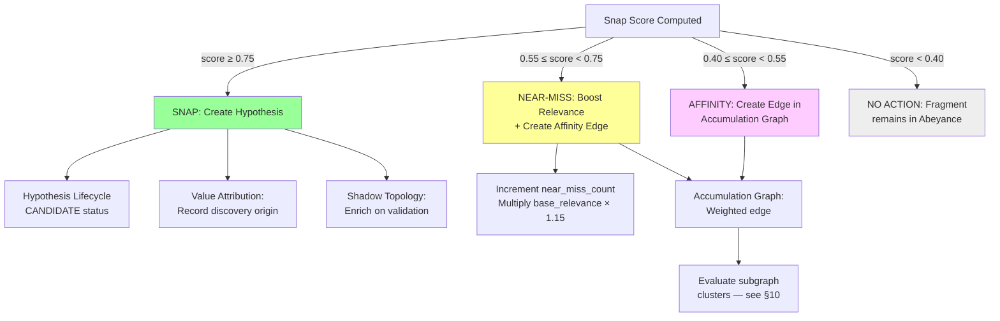

---

## 10. The Accumulation Graph

### Why Pairwise Matching Is Not Enough

The three-fragment problem described in §3 (Failure Mode 1) cannot be solved by pairwise snap evaluation. Fragment A scores 0.5 against B. B scores 0.45 against C. A scores 0.38 against C. No pair crosses the snap threshold. But the three together — a timeout, a config change, and a sleeping cell, all in the same topological corridor — are a strong signal.

The Accumulation Graph captures these weak inter-fragment relationships and detects when a cluster of weakly-connected fragments collectively constitutes strong evidence.

### Data Model

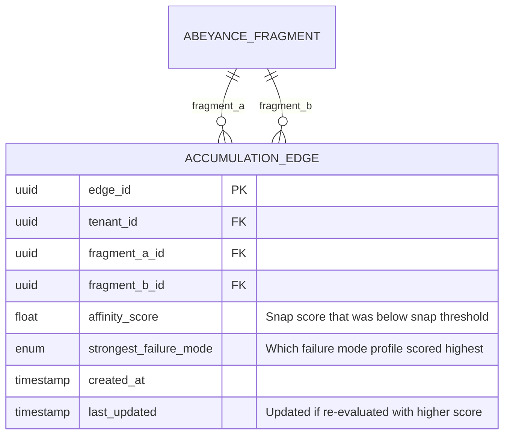

### Cluster Detection

Periodically (every 6 hours by default; event-triggered when a new affinity edge is created), evaluate the accumulation graph for emerging clusters:

**Algorithm**: Connected component detection followed by evidence fusion scoring.

1. **Find connected components** in the accumulation graph using PostgreSQL recursive CTEs (no external graph database needed):

```sql
-- Recursive CTE to find connected components
WITH RECURSIVE component AS (
    -- Start from fragments with recent affinity edges
    SELECT fragment_a_id AS fragment_id, fragment_a_id AS component_root
    FROM accumulation_edge
    WHERE tenant_id = :tenant_id AND last_updated > NOW() - INTERVAL '7 days'
    
    UNION
    
    SELECT ae.fragment_b_id, c.component_root
    FROM accumulation_edge ae
    JOIN component c ON ae.fragment_a_id = c.fragment_id
    WHERE ae.tenant_id = :tenant_id
)
SELECT component_root, array_agg(DISTINCT fragment_id) AS members, count(*) AS size
FROM component
GROUP BY component_root
HAVING count(*) >= 3  -- minimum cluster size for evaluation
ORDER BY count(*) DESC;
```

### Cluster Quality Filters

Before a cluster is submitted for Evidence Fusion, it must pass the following quality gates:

- **Temporal Span**: The time delta between the oldest and newest fragment in the cluster must not exceed 90 days.
- **Entity Coherence**: At least 60% of fragments in the cluster must share at least one common entity in their 2-hop neighbourhood.
- **Mode Consistency**: At least two fragments must have compatible `failure_mode_tags`.

### Negative Evidence in Cluster Scoring

The fusion engine (Noisy-OR) is adjusted to account for negative evidence:

- If a fragment in a cluster explicitly contradicts a hypothesis (e.g., a "Service Restored" log for a "Dark Edge" claim), it applies a **0.5× penalty** to the aggregate cluster score.

2. **Score each cluster** using the Evidence Fusion engine from §5:

For a cluster of N fragments with pairwise affinity scores, compute the aggregate confidence:

**Noisy-OR** (for dense-evidence deployments):
```
P(hypothesis | cluster) = 1 - ∏(1 - affinity_score_i) for all edges in the cluster
```

**Dempster-Shafer** (for sparse-evidence deployments):
```
Combine belief masses from each fragment pair using Dempster's Rule of Combination.
Explicitly represent ignorance — three weak signals with no counter-evidence 
yields higher combined belief than Noisy-OR would.
```

3. **Cluster snap threshold**: If the aggregate score exceeds the cluster snap threshold (default 0.70, lower than pairwise because multi-fragment corroboration provides structural confidence), create a hypothesis with all cluster members as contributing evidence.

```mermaid
graph TB
    subgraph "Accumulation Graph — Emerging Cluster"
        A[Fragment A<br/>Ticket: timeout<br/>on subnet .16.0/24]
        B[Fragment B<br/>Change: firmware upgrade<br/>TN-NW-207]
        C[Fragment C<br/>Sleeping cell detected<br/>near SITE-NW-1847]
        D[Fragment D<br/>Alarm: self-cleared CRC<br/>S1 bearer]
        
        A ---|"0.50"| B
        B ---|"0.45"| C
        A ---|"0.42"| D
        D ---|"0.48"| B
        C ---|"0.38"| D
    end
    
    subgraph "Evaluation"
        E[Noisy-OR Fusion:<br/>P = 1 - (0.5)(0.55)(0.58)(0.52)(0.62)<br/>= 1 - 0.051 = 0.949]
        F[Cluster SNAPS<br/>Multi-fragment Dark Edge<br/>Hypothesis created]
    end
    
    A --> E
    B --> E
    C --> E
    D --> E
    E --> F
    
    style F fill:#9f9,stroke:#090
```

> **This is what a vector database cannot do.** No individual pair of these fragments would snap. But the cluster — four pieces of evidence from four different sources, spanning weeks, touching a connected topological corridor — is overwhelming. The accumulation graph captures what patient, multi-source institutional memory looks like in software form.

---

## 11. The Decay Engine

### Principle

Not all fragments age equally. Abeyance Memory applies telecom-specific decay rates that reflect how different evidence types lose relevance in real network operations.

### Decay Formula

```
current_decay_score = base_relevance 
                    × relevance_boost^near_miss_count
                    × exp(-age_days / τ_source_type)
```

Where:
- `base_relevance`: Set at ingestion per source type (§5 table)
- `relevance_boost`: 1.15 per near-miss (fragments that keep almost-matching are warming up)
- `τ_source_type`: Decay time constant per source type (§5 table)
- `age_days`: Days since `event_timestamp`

### Decay Profiles Visualisation

```
Decay Score Over Time — By Fragment Source Type

1.0 ┤
    │  ╲                             
0.9 ┤   ╲  "Could not reproduce" (τ=270d)
    │    ╲╲                          
0.8 ┤     ╲ ╲  Change records (τ=365d)
    │      ╲  ╲                      
0.7 ┤       ╲  ╲╲                    
    │        ╲   ╲ CLI output (τ=180d)
0.6 ┤         ╲   ╲                  
    │          ╲   ╲╲                
0.5 ┤           ╲    ╲ Self-cleared alarms (τ=90d)
    │            ╲    ╲              
0.4 ┤             ╲    ╲╲            
    │              ╲     ╲ Telemetry events (τ=60d)
0.3 ┤               ╲     ╲          
    │                ╲╲     ╲        
0.2 ┤                  ╲     ╲╲      
    │                   ╲╲     ╲     
0.1 ┤- - - - - - - - - - -╲- - -╲- - EXPIRATION FLOOR - -
    │                       ╲     ╲  
0.0 ┤─────────┬─────────┬─────────┬─────────┬──────
    0        90       180       270       365 days

    Note: Near-miss boosts shift curves upward. A fragment with 
    3 near-misses has effective base_relevance × 1.15³ = 1.52×
```

### Decay Execution

- **Schedule**: Daily batch job (lightweight SQL UPDATE on `current_decay_score`)
- **Expiration**: Fragments with `current_decay_score < 0.1` transition to `snap_status = 'EXPIRED'`
- **Compression**: Expired fragments are compressed for cold storage — retain entity set, operational fingerprint, failure mode tags, and embedding; drop raw content
- **Affinity edge cleanup**: When a fragment expires, its accumulation graph edges are removed and connected components are re-evaluated

---

## 12. Long-Horizon Retrieval

### Tiered Storage Architecture

| Tier | Age | Storage | Fragments | Query Method |
|------|-----|---------|:---------:|-------------|
| **Hot** | 0–30 days | PostgreSQL + pgvector (primary) | Full fragment with all fields | Direct SQL + vector search |
| **Warm** | 30–180 days | PostgreSQL (partitioned table) | Full fragment, aggressively indexed | Direct SQL + vector search (same schema, different partition) |
| **Cold** | 180+ days | S3 / Parquet + PostgreSQL metadata | Compressed: embedding + entities + fingerprint + tags (no raw content) | Metadata query in PostgreSQL → selective Parquet retrieval |

### Cold Fragment Participation in Snap Evaluation

Cold fragments participate in the Slow-Loop accumulation process to ensure long-horizon discoveries are not lost:

1. **Metadata-Triggered Promotion**: If a new fragment shares a "high-entropy" entity (e.g., a specific interface IP) with a cold fragment's metadata index, the cold fragment is promoted to "Warm" status for a 48-hour evaluation window.
2. **Batch Re-Embedding**: If the `llm_model_version` of a cold fragment is deprecated, it is scheduled for background re-embedding before participating in new snaps.
3. **Cross-Service Propagation**: Cold fragments are prioritized for Phase 1b (Propagation Path Inference) when resolving multi-service outages.
4. **Performance Guard**: Snap evaluation against cold fragments is limited to 50 candidates per ingestion event to protect API latency.

> [!TIP]
> **Cold Snap Bonus**: If a cold fragment snaps (evidence separated by 6+ months connects), flag the resulting hypothesis with elevated significance — `COLD_SNAP` tag. These discoveries are exceptionally high-value.

---

## 12.5 Instant Incident Reconstruction

### Purpose
Provide NOC leads with an immediate, time-ordered reconstruction of a service failure by pulling fragments that "snap" to the current incident's context, even if they were previously uncorrelated.

### Phased Delivery
- **Phase 1a (Current)**: Time-ordered retrieval of fragments within the service's topological neighbourhood.
- **Phase 1b (Urgent)**: Cross-service propagation path inference (calculating how a fault moved from Core to RAN based on abeyance evidence).

### API Specification
`GET /api/v1/reconstruct/{incident_id}`

**Output Schema**:
```json
{
  "service_id": "SRV-4821",
  "incident_start": "2026-03-12T04:00:00Z",
  "propagation_path": [
    {"seq": 1, "service": "CORE-AUTH", "fragment_id": "uuid-1", "role": "Origin"},
    {"seq": 2, "service": "IP-BACKHAUL", "fragment_id": "uuid-2", "role": "Transit"},
    {"seq": 3, "service": "RAN-SITE-1847", "fragment_id": "uuid-3", "role": "Symptom"}
  ],
  "affected_services": 12,
  "blast_radius_score": 0.88,
  "evidence_fragments": [...]
}
```

### Performance Target
Reconstruction must return in **<800ms** to support active fire-fighting.

---

## 13. Value Attribution Methodology

### The Problem

When PedkAI discovers a dark edge and the customer integrates it into their CMDB, future incidents involving those entities are resolved faster because the CMDB is now accurate. But PedkAI did nothing during that future incident — the engineer simply followed the now-correct CMDB. The customer might perceive PedkAI as having delivered value only at the moment of discovery, not recognising that every subsequent faster resolution is a downstream consequence of PedkAI's work.

**This is an existential business problem.** If the customer doesn't see ongoing value, they cancel the subscription. PedkAI's value algorithms must be smart enough to count the ongoing impact of past discoveries.

### The Value Attribution Ledger

Every PedkAI discovery creates a permanent entry in the Value Attribution Ledger. This ledger is the accounting system that tracks the ongoing business impact of every discovery Abeyance Memory has made.

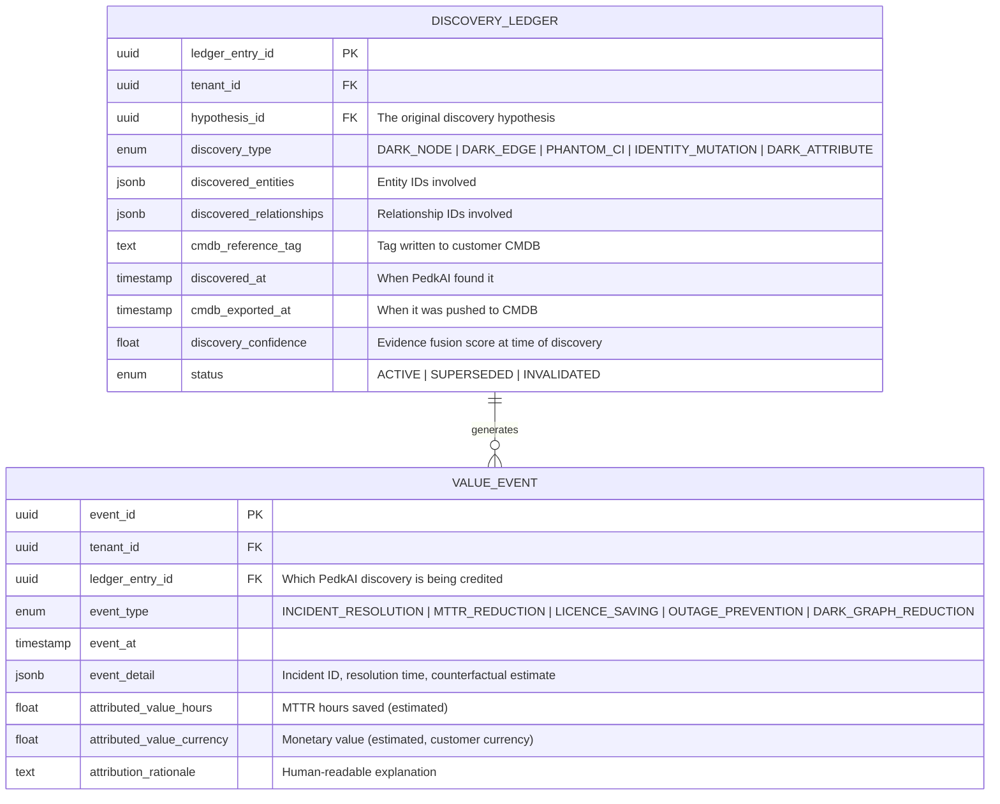

### Value Attribution Rules

**Rule 1 — Discovery Credit**: When PedkAI discovers a dark edge/node/mutation, the discovery itself is a value event. Metric: "N undocumented dependencies discovered."

**Rule 2 — Incident Resolution Acceleration**: When an incident is resolved and the resolution path touches entities or relationships that PedkAI discovered (identified via the CMDB reference tag), the MTTR improvement is attributed to PedkAI.

Attribution method:
- Measure the actual resolution time for this incident
- Compare against the *historical baseline* for similar incidents on similar entities *before* PedkAI's discovery was available
- The delta is PedkAI's attributed MTTR saving
- If no baseline exists, compare against the customer's overall MTTR for that incident priority level

```
attributed_mttr_saving = baseline_mttr - actual_mttr
```

**Rule 3 — Cascade Prevention**: When an incident involves entities that are topologically adjacent to PedkAI-discovered entities, and the operator uses the discovered topology to prevent escalation, this is proactive value. The attributed saving is the estimated cost of the prevented escalation (based on historical escalation costs for similar incidents).

**Rule 4 — Licence and CapEx Savings**: When PedkAI identifies a phantom node (decommissioned but still licensed), and the customer acts on it by reclaiming the licence, the annual licence cost saved is attributed to PedkAI. This is a hard monetary value — the most compelling metric for executive reporting.

**Rule 5 — Ongoing Illumination Credit**: Even when PedkAI takes no active role in a specific incident, if the incident's resolution involved entities or relationships that *would not have been in the CMDB without PedkAI*, the resolution is credited as "PedkAI-illuminated." This is tracked as a separate metric:

```
pedkai_illumination_ratio = incidents_involving_pedkai_discovered_entities / total_incidents
```

Over time, this ratio should grow — demonstrating that PedkAI's discoveries are becoming structurally embedded in the customer's operational effectiveness.

**Rule 6 — Dark Graph Reduction Index**: The headline metric. Measured quarterly:

```
dark_graph_reduction = 1 - (current_dark_graph_divergences / baseline_dark_graph_divergences)
```

Where baseline is measured at deployment start (from the initial Divergence Report).

### The Counterfactual Argument

The key to value attribution is the counterfactual: **"What would have happened without PedkAI?"**

For every PedkAI-illuminated incident resolution:
- The CMDB would still have been wrong
- The engineer would have spent additional time hunting for the dependency
- The MTTR would have been longer
- The risk of cascade would have been higher

PedkAI's value attribution report presents this counterfactual explicitly:

> *"In Q2 2026, PedkAI-illuminated network paths were involved in 47 incident resolutions. Based on historical baselines for similar incidents before PedkAI deployment, estimated MTTR savings total 312 engineer-hours. 3 phantom CI licence reclamations saved £184,000 in annual vendor maintenance. The Dark Graph Reduction Index improved from 0.38 to 0.51."*

### Value Dashboard Data

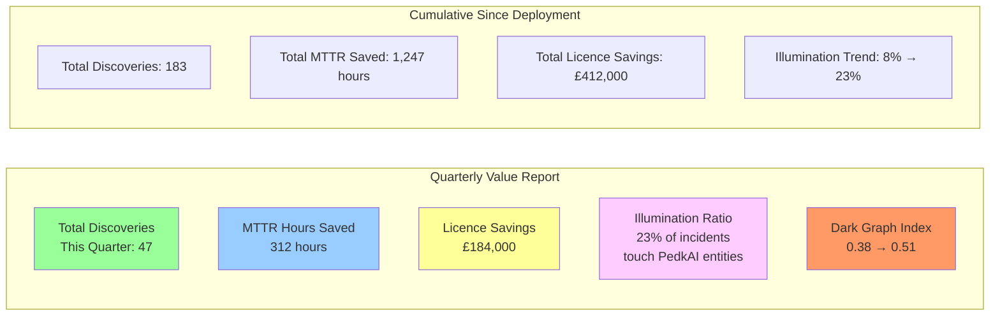

### Implementation Tasks for Value Attribution

| Task ID | Task | Priority | Detail |
|---------|------|:--------:|--------|
| **T-AM-07** | Implement Discovery Ledger schema and API | 🔴 Critical | Foundation for all value tracking |
| **T-AM-08** | Implement CMDB reference tagging in export adapter (§8) | 🔴 Critical | Links CMDB records to PedkAI discoveries |
| **T-AM-09** | Build incident-to-discovery correlation engine — match resolved incidents against PedkAI-tagged entities | 🟡 High | Requires ITSM integration (ServiceNow/Remedy API) |
| **T-AM-10** | Implement MTTR baseline calculator — historical MTTR per entity type, per incident priority, pre-PedkAI | 🟡 High | Counterfactual requires baseline |
| **T-AM-11** | Build Value Attribution Dashboard — quarterly and cumulative metrics for executive reporting | 🟡 High | Customer-facing; must be compelling |
| **T-AM-12** | Implement Dark Graph Reduction Index — automated quarterly calculation against deployment baseline | 🟡 High | The headline metric |
| **T-AM-13** | Implement Illumination Ratio tracking — percentage of incidents touching PedkAI-discovered entities | 🟢 Medium | Demonstrates compounding value |

---

## 13.5 Human Governance — Discovery Review Queue (DRQ)

### Definition
The DRQ is a staging area for discoveries that require manual analyst validation before Shadow Topology enrichment or CMDB export.

### Auto-Approval Thresholds
- **Confidence > 0.90**: Auto-enrich Shadow Topology; flag for optional CMDB review.
- **Confidence 0.75 - 0.90**: Required review for Shadow Topology enrichment.
- **Any CMDB Export**: Requires explicit human analyst approval (Workflow: `PENDING_EXPORT`).

### DRQ Data Model
```sql
CREATE TABLE discovery_review_queue (
    review_id uuid PRIMARY KEY,
    hypothesis_id uuid REFERENCES hypothesis_lifecycle,
    analyst_id uuid,
    status enum('PENDING', 'APPROVED', 'REJECTED', 'ESC_TO_EXPERT'),
    analyst_notes text,
    review_deadline timestamp,
    priority_weight float
);
```

---

## 14. Low-Level Software Design

### Service Architecture

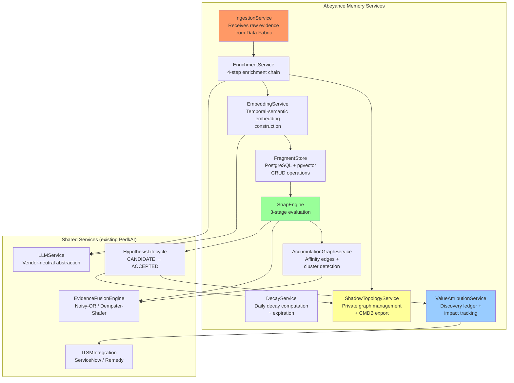

### Class Design

```python
# ============================================================
# abeyance_memory/models.py — ORM Models
# ============================================================

class AbeyanceFragmentORM(Base):
    """Core fragment storage — the atomic unit of abeyance evidence."""
    __tablename__ = "abeyance_fragment"
    
    fragment_id: Mapped[UUID] = mapped_column(primary_key=True)
    tenant_id: Mapped[UUID] = mapped_column(ForeignKey("tenant.id"), index=True)
    source_type: Mapped[SourceType]  # Enum: TICKET_TEXT, ALARM, TELEMETRY_EVENT, etc.
    raw_content: Mapped[str]
    extracted_entities: Mapped[dict] = mapped_column(JSONB)
    topological_neighbourhood: Mapped[dict] = mapped_column(JSONB)
    operational_fingerprint: Mapped[dict] = mapped_column(JSONB)
    failure_mode_tags: Mapped[dict] = mapped_column(JSONB)
    temporal_context: Mapped[dict] = mapped_column(JSONB)
    enriched_embedding = mapped_column(Vector(1536))  # pgvector
    raw_embedding = mapped_column(Vector(768))
    event_timestamp: Mapped[datetime]
    ingestion_timestamp: Mapped[datetime]
    base_relevance: Mapped[float]
    current_decay_score: Mapped[float]
    near_miss_count: Mapped[int] = mapped_column(default=0)
    snap_status: Mapped[SnapStatus]  # Enum: ABEYANCE, SNAPPED, EXPIRED, COLD
    snapped_hypothesis_id: Mapped[Optional[UUID]]
    source_ref: Mapped[str]
    source_engineer_id: Mapped[Optional[str]]

class FragmentEntityRefORM(Base):
    """Entity references with topological distance."""
    __tablename__ = "fragment_entity_ref"
    
    ref_id: Mapped[UUID] = mapped_column(primary_key=True)
    fragment_id: Mapped[UUID] = mapped_column(ForeignKey("abeyance_fragment.fragment_id"))
    entity_id: Mapped[UUID]
    entity_identifier: Mapped[str]  # Human-readable: LTE-8842-A
    entity_domain: Mapped[EntityDomain]  # Enum: RAN, TRANSPORT, CORE, IP, VNF, SITE
    topological_distance: Mapped[int]  # 0 = directly referenced, 1 = 1-hop, 2 = 2-hop

class AccumulationEdgeORM(Base):
    """Weak affinity links between fragments."""
    __tablename__ = "accumulation_edge"
    
    edge_id: Mapped[UUID] = mapped_column(primary_key=True)
    tenant_id: Mapped[UUID] = mapped_column(index=True)
    fragment_a_id: Mapped[UUID] = mapped_column(ForeignKey("abeyance_fragment.fragment_id"))
    fragment_b_id: Mapped[UUID] = mapped_column(ForeignKey("abeyance_fragment.fragment_id"))
    affinity_score: Mapped[float]
    strongest_failure_mode: Mapped[str]
    created_at: Mapped[datetime]
    last_updated: Mapped[datetime]

class ShadowEntityORM(Base):
    """PedkAI's private topology node."""
    __tablename__ = "shadow_entity"
    
    entity_id: Mapped[UUID] = mapped_column(primary_key=True)
    tenant_id: Mapped[UUID] = mapped_column(index=True)
    entity_identifier: Mapped[str]
    origin: Mapped[EntityOrigin]  # CMDB_DECLARED, PEDKAI_DISCOVERED, PEDKAI_CORRECTED
    discovery_hypothesis_id: Mapped[Optional[UUID]]
    first_seen: Mapped[datetime]
    last_evidence: Mapped[datetime]
    attributes: Mapped[dict] = mapped_column(JSONB)
    cmdb_attributes: Mapped[dict] = mapped_column(JSONB)
    enrichment_value: Mapped[float] = mapped_column(default=0.0)

class ShadowRelationshipORM(Base):
    """PedkAI's private topology edge."""
    __tablename__ = "shadow_relationship"
    
    relationship_id: Mapped[UUID] = mapped_column(primary_key=True)
    tenant_id: Mapped[UUID] = mapped_column(index=True)
    from_entity_id: Mapped[UUID] = mapped_column(ForeignKey("shadow_entity.entity_id"))
    to_entity_id: Mapped[UUID] = mapped_column(ForeignKey("shadow_entity.entity_id"))
    relationship_type: Mapped[str]
    origin: Mapped[EntityOrigin]
    discovery_hypothesis_id: Mapped[Optional[UUID]]
    confidence: Mapped[float]
    discovered_at: Mapped[datetime]
    evidence_summary: Mapped[dict] = mapped_column(JSONB)  # NEVER EXPORTED
    exported_to_cmdb: Mapped[bool] = mapped_column(default=False)
    exported_at: Mapped[Optional[datetime]]
    cmdb_reference_tag: Mapped[Optional[str]]

class DiscoveryLedgerORM(Base):
    """Value Attribution: permanent record of every PedkAI discovery."""
    __tablename__ = "discovery_ledger"
    
    ledger_entry_id: Mapped[UUID] = mapped_column(primary_key=True)
    tenant_id: Mapped[UUID] = mapped_column(index=True)
    hypothesis_id: Mapped[UUID]
    discovery_type: Mapped[str]
    discovered_entities: Mapped[dict] = mapped_column(JSONB)
    discovered_relationships: Mapped[dict] = mapped_column(JSONB)
    cmdb_reference_tag: Mapped[str]
    discovered_at: Mapped[datetime]
    cmdb_exported_at: Mapped[Optional[datetime]]
    discovery_confidence: Mapped[float]
    status: Mapped[str]  # ACTIVE, SUPERSEDED, INVALIDATED

class ValueEventORM(Base):
    """Value Attribution: individual value realization event."""
    __tablename__ = "value_event"
    
    event_id: Mapped[UUID] = mapped_column(primary_key=True)
    tenant_id: Mapped[UUID] = mapped_column(index=True)
    ledger_entry_id: Mapped[UUID] = mapped_column(ForeignKey("discovery_ledger.ledger_entry_id"))
    event_type: Mapped[str]  # INCIDENT_RESOLUTION, MTTR_REDUCTION, LICENCE_SAVING, etc.
    event_at: Mapped[datetime]
    event_detail: Mapped[dict] = mapped_column(JSONB)
    attributed_value_hours: Mapped[Optional[float]]
    attributed_value_currency: Mapped[Optional[float]]
    attribution_rationale: Mapped[str]
```

```python
# ============================================================
# abeyance_memory/services.py — Service Layer (Key Methods)
# ============================================================

class EnrichmentService:
    """The 4-step enrichment chain."""
    
    def __init__(self, shadow_topology: ShadowTopologyService,
                 llm: LLMService, itsm: ITSMIntegration,
                 kpi_store: KPIStore):
        self.shadow_topology = shadow_topology
        self.llm = llm
        self.itsm = itsm
        self.kpi_store = kpi_store
    
    async def enrich(self, raw_evidence: RawEvidence) -> EnrichedFragment:
        # Step 1: Entity Resolution
        entities = await self._resolve_entities(raw_evidence)
        neighbourhood = await self.shadow_topology.expand_neighbourhood(
            entity_ids=entities.ids, hops=2
        )
        
        # Step 2: Operational Fingerprinting
        fingerprint = await self._build_operational_fingerprint(
            entities=entities,
            neighbourhood=neighbourhood,
            event_time=raw_evidence.timestamp
        )
        
        # Step 3: Failure Mode Classification
        failure_modes = self._classify_failure_modes(
            entities=entities,
            fingerprint=fingerprint,
            raw_content=raw_evidence.content
        )
        
        # Step 4: Temporal-Semantic Embedding
        temporal_context = self._build_temporal_context(
            event_time=raw_evidence.timestamp,
            fingerprint=fingerprint
        )
        embeddings = await self._compute_embeddings(
            raw_content=raw_evidence.content,
            entities=entities,
            neighbourhood=neighbourhood,
            fingerprint=fingerprint,
            failure_modes=failure_modes,
            temporal_context=temporal_context
        )
        
        return EnrichedFragment(
            raw_evidence=raw_evidence,
            entities=entities,
            neighbourhood=neighbourhood,
            fingerprint=fingerprint,
            failure_modes=failure_modes,
            temporal_context=temporal_context,
            enriched_embedding=embeddings.enriched,  # 1536-dim
            raw_embedding=embeddings.raw              # 768-dim
        )
    
    def _build_temporal_context(self, event_time: datetime,
                                 fingerprint: OperationalFingerprint) -> TemporalContext:
        """Construct the temporal context vector for embedding."""
        hour = event_time.hour + event_time.minute / 60.0
        dow = event_time.weekday()
        doy = event_time.timetuple().tm_yday
        
        return TemporalContext(
            norm_timestamp=self._normalise_timestamp(event_time),
            time_of_day_sin=math.sin(2 * math.pi * hour / 24),
            time_of_day_cos=math.cos(2 * math.pi * hour / 24),
            day_of_week_sin=math.sin(2 * math.pi * dow / 7),
            day_of_week_cos=math.cos(2 * math.pi * dow / 7),
            change_proximity=fingerprint.change_proximity_gaussian,
            vendor_upgrade_recency=fingerprint.vendor_upgrade_decay,
            traffic_load_ratio=fingerprint.traffic_load_ratio,
            seasonal_sin=math.sin(2 * math.pi * doy / 365),
            seasonal_cos=math.cos(2 * math.pi * doy / 365),
        )


class SnapEngine:
    """The 3-stage snap evaluation engine."""
    
    SNAP_THRESHOLD = 0.75
    NEAR_MISS_THRESHOLD = 0.55
    AFFINITY_THRESHOLD = 0.40
    RELEVANCE_BOOST = 1.15
    
    WEIGHT_PROFILES = {
        "DARK_EDGE":        {"w_sem": 0.20, "w_topo": 0.35, "w_entity": 0.25, "w_oper": 0.20},
        "DARK_NODE":        {"w_sem": 0.30, "w_topo": 0.15, "w_entity": 0.35, "w_oper": 0.20},
        "IDENTITY_MUTATION": {"w_sem": 0.15, "w_topo": 0.20, "w_entity": 0.45, "w_oper": 0.20},
        "PHANTOM_CI":       {"w_sem": 0.25, "w_topo": 0.20, "w_entity": 0.30, "w_oper": 0.25},
        "DARK_ATTRIBUTE":   {"w_sem": 0.30, "w_topo": 0.15, "w_entity": 0.25, "w_oper": 0.30},
    }
    
    async def evaluate(self, new_fragment: EnrichedFragment) -> SnapResult:
        # Stage 1: Targeted Retrieval
        candidates = await self.fragment_store.targeted_retrieval(
            entity_ids=new_fragment.all_entity_ids,
            failure_mode_types=new_fragment.failure_mode_types,
            tenant_id=new_fragment.tenant_id,
            min_decay_score=0.1,
            limit=200
        )
        
        # Stage 2: Evidence Scoring
        scored_pairs = []
        for candidate in candidates:
            best_score, best_mode = self._score_pair(new_fragment, candidate)
            scored_pairs.append(ScoredPair(
                stored_fragment=candidate,
                score=best_score,
                failure_mode=best_mode
            ))
        
        # Stage 3: Snap Decision
        snaps = []
        near_misses = []
        affinities = []
        
        for pair in scored_pairs:
            if pair.score >= self.SNAP_THRESHOLD:
                snaps.append(pair)
            elif pair.score >= self.NEAR_MISS_THRESHOLD:
                near_misses.append(pair)
                affinities.append(pair)
            elif pair.score >= self.AFFINITY_THRESHOLD:
                affinities.append(pair)
        
        # Process snaps → create hypotheses
        for snap in snaps:
            await self._create_hypothesis(new_fragment, snap)
        
        # Process near-misses → boost relevance
        for nm in near_misses:
            await self.fragment_store.boost_relevance(
                nm.stored_fragment.fragment_id, self.RELEVANCE_BOOST
            )
        
        # Process affinities → create/update accumulation edges
        for aff in affinities:
            await self.accumulation_graph.add_or_update_edge(
                new_fragment.fragment_id,
                aff.stored_fragment.fragment_id,
                aff.score,
                aff.failure_mode
            )
        
        # Evaluate accumulation graph for cluster snaps
        if affinities:
            await self.accumulation_graph.evaluate_clusters(
                new_fragment.fragment_id
            )
        
        return SnapResult(snaps=snaps, near_misses=near_misses, affinities=affinities)
    
    def _score_pair(self, new_frag: EnrichedFragment,
                     stored_frag: AbeyanceFragmentORM) -> Tuple[float, str]:
        """Score under each compatible failure mode; return best."""
        compatible_modes = self._compatible_modes(new_frag, stored_frag)
        best_score = 0.0
        best_mode = None
        
        for mode in compatible_modes:
            w = self.WEIGHT_PROFILES[mode]
            
            semantic_sim = cosine_similarity(
                new_frag.enriched_embedding, stored_frag.enriched_embedding
            )
            topo_prox = self.shadow_topology.topological_proximity(
                new_frag.all_entity_ids, stored_frag.all_entity_ids
            )
            entity_overlap = jaccard_similarity(
                new_frag.all_entity_ids, stored_frag.all_entity_ids
            )
            oper_sim = self._operational_similarity(
                new_frag.fingerprint, stored_frag.operational_fingerprint
            )
            temp_weight = self._temporal_weight(new_frag, stored_frag)
            
            score = (
                w["w_sem"] * semantic_sim
                + w["w_topo"] * topo_prox
                + w["w_entity"] * entity_overlap
                + w["w_oper"] * oper_sim
            ) * temp_weight
            
            if score > best_score:
                best_score = score
                best_mode = mode
        
        return best_score, best_mode


class ShadowTopologyService:
    """Manages PedkAI's private topology graph."""
    
    async def expand_neighbourhood(self, entity_ids: List[UUID],
                                     hops: int = 2) -> TopologicalNeighbourhood:
        """Expand entities through Shadow Topology relationships."""
        # Uses recursive CTE to walk relationships up to N hops
        # Returns entities at each hop distance with relationship metadata
        ...
    
    async def topological_proximity(self, entity_set_a: Set[UUID],
                                      entity_set_b: Set[UUID]) -> float:
        """Shortest path between nearest entities of two sets."""
        # Returns 1/min_hops, capped at 1.0 for direct connection
        ...
    
    async def enrich_on_validated_snap(self, hypothesis_id: UUID):
        """Add discovered entities/relationships to Shadow Topology."""
        # Called when hypothesis reaches ACCEPTED status
        # Creates ShadowEntity/ShadowRelationship records with origin=PEDKAI_DISCOVERED
        # DOES NOT export to CMDB — that's a separate controlled action
        ...
    
    async def export_to_cmdb(self, relationship_id: UUID) -> CMDBExportResult:
        """Controlled export: sanitise and push to customer CMDB."""
        relationship = await self._get_relationship(relationship_id)
        
        # Sanitise: strip evidence_summary, confidence, fragment refs
        export_payload = self._sanitise_for_export(relationship)
        
        # Generate reference tag
        reference_tag = f"PEDKAI-{relationship.tenant_id[:8]}-{relationship.relationship_id[:8]}"
        
        # Push to CMDB adapter
        result = await self.cmdb_adapter.create_relationship(
            export_payload, reference_tag
        )
        
        # Log in export ledger (retained vs exported payload)
        await self._log_export(relationship, export_payload, reference_tag)
        
        return result


class ValueAttributionService:
    """Tracks ongoing business impact of PedkAI discoveries."""
    
    async def record_discovery(self, hypothesis_id: UUID,
                                discovery_type: str,
                                entities: List[UUID],
                                relationships: List[UUID]):
        """Create permanent ledger entry for a validated discovery."""
        ...
    
    async def correlate_incident(self, incident_id: str,
                                  resolved_entities: List[UUID]):
        """Check if resolved incident touched PedkAI-discovered entities."""
        # Query discovery ledger for any matching entities
        discoveries = await self._find_discoveries_for_entities(resolved_entities)
        
        if discoveries:
            # Calculate MTTR attribution
            baseline_mttr = await self._get_mttr_baseline(incident)
            actual_mttr = incident.resolution_time - incident.created_time
            mttr_saving = baseline_mttr - actual_mttr
            
            for discovery in discoveries:
                await self._create_value_event(
                    ledger_entry=discovery,
                    event_type="MTTR_REDUCTION",
                    attributed_hours=mttr_saving.total_seconds() / 3600,
                    rationale=f"Incident {incident_id} resolved using "
                              f"PedkAI-discovered {discovery.discovery_type} "
                              f"(tag: {discovery.cmdb_reference_tag})"
                )
    
    async def generate_quarterly_report(self, tenant_id: UUID,
                                          quarter: str) -> ValueReport:
        """Generate quarterly value attribution report."""
        ...
```

### Database Indexes

```sql
-- Fragment retrieval performance
CREATE INDEX idx_fragment_tenant_status ON abeyance_fragment(tenant_id, snap_status) 
    WHERE snap_status = 'ABEYANCE';
CREATE INDEX idx_fragment_decay ON abeyance_fragment(current_decay_score) 
    WHERE snap_status = 'ABEYANCE';
CREATE INDEX idx_fragment_entity_ref ON fragment_entity_ref(entity_id, fragment_id);
CREATE INDEX idx_fragment_failure_modes ON abeyance_fragment 
    USING GIN(failure_mode_tags jsonb_path_ops);
CREATE INDEX idx_fragment_enriched_embedding ON abeyance_fragment 
    USING ivfflat(enriched_embedding vector_cosine_ops) WITH (lists = 100);
CREATE INDEX idx_fragment_dedup ON abeyance_fragment(content_hash, tenant_id);
CREATE INDEX idx_fragment_enrichment_state ON abeyance_fragment(enrichment_state) 
    WHERE enrichment_state != 'READY';
CREATE INDEX idx_fragment_cold_metadata ON abeyance_fragment(tenant_id, event_timestamp) 
    WHERE snap_status = 'COLD';

-- Shadow Topology traversal
CREATE INDEX idx_shadow_rel_from ON shadow_relationship(from_entity_id, tenant_id);
CREATE INDEX idx_shadow_rel_to ON shadow_relationship(to_entity_id, tenant_id);
CREATE INDEX idx_shadow_entity_identifier ON shadow_entity(entity_identifier, tenant_id);

-- Accumulation Graph
CREATE INDEX idx_accum_edge_fragment_a ON accumulation_edge(fragment_a_id);
CREATE INDEX idx_accum_edge_fragment_b ON accumulation_edge(fragment_b_id);

-- Value Attribution
CREATE INDEX idx_discovery_entities ON discovery_ledger 
    USING GIN(discovered_entities jsonb_path_ops);
CREATE INDEX idx_value_event_ledger ON value_event(ledger_entry_id);
```

### API Endpoints

| Endpoint | Method | Purpose |
|----------|:------:|---------|
| `/api/v1/abeyance/ingest` | POST | Submit raw evidence for enrichment and storage |
| `/api/v1/abeyance/fragments` | GET | Query stored fragments (filtered by tenant, status, entity, time range) |
| `/api/v1/abeyance/fragments/{id}` | GET | Retrieve single fragment with full enrichment detail |
| `/api/v1/abeyance/snap-history` | GET | Query snap history (successful snaps, near-misses) |
| `/api/v1/abeyance/accumulation-graph` | GET | Query accumulation graph state (edges, clusters) |
| `/api/v1/abeyance/accumulation-graph/clusters` | GET | List current clusters above size threshold |
| `/api/v1/shadow-topology/entities` | GET | Query Shadow Topology entities (internal use only) |
| `/api/v1/shadow-topology/neighbourhood/{entity_id}` | GET | Get N-hop neighbourhood expansion |
| `/api/v1/shadow-topology/export/{relationship_id}` | POST | Trigger controlled CMDB export |
| `/api/v1/value/ledger` | GET | Query discovery ledger entries |
| `/api/v1/value/events` | GET | Query value attribution events |
| `/api/v1/value/report` | GET | Generate value attribution report (quarterly/cumulative) |
| `/api/v1/value/illumination-ratio` | GET | Current illumination ratio metric |
| `/api/v1/value/dark-graph-index` | GET | Current Dark Graph Reduction Index |

---

## 15. Embedding Space Visualisation

### Purpose

These visualisations serve two audiences:

1. **Customer demos**: Show NOC engineers and IT leaders how Abeyance Memory "sees" their network — fragments clustering by operational reality, not by source system vocabulary
2. **Investor presentations**: Show VCs that this is not a vector database — the embedding space has visible structure that reflects telecom domain knowledge

### Visualisation 1: Raw vs Enriched Embedding Space

This is a side-by-side comparison showing the same fragments plotted in raw embedding space (left) and enriched embedding space (right).

```
RAW EMBEDDING SPACE (no enrichment)          ENRICHED EMBEDDING SPACE (with enrichment)
──────────────────────────────────           ──────────────────────────────────────────

    ○ "high BLER cell 8842"                       ┌── CLUSTER: Site NW-1847 ──┐
                                                   │  ○ "high BLER cell 8842"  │
         □ "CRC errors S1 bearer"                  │  □ "CRC errors S1 bearer" │
                                                   │  ◇ "pkt loss VLAN 342"   │
                            ◇ "pkt loss VLAN 342"  │  △ "FW upgrade TN-NW-207"│
                                                   └──────────────────────────┘
  △ "FW upgrade TN-NW-207"           
                                              ┌── CLUSTER: Site S-4221 ──┐
                                              │  ○ "no fault found 4221" │
         ○ "no fault found site 4221"         │  ◇ "zero-user cell 4221" │
                                              │  □ "self-clr RF alarm"   │
 ◇ "zero-user anomaly 4221"                  └──────────────────────────┘
           □ "self-cleared RF alarm"
                                                   ⊗ "timeout CR-EAST-17"
    ⊗ "timeout CR-EAST-17"                         (alone — waiting in abeyance)

  Fragments scatter by vocabulary.            Fragments cluster by operational reality.
  RAN, transport, IP vocabulary               Topology + temporal + operational context
  creates artificial distance.                pulls related evidence together.
```

### Visualisation 2: The Snap Moment (Time-Lapse)

```
WEEK 1: Fragment A arrives                    WEEK 3: Fragment B arrives
─────────────────────────                    ─────────────────────────

    [A] timeout on .16.0/24                      [A] ·· ·· ·· ·· ·· [B] alarm from .16.0/24
        (alone in abeyance)                           affinity = 0.52
                                                      (near-miss — A boosted)

WEEK 5: Fragment C arrives                    WEEK 8: Fragment D arrives → CLUSTER SNAP
─────────────────────────                    ──────────────────────────────────────────

    [A]──0.42──[B]                               [A]──0.42──[B]
     │                                            │  ╲        │
     └── 0.50──[C] sleeping cell                  │   0.50   0.48
                                                  │     ╲      │
                                                 [C]──0.38──[D] CRC errors
                                                  
                                                 Noisy-OR = 0.949 → SNAP!
                                                 → Dark Edge Hypothesis created
                                                 → 4 fragments, 8 weeks, 3 domains
```

### Visualisation 3: The Temporal Sub-Vector Effect

```
WITHOUT TEMPORAL ENCODING                    WITH TEMPORAL ENCODING
───────────────────────                     ────────────────────────

Fragment X: 3am Thursday                    Fragment X: 3am Thursday     ─┐
Fragment Y: 3pm Monday                      Fragment Z: 3am Wednesday    ─┤ CLUSTER
Fragment Z: 3am Wednesday                                                 │ (same operational
                                                                          │  time context)
All equally spaced in                       Fragment Y: 3pm Monday    ──── (different context)
embedding space
                                            Cyclic time encoding makes 3am events
                                            cluster regardless of calendar distance.
                                            Thursday 3am and Wednesday 3am are
                                            operationally similar. Monday 3pm is not.
```

### Visualisation 4: The Shadow Topology Flywheel

```
MONTH 1                    MONTH 6                    MONTH 12
────────                   ────────                   ─────────
Shadow = CMDB only         Shadow = CMDB + 47         Shadow = CMDB + 183
                           PedkAI discoveries         PedkAI discoveries

Entity expansion:          Entity expansion:          Entity expansion:
cell → site → eNB          cell → site → eNB          cell → site → eNB
(3 hops max)               → [dark edge] → TN         → [dark edge] → TN
                           → [dark edge] → VLAN        → [dark edge] → VLAN
                           (5 hops, 2 discovered)      → [dark edge] → core
                                                       → [dark edge] → BSS
                                                       (8 hops, 5 discovered)

Fragment clustering:       Fragment clustering:        Fragment clustering:
weak (CMDB-only)           moderate (enriched          strong (deep enrichment)
                           by discoveries)             
                                                       Competitor starting now:
                                                       still at Month 1 quality
```

---

## 16. Implementation Phases & Task Backlog

### Phase Sequence

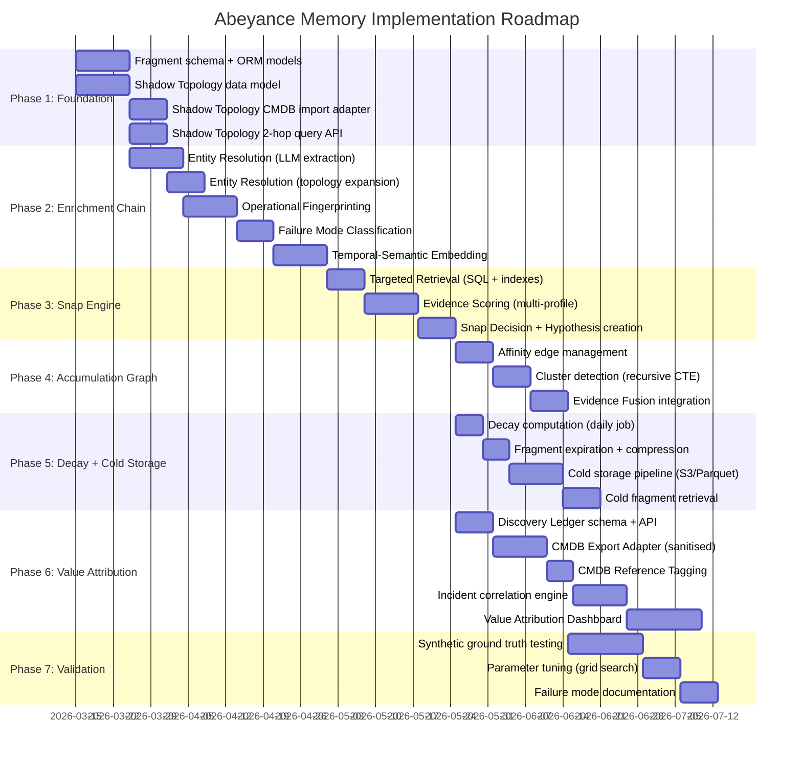

### Complete Task Backlog

| Task ID | Task | Priority | Phase | Depends On |
|---------|------|:--------:|:-----:|-----------|
| **T-AM-01** | Shadow Topology data model (PostgreSQL tables) | 🔴 Critical | 1 | — |
| **T-AM-02** | CMDB snapshot import adapter for Shadow Topology | 🔴 Critical | 1 | T-AM-01 |
| **T-AM-03** | Shadow Topology 2-hop neighbourhood query API | 🔴 Critical | 1 | T-AM-01 |
| **T-AM-04** | CMDB Export Adapter with sanitisation and reference tagging | 🟡 High | 6 | T-AM-01 |
| **T-AM-05** | Shadow Topology enrichment on validated snap | 🟡 High | 3 | T-AM-01 |
| **T-AM-06** | Enrichment value tracking per Shadow entity | 🟢 Medium | 7 | T-AM-05 |
| **T-AM-07** | Discovery Ledger schema and API | 🔴 Critical | 6 | — |
| **T-AM-08** | CMDB reference tagging in export adapter | 🔴 Critical | 6 | T-AM-04 |
| **T-AM-09** | Incident-to-discovery correlation engine | 🟡 High | 6 | T-AM-07, ITSM integration |
| **T-AM-10** | MTTR baseline calculator (pre-PedkAI historical) | 🟡 High | 6 | T-AM-09 |
| **T-AM-11** | Value Attribution Dashboard (quarterly + cumulative) | 🟡 High | 6 | T-AM-09, T-AM-10 |
| **T-AM-12** | Dark Graph Reduction Index calculator | 🟡 High | 6 | T-AM-07 |
| **T-AM-13** | Illumination Ratio tracking | 🟢 Medium | 6 | T-AM-09 |
| **T-AM-14** | Fragment ORM model + schema migration | 🔴 Critical | 1 | — |
| **T-AM-15** | Entity Resolution — LLM structured extraction prompt | 🔴 Critical | 2 | T-AM-14, LLMService |
| **T-AM-16** | Entity Resolution — topology expansion integration | 🔴 Critical | 2 | T-AM-03 |
| **T-AM-17** | Operational Fingerprinting — change window proximity | 🟡 High | 2 | ITSM integration |
| **T-AM-18** | Operational Fingerprinting — vendor upgrade recency | 🟡 High | 2 | Change record ingestion |
| **T-AM-19** | Operational Fingerprinting — traffic cycle position | 🟡 High | 2 | KPI store (TimescaleDB) |
| **T-AM-20** | Failure Mode Classification — rule-based heuristics | 🔴 Critical | 2 | T-AM-15, T-AM-16 |
| **T-AM-21** | Temporal-Semantic Embedding — sub-vector construction | 🔴 Critical | 2 | T-AM-15 through T-AM-20 |
| **T-AM-22** | Temporal sub-vector — sinusoidal time encoding | 🔴 Critical | 2 | — |
| **T-AM-23** | Targeted Retrieval — SQL queries + GIN indexes | 🔴 Critical | 3 | T-AM-14 |
| **T-AM-24** | Evidence Scoring — multi-profile weight system | 🔴 Critical | 3 | T-AM-21 |
| **T-AM-25** | Context-aware temporal weighting function | 🔴 Critical | 3 | T-AM-22 |
| **T-AM-26** | Snap Decision — threshold evaluation + hypothesis creation | 🔴 Critical | 3 | T-AM-24 |
| **T-AM-27** | Accumulation Edge management (create/update) | 🟡 High | 4 | T-AM-26 |
| **T-AM-28** | Cluster detection — recursive CTE implementation | 🟡 High | 4 | T-AM-27 |
| **T-AM-29** | Cluster scoring — Evidence Fusion integration | 🟡 High | 4 | T-AM-28, FusionMethodologyFactory |
| **T-AM-30** | Decay computation — daily scheduled job | 🟡 High | 5 | T-AM-14 |
| **T-AM-31** | Fragment expiration + compression | 🟡 High | 5 | T-AM-30 |
| **T-AM-32** | Cold storage pipeline (S3/Parquet) | 🟡 High | 5 | T-AM-31 |
| **T-AM-33** | Cold fragment retrieval + cold snap bonus | 🟡 High | 5 | T-AM-32 |
| **T-AM-34** | Validation against divergence_manifest.parquet ground truth | 🔴 Critical | 7 | Phases 1–4 complete |
| **T-AM-35** | Parameter tuning — grid search on α, β, τ, thresholds | 🟡 High | 7 | T-AM-34 |
| **T-AM-36** | Failure mode documentation — what AM catches and what it doesn't | 🟡 High | 7 | T-AM-34 |
| **T-AM-37** | pgvector IVFFlat index tuning (lists parameter) | 🟢 Medium | 3 | T-AM-23 |
| **T-AM-38** | Near-miss relevance boost mechanism | 🟡 High | 3 | T-AM-26 |
| **T-AM-39** | API endpoints for abeyance fragment management | 🟡 High | 3 | T-AM-14 |
| **T-AM-40** | API endpoints for Shadow Topology management | 🟡 High | 1 | T-AM-01 |
| **T-AM-41** | API endpoints for Value Attribution reporting | 🟡 High | 6 | T-AM-07 |

### Cross-References to PRODUCT_SPEC Task Backlog

| PRODUCT_SPEC Task | Abeyance Memory Tasks | Status |
|-------------------|----------------------|--------|
| T-016: Abeyance Memory decay scoring and cold storage | T-AM-30, T-AM-31, T-AM-32, T-AM-33 | Specified in this document |
| T-017: FusionMethodologyFactory | T-AM-29 depends on this | External dependency |
| T-026: Abeyance Memory multi-modal matching | T-AM-15, T-AM-16, T-AM-21, T-AM-22 | Specified in this document |
| T-003: Behavioural observation feedback pipeline | T-AM-09 (incident correlation) partially overlaps | Coordinate implementation |

---

## Appendix A: Glossary

| Term | Definition |
|------|-----------|
| **Fragment** | The atomic unit of evidence in Abeyance Memory — any piece of unresolved information from any source |
| **Enrichment Chain** | The 4-step pipeline that transforms raw evidence into telecom-aware intelligence before storage |
| **Snap** | The moment when two or more fragments are recognised as describing the same underlying network truth |
| **Snap Score** | The weighted similarity metric combining semantic, topological, temporal, and operational dimensions |
| **Affinity Edge** | A weak link between two fragments in the Accumulation Graph — below snap threshold but above affinity threshold |
| **Accumulation Graph** | The graph of weak inter-fragment relationships that enables multi-fragment cluster snaps |
| **Shadow Topology** | PedkAI's private, enriched topology graph — the competitive moat |
| **CMDB Export Adapter** | The controlled gateway that sanitises discoveries before pushing to the customer's CMDB |
| **Discovery Ledger** | The permanent accounting record of every PedkAI discovery, for value attribution |
| **Illumination Ratio** | The percentage of customer incidents that touch entities or relationships PedkAI discovered |
| **Dark Graph Reduction Index** | The headline metric: how much of the Dark Graph has PedkAI eliminated |
| **Cold Snap** | A snap involving a fragment older than 180 days — exceptionally high-value discovery |
| **Near-Miss** | A snap evaluation scoring between 0.55 and 0.75 — boosts the stored fragment's relevance |
| **Temporal Sub-Vector** | The 256-dimension portion of the enriched embedding encoding cyclical and operational time |

---

## Appendix B: Key Decisions and Rationale

| Decision | Rationale | Alternatives Rejected |
|----------|-----------|----------------------|
| **Stay on PostgreSQL + pgvector** | No new databases. Operational simplicity. pgvector handles the vector search; PostgreSQL handles the graph queries via recursive CTEs. | Neo4j (operational burden), Pinecone (external dependency), FAISS (no persistence) |
| **LLM for entity extraction, not spaCy/BERT** | PedkAI already has a vendor-neutral LLM abstraction layer. It handles telecom NER better than domain-generic NLP libraries. | spaCy (poor on telecom vocabulary), fine-tuned BERT (training data not available) |
| **No neural network architectures in V1** | Synthetic data realism is the acknowledged Achilles heel (PRODUCT_SPEC §10). Training neural nets on untrusted synthetic data is how you build systems that fail in production. | GNNs, VAEs, siamese networks (all deferred to V2+, after production snap data exists) |
| **Enrichment-time embedding, not query-time** | Pre-computing enriched embeddings at ingestion keeps snap evaluation fast (<100ms). Re-enriching at query time would require Shadow Topology queries on every snap evaluation. | Query-time enrichment (too slow at scale) |
| **Shadow Topology over direct CMDB enrichment** | Protects competitive moat. Customer gets the value (accurate CMDB); PedkAI retains the intelligence (evidence chains, scoring calibration, accumulation state). | Direct CMDB writes (dissolves moat into competitor-accessible CMDB) |
| **Four sub-vectors in enriched embedding** | Enables failure-mode-specific weighting without re-embedding. Dark edge detection can weight topological proximity differently from identity mutation detection. | Single combined embedding (loses per-dimension control) |
| **Event-triggered snap, not batch** | Snaps should happen when evidence arrives, not on a schedule. Batch evaluation misses the immediacy that makes Abeyance Memory operationally useful. | Apache Airflow cron (wrong paradigm for event-driven intelligence) |
| **Noisy-OR/DS for cluster scoring** | Reuses the Evidence Fusion engine already being built for PedkAI (T-017). Dempster-Shafer's explicit handling of ignorance is specifically valuable for sparse multi-fragment clusters. | Custom scoring (reinventing what Evidence Fusion already provides) |
| **CMDB Reference Tags for value attribution** | Lightweight, non-invasive. A text tag in the CMDB record that links back to PedkAI's internal ledger. No schema changes needed in ServiceNow/BMC. | Custom CMDB fields (requires customer schema changes — rejected by procurement) |

---

*Abeyance Memory — PedkAI's Core Differentiator*  
*"The institutional memory your NOC has always needed and never had."*
