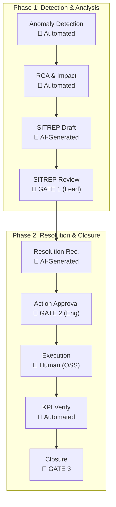

New text

mermaid
```graph TB

    subgraph Row1["Phase 1: Detection & Analysis"]
        direction LR
        A["Anomaly Detection<br/>🤖 Automated"] --> B["RCA & Impact<br/>🤖 Automated"]
        B --> C["SITREP Draft<br/>🤖 AI-Generated"]
        C --> D["SITREP Review<br/>🧑 GATE 1 (Lead)"]
    end

    subgraph Row2["Phase 2: Resolution & Closure"]
        direction LR
        E["Resolution Rec.<br/>🤖 AI-Generated"] --> F["Action Approval<br/>🧑 GATE 2 (Eng)"]
        F --> G["Execution<br/>🧑 Human (OSS)"]
        G --> H["KPI Verify<br/>🤖 Automated"]
        H --> I["Closure<br/>🧑 GATE 3"]
    end

    D --> E
```





graph TB
    %% Top row: Phase 1
    A["Anomaly Detection\n🤖 Automated"]
    B["RCA & Impact\n🤖 Automated"]
    C["SITREP Draft\n🤖 AI-Generated"]
    D["SITREP Review\n🧑 GATE 1 (Lead)"]

    %% Bottom row: Phase 2
    E["Resolution Rec.\n🤖 AI-Generated"]
    F["Action Approval\n🧑 GATE 2 (Eng)"]
    G["Execution\n🧑 Human (OSS)"]
    H["KPI Verify\n🤖 Automated"]
    I["Closure\n🧑 GATE 3"]

    %% Horizontal links for top row
    A --> B --> C --> D

    %% Horizontal links for bottom row
    E --> F --> G --> H --> I

    %% Vertical link connecting rows
    D --> E


```mermaid
graph LR
    %% Top row: Phase 1
    A[Anomaly Detection 🤖 Automated] --> B[RCA & Impact 🤖 Automated] --> C[SITREP Draft 🤖 AI-Generated] --> D[SITREP Review 🧑 GATE 1 (Lead)]

    %% Invisible link to push second row below
    D --- E

    %% Bottom row: Phase 2
    E[Resolution Rec. 🤖 AI-Generated] --> F[Action Approval 🧑 GATE 2 (Eng)] --> G[Execution 🧑 Human (OSS)] --> H[KPI Verify 🤖 Automated] --> I[Closure 🧑 GATE 3]
    ```
