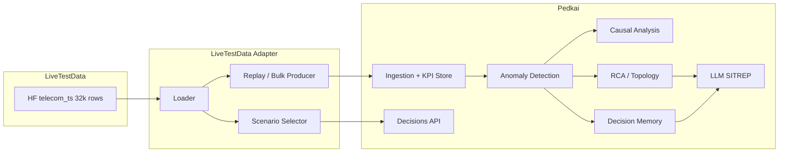

# Plan: Using LiveTestData to Test and Tune All Pedkai Functionality

## 1. Data–Pedkai alignment summary

| LiveTestData (per row)                                              | Pedkai expects                                                 | Mapping approach                                                                                                                            |
| ------------------------------------------------------------------- | -------------------------------------------------------------- | ------------------------------------------------------------------------------------------------------------------------------------------- |
| `KPIs` (dict of lists, ~127 points @ 10 Hz)                         | `entity_id`, `metrics` dict (name → single value), `timestamp` | Replay: one event per timestep, or bulk insert with distinct timestamps                                                                     |
| Numeric KPIs (RSRP, DL_BLER, UL_MCS, TX_Bytes, …)                   | `KPIMetricORM`: float `value`                                  | Use as-is; 20 numeric series per row                                                                                                        |
| `UL_Protocol` / `DL_Protocol` (string lists)                        | Anomaly detector uses `float(value)`                           | Omit from anomaly path, or encode (e.g. TCP=1) for optional tests                                                                           |
| `anomalies.exists`, `anomalies.type`, `affected_kpis`               | Ground truth for detection/RCA                                 | Validation: compare detector output vs these labels                                                                                         |
| `description`, `QnA`, `troubleshooting_tickets`                     | Decision context, SITREP, similar-decisions                    | Feed into DecisionTrace context; use as expected reference for LLM contract tests                                                           |
| `labels` (zone, application, mobility, congestion, anomaly_present) | Topology (entity/site), scenario tagging                       | Synthetic `entity_id` (e.g. `CELL_LIVE_{zone}_{idx}`); optional topology seed from zones                                                    |
| `statistics` (mean, variance, trend, periodicity per KPI)           | Causal/Granger, baseline checks                                | Validate causal outputs and baseline stability                                                                                              |
| No explicit graph (no cell/site IDs)                                | RCA `analyze_incident(entity_id)`                              | Optional: seed minimal topology (e.g. Zone → cells) so RCA has something to traverse; or run RCA tests with “entity not in graph” behaviour |

**Entity semantics:** Treat each row as one logical observation point (e.g. cell or UE session) per adapter contract; the adapter docstring must state whether `entity_id` is cell-level or session-level for operator clarity.

**Replay timestamp rule:** Derive each event’s `timestamp` deterministically as `start_time + (index / sampling_rate)` so replay is deterministic and re-runs hit the same PK for idempotency (TC-002).

**Conclusion:** The dataset can drive **all** Pedkai layers. A single **LiveTestData adapter** (loader + event/sample producer) plus a **scenario selector** (by `labels` and `anomalies.type`) will be the main integration point.

---

## 2. Architecture: adapter and test layers

- **Loader:** Load `AliMaatouk/telecom_ts` (or local cache), return rows with schema aligned to [LiveTestData/dataset_info_pretty.json](LiveTestData/dataset_info_pretty.json).
- **Replay / Bulk producer:** Emit events in the shape expected by [data_fabric/event_handlers.py](data_fabric/event_handlers.py) (`entity_id`, `tenant_id`, `metrics`, `timestamp`) — either one event per timestep (KPI replay at `sampling_rate`) or bulk insert of (entity_id, metric_name, value, timestamp) for each KPI series.
- **Scenario selector:** Filter rows by `labels` and `anomalies.type` (e.g. “Jamming”, “Congestion”, normal) for scenario-based regression and demo.

---

## 3. Per-layer test plan (all testable with LiveTestData)

### 3.1 Layer 1: Data ingestion and storage (TC-001–TC-009)

- **Source:** LiveTestData rows → adapter produces `(tenant_id, entity_id, metric_name, value, timestamp)`.
- **Entity strategy:** One logical entity per row, e.g. `entity_id = f"CELL_LIVE_{row['labels']['zone']}_{idx}"` (or `CELL_LIVE_{idx}`) so bulk and replay tests are consistent.
- **Deterministic timestamps and idempotency:** Adapter must emit deterministic `timestamp` per (row, timestep_index), e.g. `start_time + timedelta(seconds=index/sampling_rate)`, so re-runs and duplicate replays hit the same PK and are idempotent.
- **Bulk insert shape:** One LiveTestData row = one entity × 127 timesteps × 20 numeric KPIs = 2,540 metric rows. For TC-003, 10k points = e.g. 4 full rows (4 × 2,540) or 80 rows × 127 timesteps × 1 metric; state exact row count and schema (tenant_id, entity_id, metric_name, value, timestamp) for repeatable performance.
- **Replay time compression:** Adapter supports “replay time compression”: emit 127 points with configurable inter-event spacing (e.g. 0.1 s in test time, or bulk insert with real inter-sample interval) so tests do not run in real-time; production ingestion rate may differ.
- **Coverage:**
  - TC-001/002: Persist metrics, idempotent duplicates (same PK) via `on_conflict_do_nothing`; add test that replays same row twice and asserts no duplicate SITREPs.
  - TC-003: Bulk insert 10k+ points in &lt; 5 s (exact count as above).
  - TC-006: Reject or skip NULL/NaN (adapter drops or fills before send); optional fixture scans N rows and fails if null rate exceeds X% for critical KPIs (data quality report).
  - TC-007: Concurrent writes from multiple `entity_id`s (multiple rows in parallel).
  - TC-008/009: Schema/init unchanged; use LiveTestData only as data source.

**Deliverable:** Fixture in `tests/conftest.py` or `tests/data/live_test_data.py`: load N rows, convert to list of metric rows for bulk insert and to event payloads for `handle_metrics_event`; optional data quality report (per-KPI null count, max/min).

---

### 3.2 Layer 2: Context graph / topology (TC-010–TC-018)

- **Gap:** Dataset has no cell/site/customer IDs; only `labels.zone` (e.g. A, B, C).
- **Options:**
  - **A (recommended):** Seed a minimal topology: e.g. `Zone A → CELL_LIVE_A_*`, `Zone B → CELL_LIVE_B_*`, and optionally attach a shared “Customer” or “SLA” for RCA impact. Use [anops/seed_topology.py](anops/seed_topology.py) or equivalent to create `NetworkEntityORM` / `EntityRelationshipORM` for these IDs so `analyze_incident("CELL_LIVE_A_0")` returns upstream/downstream.
  - **B:** Use LiveTestData only for metric/causal/LLM tests; keep topology tests on existing `seed_topology.py` + synthetic entities.
- **Coverage with Option A:** TC-010–TC-015 (seed, get_entity, get_relationships, analyze_incident), TC-016 (multi-tenant: different `tenant_id` per zone or dataset split), TC-017 (deeper chain if you add Site → Zone → Cell). TC-018 (circular graph) remains synthetic.

**Deliverable:** Script or fixture that seeds zone-based topology and maps `entity_id` from adapter to these entities.

---

### 3.3 Layer 3: Anomaly detection (TC-020–TC-029, TC-027a)

- **Source:** Per-row KPI series; feed into [anops/anomaly_detection.py](anops/anomaly_detection.py) via `process_metric` (replay) or bulk insert then run detector on “current” value.
- **Numeric-only:** Send only numeric KPI keys (exclude `UL_Protocol`, `DL_Protocol` or encode them if you add protocol-based tests later). Document if z-score threshold (3σ) is tuned for RAN ranges (e.g. RSRP -120 to -60 dBm).
- **Ground truth and pass criteria:** (a) For rows with `anomaly.exists=True`, detector must raise ≥1 anomaly on any `affected_kpis` metric (RAN validation: for Jamming rows, at least one of RSRP/UL_BLER/DL_BLER or dataset `affected_kpis` flagged). (b) Aggregate anomaly rate over a fixed “normal” subset is within [X%, Y%] (e.g. TC-026 &lt; 5%); allow benign variance and document in test.
- **Coverage:**
  - TC-020/021: Use rows with known anomaly and affected KPIs; assert z-score behaviour on those metrics.
  - TC-022/023: Baseline cache TTL with repeated replay from same entity.
  - TC-024/025: Use a row with very few points or constant series (or synthesize one row).
  - TC-026: Subset of “normal” or mixed rows; assert anomaly rate &lt; 5%.
  - TC-027: Rapid replay of one row’s timesteps for one entity.
  - **Anomaly-window test:** Replay a row with known `anomaly_duration.start/end`; assert at least one anomaly is raised within that index range (no “anomaly only after the fact”).
  - TC-028: Single `process_metric` call stores and returns anomaly result.
  - TC-029: RSRP (negative dBm) already in dataset; use as-is.
  - TC-027a: Two tenants, same detector; different `tenant_id` per entity; assert baseline isolation.
  - **Negative:** Row with all NaN for a critical KPI is either skipped or triggers a defined error path (no silent drop); assert in test.

**Deliverable:** Tests in `tests/unit/test_anomaly_detection.py` or `tests/validation/test_live_data_anomaly.py` that use adapter output and ground-truth labels.

---

### 3.4 Layer 4: Causal AI (TC-030–TC-045)

- **Source:** Same entity’s metrics over time. Each row has ~127 points; [anops/causal_analysis.py](anops/causal_analysis.py) requires `MIN_OBSERVATIONS = 100`. So one row per entity is enough for one Granger run.
- **Flow:** Ingest one full row (all timesteps) for one `entity_id` into `kpi_metrics`, then call `CausalAnalyzer.find_causes_for_anomaly(entity_id, anomalous_metric)`.
- **Ground truth:** `anomalies.affected_kpis` and `statistics` (trend/periodicity); optional: QnA answers for “trend” and “period length” to check causal/consistency.
- **Coverage:**
  - TC-030/031: Short series (&lt; 100) vs 100+ from one row.
  - TC-032/033/034/035/036: Use rows with clear anomaly (e.g. Jamming) and check that affected KPIs appear in causal results where expected; non-causal pairs from independent rows.
  - TC-037: Constant series (e.g. DL_MCS=7 in firstrow); ensure no crash.
  - TC-038/039: `get_available_metrics` after ingesting one row (expect many metrics); unknown entity returns [].
  - TC-040/041: Self-causation skipped; sort by p-value.
  - TC-042: Use rows where RSRP and throughput (e.g. TX_Bytes/RX_Bytes) vary; expect RSRP → throughput causality where applicable.
  - TC-043: Row has 20+ metrics; run Granger within timeout.
  - TC-044/045: Short series and seasonal behaviour; use subset or synthetic if needed.

**Deliverable:** Tests in `tests/unit/test_causal_analysis.py` or `tests/validation/test_live_data_causal.py` using adapter + ingested row(s).

---

### 3.5 Layer 5: Decision memory and RLHF (TC-050–TC-064)

- **Source:** `description`, `anomalies.troubleshooting_tickets`, `labels`, `QnA` → build `DecisionTraceCreate` and optional feedback.
- **Flow:** Adapter converts a row to `DecisionTraceCreate` (trigger_description from `description`, context with labels, troubleshooting_tickets, kpi_snapshot from statistics); POST to `/decisions` or use `DecisionTraceRepository.create`. Then upvote/downvote and `find_similar`.
- **Coverage:** TC-050–TC-058 (create, find_similar, feedback, upsert, aggregate score), TC-059/059a (many upvotes, bounded boost), TC-060–TC-063 (non-existent decision, multi-tenant, embedding consistency, no embedding), TC-064 (round-trip JSONB). Use LiveTestData rows as rich context for similarity and feedback tests.

**Deliverable:** Fixture that builds `DecisionTraceCreate` from a row; tests in `tests/unit/test_decision_repository.py` or `tests/api/test_decisions_api.py` using these payloads.

---

### 3.6 Layer 6: LLM SITREP (TC-070–TC-076)

- **Source:** `rca_results` can be mocked or come from RCA seeded with zone topology; `causal_evidence` from CausalAnalyzer; `similar_decisions` from decision memory seeded with LiveTestData rows; incident context can include `description` and `troubleshooting_tickets`.
- **Ground truth:** `description` and `QnA` (and optionally `troubleshooting_tickets`) as reference for contract checks (SITREP sections, causal language, no fabrication).
- **Coverage:** TC-070–TC-073 (sections, causal wording, empty causal/similar), TC-074/076 (no API key, timeout). Use one or more rows to build a stable incident context for contract tests.

**Deliverable:** Contract tests that build context from LiveTestData row(s) and assert SITREP structure and wording (with mocked LLM if needed).

---

### 3.7 Layer 7: E2E pipeline (TC-080–TC-088)

- **Source:** Adapter emits events in the format consumed by [data_fabric/event_handlers.py](data_fabric/event_handlers.py); handler calls AnomalyDetector, then RCA, CausalAnalyzer, DecisionTraceRepository, LLM. Use replay time compression so tests do not run in real-time.
- **Coverage:**
  - TC-080: Normal row → no anomaly → quick return.
  - TC-081: Anomalous row → RCA → Causal → SITREP (with topology seeded for RCA).
  - TC-082: Row with multiple affected KPIs → all investigated.
  - TC-083: Unknown `entity_id` (not in graph) → RCA “not found”, pipeline continues.
  - TC-084: Full pipeline on a subset of LiveTestData (ingest → detect → RCA → SITREP).
  - TC-085/086: Adapter sends `entity_id=None` or `metrics={}` for robustness.
  - TC-087: Alarm storm: replay 50 entities (default acceptance threshold) in 10 s; no deadlock, no duplicate SITREPs, complete in &lt; 120 s; optional stress level 200 entities for pre-release capacity runs.
  - TC-088: Latency budget: single event → SITREP in &lt; 30 s (95th percentile). When using real LLM (non-mocked), baseline the 95th percentile once with LiveTestData and document; if it exceeds 30 s, tune or flag as known gap.

**Deliverable:** E2E tests in `tests/integration/test_event_pipeline.py` or `tests/validation/test_live_data_e2e.py` that use adapter + optional topology seed.

---

### 3.8 Layer 8: API (TC-090–TC-096)

- **Source:** Decision payloads derived from LiveTestData (as in Layer 5); optional metrics/health if you add KPI read endpoints.
- **Coverage:** POST/GET `/decisions`, upvote/downvote, 404, POST `/similar` with LiveTestData-backed traces.

**Deliverable:** Reuse or extend [backend/app/api/decisions.py](backend/app/api/decisions.py) tests with payloads from adapter.

---

### 3.9 Demo scenarios (demo/scenarios.py and test_demo_scenario.py)

- **Source:** Replace or augment seed data with LiveTestData: pick rows by `anomalies.type` (e.g. Jamming) and `labels` (e.g. zone, congestion).
- **Mapping and acceptance:**
  - **Scenario 1 (happy path):** Use row(s) with `anomaly_present=No` or mild anomaly; entity mapped to Cell-99 or equivalent in seeded topology/BSS.
  - **Scenario 2 (amorphous / entity inference):** Use row with `labels.application` and `labels.zone`; `affected_entities`-style context; impact customer from BSS.
  - **Scenario 3 (cumulative risk):** Use several rows or repeated decisions with `context.predicted_revenue_loss` from labels or fixed values; assert policy block.
  - **Demo acceptance criterion:** SITREP for a chosen Jamming row must mention interference/jamming and affected KPIs in line with `troubleshooting_tickets`.
- **Deliverable:** Option in [demo/seed_data.py](demo/seed_data.py) or new `demo/seed_live_test_data.py` to load N rows and seed topology + decisions; [demo/test_demo_scenario.py](demo/test_demo_scenario.py) runs scenarios against LiveTestData-backed DB.

---

### 3.10 Kafka and stress (TC-100–TC-107, backpressure, alarm storm)

- **Source:** Adapter produces event stream (one event per timestep per row, or batched). Kafka producer sends to `pedkai.metrics`; consumer runs `handle_metrics_event`.
- **Coverage:** TC-100–TC-107 (connect, idempotent duplicate, out-of-order, retry, offset resume, backpressure, malformed JSON, missing topic). TC-105 (10k events drain ≥ 100/s) and TC-087 (50 entities default; optional 200 for capacity) use LiveTestData replay.
- **Runbook/observability:** Document in runbook or script: required resources (DB pool, Kafka partitions), expected duration, how to abort/cleanup; add simple health check before/after (e.g. /health, metric row count) so ops can confirm state.

**Deliverable:** Integration tests that publish adapter-generated events to Kafka and assert consumer behaviour; optional script `scripts/replay_live_test_data_kafka.py` for manual stress runs; runbook with resources and health checks.

---

## 4. Implementation order and files

- **Smoke subset vs full run:** Validation/E2E use a **smoke subset** (e.g. 100–500 rows) by default; separate CI or manual job for “full 32k” or sampled 10%. Loader may partition or chunk for memory safety.
- **CI and cache:** Unit and integration tests using LiveTestData must be CI-runnable without external HuggingFace dependency if dataset is cached (e.g. `tests/data/cache/` or env var `LIVETESTDATA_CACHE`); document cache refresh and version pin (dataset name/tag, e.g. `AliMaatouk/telecom_ts`).

1. **LiveTestData adapter (new)**
  - `LiveTestData/loader.py` (or `tests/data/live_test_data_loader.py`): load dataset (HuggingFace or local cache), return list of row dicts.  
  - Same module or `LiveTestData/adapter.py`: `row_to_metric_events(row, entity_id_fn, tenant_id)`, `row_to_bulk_metrics(row, ...)`, `row_to_decision_context(row)` for DecisionTraceCreate, and `get_scenario_rows(dataset, anomaly_type=None, zone=None)`.
2. **Conftest / fixtures**
  - In [tests/conftest.py](tests/conftest.py): `live_test_data_rows`, `live_test_metric_events`, `live_test_bulk_metrics`, optional `live_test_topology_seed` (zone → cells).
3. **Unit tests**
  - Wire existing or new tests for anomaly (3.3), causal (3.4), decision memory (3.5), LLM contract (3.6) to use adapter outputs and ground truth from rows.
4. **Integration / E2E**
  - Data ingestion (3.1), event pipeline (3.7), Kafka (3.10) using adapter and optional topology.
5. **Demo**
  - Seed and scenario selection from LiveTestData (3.9).
6. **Validation suite**
  - `tests/validation/test_live_data_*.py`: TC-026, TC-042, TC-084 and any “real-world” marker tests, all driven by LiveTestData.

---

## 5. Data gaps and when to ask for more

- **Topology:** No cell/site/customer IDs. Option A (zone-based synthetic topology) is enough for RCA and E2E; if you want real site IDs, you’d need a separate mapping or dataset.
- **String KPIs (UL_Protocol, DL_Protocol):** Omitted from anomaly/causal by default. **Follow-up:** Protocol encoding (categorical → int) is in scope for a later iteration so protocol mix can be used in causal and decision context.
- **Data quality:** Adapter or loader should produce an optional **data quality report** (per-KPI null count, max/min, one-row sample) for the chosen subset; optional fixture fails if null rate exceeds X% for critical KPIs.
- **Anomaly type variety:** First row is “Jamming”. If the 32k rows include other types (e.g. Congestion, Mobility), no extra data needed for scenario coverage; if not, we can still test with Jamming + normal and document that other types are synthetic.
- **Larger stress (10k+ entities):** 32k rows can represent 32k entities; for very large Kafka/backpressure tests, we can reuse rows with different `entity_id` or repeat with offset; no extra dataset required unless you need more distinct “episodes”.

**If you need more data for specific aspects:** (1) Multiple anomaly types — confirm whether 32k rows already contain Congestion/Mobility/etc.; (2) Real topology — provide a small mapping (e.g. zone/site/cell IDs) or second dataset; (3) Longer series for Granger — current ~127 points is sufficient; for &gt; 1 year of 10 Hz you’d need another source.

---

## 6. Summary

- **Business impact:** Testing with vendor-provided real telecom traces reduces risk of field surprises (anomaly semantics, KPI correlations, operator-facing explanations) and supports acceptance criteria for pilots.
- **One adapter** loads LiveTestData and produces metric events, bulk metrics, and decision context; **scenario selector** filters by anomaly type and labels.
- **All Pedkai functionality** (ingestion, anomaly, causal, RCA, decision memory, LLM SITREP, API, demo, Kafka, stress) can be tested and tuned with this dataset.
- **Regression vs tuning:** Regression tests use fixed assertions (no tuning). Tuning runs (e.g. z-score threshold, Granger lag) must have results captured in config or docs so regression stays stable.
- **Optional topology seed** (zone → cells) enables full RCA and E2E; without it, RCA tests remain “entity not in graph” or use existing synthetic topology.
- **No additional data is strictly required** for the plan; only clarify topology preference and anomaly-type coverage if you want to prioritise certain tests.

---

## 7. Committee review and recommended amendments

The following feedback from Core Network, RAN, Big Data, Business Strategy, Ops, and QA leads is intended to harden the plan before implementation.

### 7.1 Core network expert

- **Timestamp and ordering:** The plan does not specify how `start_time` / `end_time` and per-sample timestamps are derived when replaying. In core networks, out-of-order and clock skew are critical. **Add:** Explicit rule: derive each event’s `timestamp` from `start_time` + (index / `sampling_rate`) so replay is deterministic; add a test that replays the same row twice with different “wall clock” and asserts idempotency (TC-002) and no duplicate SITREPs.
- **Protocol KPIs:** Dropping `UL_Protocol` / `DL_Protocol` loses information that often correlates with core issues (e.g. TCP vs UDP vs mixed). **Add:** In Section 5 (Data gaps), state that protocol encoding (e.g. categorical → int) should be in scope for a follow-up iteration so protocol mix can be used in causal and decision context.
- **Entity semantics:** `CELL_LIVE_*` implies RAN cell; the dataset may be UE/session-centric. **Add:** One sentence in Section 1 or 3.1: “Treat each row as one logical observation point (e.g. cell or UE session) per adapter contract; document in adapter docstring whether entity_id is cell-level or session-level for operator clarity.”

### 7.2 RAN expert

- **KPI semantics:** RSRP, BLER, MCS, PRB are RAN-native; the plan correctly uses them. **Add:** In 3.3 (anomaly), add an explicit validation: for rows labelled Jamming, at least one of RSRP/UL_BLER/DL_BLER (or dataset `affected_kpis`) should be flagged by the detector; document if z-score threshold (3σ) is tuned for RAN ranges (e.g. RSRP -120 to -60 dBm).
- **Sampling rate:** 10 Hz is high for typical PM; 15 min is common. **Add:** In 3.1 or adapter spec: support “replay time compression” (e.g. emit 127 points with 0.1 s spacing in test time, or bulk insert with real inter-sample interval) so tests don’t run in real-time; document that production ingestion rate may differ.
- **Baseline vs anomaly window:** Detector baseline is historical; in the dataset the anomaly has a defined `anomaly_duration.start/end`. **Add:** In 3.3, add a test that replays a row with known anomaly window and asserts that at least one anomaly is raised within that window (index range), to avoid “anomaly only after the fact” behaviour.

### 7.3 Big data guru

- **Bulk insert shape:** TC-003 says “~80 rows × 127 timesteps” but the natural shape is one row = one entity × 127 timesteps × 20 metrics = 2,540 rows per LiveTestData row. **Add:** Clarify: “10k points = e.g. 4 full rows (4 × 2,540) or 80 rows × 127 timesteps × 1 metric”; state the exact bulk insert row count and schema (tenant_id, entity_id, metric_name, value, timestamp) so performance is repeatable.
- **Idempotency key:** `on_conflict_do_nothing` uses (tenant_id, entity_id, metric_name, timestamp). **Add:** In 3.1, state that adapter must emit deterministic timestamps per (row, timestep_index) so that re-runs and duplicate replays hit the same PK and are idempotent.
- **Data quality:** TC-006 (NULL/NaN) is adapter-side. **Add:** In adapter spec, require a “data quality report” for the chosen subset (e.g. per-KPI null count, max/min, one row sample) so we know what we’re testing; add an optional fixture that scans N rows and fails if null rate exceeds X% for critical KPIs.
- **Scale and partitioning:** 32k entities × 127 × 20 ≈ 81M metric rows if fully ingested. **Add:** In Section 5 or 4, state that validation/E2E should use a “smoke subset” (e.g. 100–500 rows) by default, with a separate CI or manual job for “full 32k” or sampled 10%; document any partitioning or chunking in the loader for memory safety.

### 7.4 Business strategist

- **Value of testing with real data:** The plan should articulate why LiveTestData improves confidence vs synthetic. **Add:** Short “Business impact” bullet in Section 6: “Testing with vendor-provided real telecom traces reduces risk of field surprises (anomaly semantics, KPI correlations, and operator-facing explanations) and supports acceptance criteria for pilots.”
- **Demo and acceptance:** Demo scenarios (3.9) drive stakeholder acceptance. **Add:** Explicitly tie Scenario 1–3 to LiveTestData: “Scenario 1 uses row(s) with anomaly_present=No or mild anomaly; Scenario 2 uses a row with labels.application and zone; Scenario 3 uses rows or repeated decisions with revenue-impact context”; and add a demo acceptance criterion: “SITREP for a chosen Jamming row must mention interference/jamming and affected KPIs in line with troubleshooting_tickets.”
- **Tuning vs regression:** Plan says “test and tune”. **Add:** Distinguish “regression tests” (fixed assertions, no tuning) from “tuning runs” (e.g. threshold or model params); state that tuning results (e.g. z-score threshold, Granger lag) should be captured in config or docs so regression stays stable.

### 7.5 Ops director

- **Runbook and observability:** Replay and stress tests (3.10, TC-087) can impact DB and Kafka. **Add:** In 3.10 deliverable: “Document in runbook or script: required resources (DB pool, Kafka partitions), expected duration, and how to abort/cleanup; add a simple health check before/after (e.g. /health, metric row count) so ops can confirm state.”
- **Alarm storm (TC-087):** “50 entities in 10 s” is good; real storms can be 100s of cells. **Add:** Make 50 the default; add an optional “stress level” (e.g. 200 entities) for pre-release or capacity runs, with a note that 50 is the acceptance threshold.
- **SITREP latency (TC-088):** 30 s is the SLA. **Add:** In 3.7, note that when using real LLM (non-mocked), baseline the 95th percentile once with LiveTestData and document it; if it exceeds 30 s, either tune (e.g. sampling, model size) or flag as known gap until optimisation.

### 7.6 QA director

- **Traceability:** Each test case (TC-xxx) should map to at least one concrete test file and, where applicable, one or more LiveTestData row criteria (e.g. “TC-026: test_live_data_anomaly.py, rows with anomaly_present=No”). **Add:** A short “Test traceability” table or appendix: TC-ID → test module → data selector (e.g. “normal rows”, “Jamming rows”, “row 0”).
- **Ground truth and variance:** Anomaly “ground truth” is vendor-labelled; detector may use z-score and see different anomalies. **Add:** In 3.3: “Define pass criteria: (a) for rows with anomaly.exists=True, detector raises ≥1 anomaly on any affected_kpis metric, or (b) aggregate anomaly rate over a fixed subset is within [X%, Y%]”; allow for benign variance and document in test.
- **Regression and CI:** Plan mentions pytest and validation suite. **Add:** In Section 4: “Unit and integration tests using LiveTestData must be CI-runnable without external HuggingFace dependency if dataset is cached (e.g. tests/data/cache/ or env var); document cache refresh and version pin (dataset name/tag).”
- **Negative tests:** TC-085/086 (null entity_id, empty metrics) are adapter-driven. **Add:** Explicit negative test: “Row with all NaN for a critical KPI is either skipped or triggers a defined error path (no silent drop); assert behaviour in test.”

---

## 8. Test traceability (TC-ID → test module → data selector)

| TC-ID          | Test module                           | Data selector                                    |
| -------------- | ------------------------------------- | ------------------------------------------------ |
| TC-001, TC-002 | test_live_data_ingestion.py           | Any row; duplicate replay same row               |
| TC-003         | test_live_data_ingestion.py           | 4 full rows (2,540 × 4) or 80×127×1 metric       |
| TC-006         | test_live_data_ingestion.py / adapter | Rows with NaN; optional null-rate guard          |
| TC-020, TC-021 | test_live_data_anomaly.py             | Rows with anomaly + affected_kpis                |
| TC-026         | test_live_data_anomaly.py             | Normal rows (anomaly_present=No) or mixed subset |
| TC-027         | test_live_data_anomaly.py             | Single row, rapid replay                         |
| TC-028         | test_live_data_anomaly.py             | Single row, one process_metric                   |
| TC-029         | test_live_data_anomaly.py             | Any row (RSRP present)                           |
| TC-027a        | test_live_data_anomaly.py             | Two tenants, same row different tenant_id        |
| TC-080         | test_live_data_e2e.py                 | Normal row                                       |
| TC-081         | test_live_data_e2e.py                 | Jamming (or anomalous) row                       |
| TC-084         | test_live_data_e2e.py                 | Smoke subset (100–500 rows)                      |
| TC-085, TC-086 | test_live_data_e2e.py                 | Adapter emits entity_id=None, metrics={}         |
| TC-087         | test_live_data_e2e.py / stress        | 50 entities (default), optional 200              |
| TC-088         | test_live_data_e2e.py                 | Single event, timed                              |

*Amendments from Section 7 have been integrated into sections 1, 3.1, 3.3, 3.7, 3.9, 3.10, 4, 5, and 6 above.*