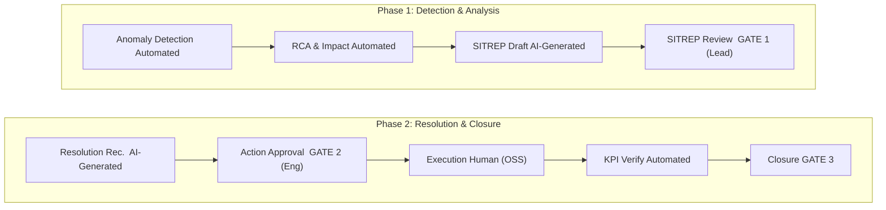

```mermaid
graph LR

    subgraph Phase 2: Resolution & Closure
    direction LR
    E["Resolution Rec.  AI-Generated"] --> F["Action Approval  GATE 2 (Eng)"] --> G["Execution  Human (OSS)"] --> H["KPI Verify  Automated"] --> I["Closure  GATE 3"]
    end

    subgraph Phase 1: Detection & Analysis
    direction LR
    A["Anomaly Detection  Automated"] --> B["RCA & Impact  Automated"] --> C["SITREP Draft  AI-Generated"] --> D["SITREP Review  GATE 1 (Lead)"]
    end

```