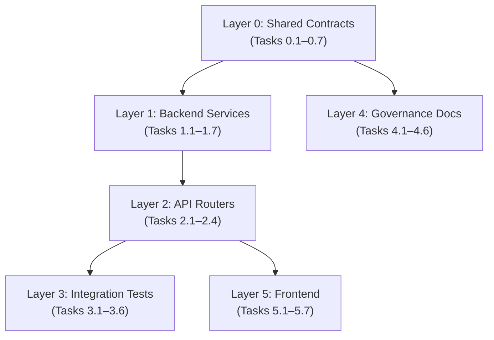

# Pedkai — Agentic Development Plan

**Purpose**: This document breaks the [implementation_plan_v3_updated.md](file:///Users/himanshu/Library/CloudStorage/GoogleDrive-himanshu@htadvisers.co.uk/My%20Drive/AI%20Learning/AntiGravity/Pedkai/implementation_plan_v3_updated.md) into fully isolated, self-contained tasks that can be executed by less capable AI models (Sonnet, Gemini Flash). Each task has zero dependencies on any other task's completion unless explicitly stated.

**How to use**: Give any single task block (everything between two `---` separators) as a prompt to an AI coding agent. Each block contains everything the agent needs: context, exact file paths, function signatures, what to import, and how to verify success.

> [!IMPORTANT]
> **Execution order matters.** Tasks are grouped into layers. Complete **all tasks in Layer 0** before starting Layer 1, all of Layer 1 before Layer 2, etc. Within a layer, tasks can run in **any order or in parallel** — they are fully independent of each other.

> [!TIP]
> **After each task completes**, run the verification command at the bottom of that task. If it passes, move on. If not, re-prompt the same task with the error output.

---

## Layer 0 — Shared Contracts (MUST complete first)

These tasks create the shared schemas, enums, and interfaces that all subsequent tasks import. They touch only new files and do not modify any existing code.

---

### Task 0.1: Incident Lifecycle Enums and Schemas

**What**: Create the shared enums and Pydantic schemas for the incident lifecycle that WS1, WS2, WS3, and WS4 all depend on.

**File to create**: `backend/app/schemas/incidents.py`

**Exact content to produce**:

```python
"""
Incident Lifecycle Schemas and Enums.

Shared contract used by: WS1 (topology), WS2 (incidents), WS3 (frontend), WS4 (correlation).
DO NOT modify this file without checking all consumers.
"""
from enum import Enum
from typing import Optional, List, Dict, Any
from uuid import UUID
from datetime import datetime
from pydantic import BaseModel, Field


class IncidentStatus(str, Enum):
    """Incident lifecycle stages. Three stages require human gate approval."""
    ANOMALY = "anomaly"
    DETECTED = "detected"
    RCA = "rca"
    SITREP_DRAFT = "sitrep_draft"
    SITREP_APPROVED = "sitrep_approved"      # Human Gate 1
    RESOLVING = "resolving"
    RESOLUTION_APPROVED = "resolution_approved"  # Human Gate 2
    RESOLVED = "resolved"
    CLOSED = "closed"                          # Human Gate 3
    LEARNING = "learning"


class IncidentSeverity(str, Enum):
    CRITICAL = "critical"  # P1
    MAJOR = "major"        # P2
    MINOR = "minor"        # P3
    WARNING = "warning"    # P4


class ReasoningStep(BaseModel):
    """A single step in the AI reasoning chain."""
    step_number: int
    description: str
    evidence: Optional[str] = None
    confidence: float = Field(0.0, ge=0.0, le=1.0)
    source: Optional[str] = None  # e.g., "topology_graph", "kpi_data", "decision_memory"


class IncidentCreate(BaseModel):
    tenant_id: str
    title: str
    severity: IncidentSeverity
    entity_id: Optional[UUID] = None
    entity_external_id: Optional[str] = None


class IncidentResponse(BaseModel):
    id: UUID
    tenant_id: str
    title: str
    severity: IncidentSeverity
    status: IncidentStatus
    entity_id: Optional[UUID] = None
    reasoning_chain: Optional[List[ReasoningStep]] = None
    resolution_summary: Optional[str] = None
    created_at: datetime
    updated_at: Optional[datetime] = None
    # Audit fields
    sitrep_approved_by: Optional[str] = None
    sitrep_approved_at: Optional[datetime] = None
    action_approved_by: Optional[str] = None
    action_approved_at: Optional[datetime] = None
    closed_by: Optional[str] = None
    closed_at: Optional[datetime] = None
    llm_model_version: Optional[str] = None

    class Config:
        from_attributes = True


class ApprovalRequest(BaseModel):
    """Request body for human gate approval endpoints."""
    approved_by: str
    reason: Optional[str] = None


class AuditTrailEntry(BaseModel):
    timestamp: datetime
    action: str
    actor: str
    details: Optional[str] = None
    llm_model_version: Optional[str] = None
    llm_prompt_hash: Optional[str] = None
```

**Verification**:
```bash
cd "/Users/himanshu/Library/CloudStorage/GoogleDrive-himanshu@htadvisers.co.uk/My Drive/AI Learning/AntiGravity/Pedkai"
python -c "from backend.app.schemas.incidents import IncidentStatus, IncidentSeverity, IncidentCreate, IncidentResponse, ApprovalRequest; print('✅ Incident schemas OK')"
```

---

### Task 0.2: Topology API Schemas

**What**: Create shared Pydantic schemas for topology endpoints that WS1 and WS3 both consume.

**File to create**: `backend/app/schemas/topology.py`

```python
"""
Topology API Schemas.

Shared contract used by: WS1 (topology API), WS3 (frontend), WS4 (correlation).
"""
from typing import Optional, List, Dict, Any
from uuid import UUID
from datetime import datetime
from pydantic import BaseModel, Field


class EntityResponse(BaseModel):
    """A single network entity in the topology graph."""
    id: UUID
    external_id: str
    name: str
    entity_type: str
    tenant_id: str
    properties: Optional[Dict[str, Any]] = None
    last_synced_at: Optional[datetime] = None

    class Config:
        from_attributes = True


class RelationshipResponse(BaseModel):
    """A relationship between two entities."""
    id: UUID
    source_entity_id: UUID
    target_entity_id: UUID
    relationship_type: str
    properties: Optional[Dict[str, Any]] = None

    class Config:
        from_attributes = True


class TopologyGraphResponse(BaseModel):
    """Full topology graph for a tenant."""
    tenant_id: str
    entities: List[EntityResponse]
    relationships: List[RelationshipResponse]
    topology_health: Optional["TopologyHealth"] = None


class TopologyHealth(BaseModel):
    """Topology staleness and completeness metrics."""
    total_entities: int
    stale_entities: int  # Entities where last_synced_at > threshold
    completeness_pct: float = Field(ge=0.0, le=100.0)
    staleness_threshold_minutes: int = 60


class ImpactTreeNode(BaseModel):
    """A node in the impact analysis tree."""
    entity_id: UUID
    entity_name: str
    entity_type: str
    external_id: str
    direction: str  # "upstream" or "downstream"
    relationship_type: str
    depth: int
    children: Optional[List["ImpactTreeNode"]] = None
    revenue_at_risk: Optional[float] = None


class ImpactTreeResponse(BaseModel):
    """Impact analysis result."""
    root_entity_id: UUID
    root_entity_name: str
    root_entity_type: str
    upstream: List[ImpactTreeNode]
    downstream: List[ImpactTreeNode]
    total_customers_impacted: int = 0
    total_revenue_at_risk: Optional[float] = None


# Rebuild forward refs
TopologyGraphResponse.model_rebuild()
ImpactTreeNode.model_rebuild()
```

**Verification**:
```bash
cd "/Users/himanshu/Library/CloudStorage/GoogleDrive-himanshu@htadvisers.co.uk/My Drive/AI Learning/AntiGravity/Pedkai"
python -c "from backend.app.schemas.topology import TopologyGraphResponse, ImpactTreeResponse, TopologyHealth; print('✅ Topology schemas OK')"
```

---

### Task 0.3: Service Impact and Alarm Correlation Schemas

**What**: Create shared Pydantic schemas for alarm correlation and service impact.

**File to create**: `backend/app/schemas/service_impact.py`

```python
"""
Service Impact & Alarm Correlation Schemas.

Shared contract used by: WS4 (correlation API), WS3 (frontend).
"""
from typing import Optional, List, Dict, Any
from uuid import UUID
from datetime import datetime
from pydantic import BaseModel, Field


class AlarmCluster(BaseModel):
    """A group of correlated alarms."""
    cluster_id: UUID
    alarm_count: int
    noise_reduction_pct: float
    root_cause_entity_id: Optional[UUID] = None
    root_cause_entity_name: Optional[str] = None
    severity: str
    created_at: datetime
    is_emergency_service: bool = False  # H&S §2.13


class CustomerImpact(BaseModel):
    """A customer impacted by a service issue."""
    customer_id: UUID
    customer_name: str
    customer_external_id: str
    revenue_at_risk: Optional[float] = None
    pricing_status: str = "priced"  # "priced" | "unpriced"
    requires_manual_valuation: bool = False
    sla_penalty_risk: Optional[float] = None
    nps_score: Optional[float] = None
    has_recent_dispute: bool = False
    complaint_count: int = 0
    priority_score: Optional[float] = None


class ServiceImpactSummary(BaseModel):
    """Summary of service impact for a cluster or incident."""
    cluster_id: Optional[UUID] = None
    total_customers_impacted: int
    total_revenue_at_risk: Optional[float] = None
    unpriced_customer_count: int = 0
    customers: List[CustomerImpact]
    emergency_service_affected: bool = False
```

**Verification**:
```bash
cd "/Users/himanshu/Library/CloudStorage/GoogleDrive-himanshu@htadvisers.co.uk/My Drive/AI Learning/AntiGravity/Pedkai"
python -c "from backend.app.schemas.service_impact import AlarmCluster, CustomerImpact, ServiceImpactSummary; print('✅ Service impact schemas OK')"
```

---

### Task 0.4: Autonomous Shield Schemas

**What**: Create shared schemas for drift detection and autonomous shield endpoints.

**File to create**: `backend/app/schemas/autonomous.py`

```python
"""
Autonomous Shield Schemas.

Shared contract used by: WS5 (autonomous API), WS3 (frontend).
"""
from typing import Optional, List, Dict, Any
from uuid import UUID
from datetime import datetime
from pydantic import BaseModel, Field


class DriftPrediction(BaseModel):
    """Result of KPI drift detection."""
    entity_id: UUID
    entity_name: str
    metric_name: str
    current_value: float
    baseline_value: float
    drift_magnitude: float
    predicted_breach_time: Optional[datetime] = None
    confidence: float = Field(ge=0.0, le=1.0)
    detected_at: datetime


class PreventiveRecommendation(BaseModel):
    """A recommended preventive action (human must execute)."""
    recommendation_id: UUID
    drift_prediction_id: Optional[UUID] = None
    action_description: str
    expected_benefit: str
    risk_if_ignored: str
    priority: str  # "critical", "high", "medium", "low"
    requires_change_request: bool = True


class ChangeRequestOutput(BaseModel):
    """Structured change request for human engineer execution."""
    change_request_id: UUID
    recommendation_id: UUID
    title: str
    description: str
    affected_entities: List[str]
    rollback_plan: str
    created_at: datetime


class ValueProtected(BaseModel):
    """Counterfactual value metrics (auditable methodology)."""
    revenue_protected: Optional[float] = None
    incidents_prevented: int = 0
    uptime_gained_minutes: float = 0.0
    methodology_doc_url: str = "/docs/value_methodology.md"
    confidence_interval: Optional[str] = None


class ScorecardResponse(BaseModel):
    """Pedkai zone vs non-Pedkai zone comparison."""
    pedkai_zone_mttr_minutes: float
    non_pedkai_zone_mttr_minutes: float
    pedkai_zone_incident_count: int
    non_pedkai_zone_incident_count: int
    improvement_pct: float
    period_start: datetime
    period_end: datetime
    value_protected: ValueProtected
```

**Verification**:
```bash
cd "/Users/himanshu/Library/CloudStorage/GoogleDrive-himanshu@htadvisers.co.uk/My Drive/AI Learning/AntiGravity/Pedkai"
python -c "from backend.app.schemas.autonomous import DriftPrediction, ScorecardResponse, ChangeRequestOutput; print('✅ Autonomous schemas OK')"
```

---

### Task 0.5: LLM Adapter Abstract Interface

**What**: Create the abstract LLM adapter interface that decouples Pedkai from any specific LLM vendor. The existing `LLMProvider` class in `llm_service.py` is too simple — this new adapter adds PII scrubbing hook, model versioning, and response metadata.

**File to create**: `backend/app/services/llm_adapter.py`

**Important context**: The existing `backend/app/services/llm_service.py` already has an `LLMProvider` ABC and a `GeminiProvider`. This new file provides the richer adapter. The existing `llm_service.py` will be modified in a later task (Task 2.3) to use this adapter. **Do NOT modify `llm_service.py` in this task.**

```python
"""
Cloud-Agnostic LLM Adapter.

Pedkai does not lock into any AI vendor. This module provides the abstraction layer.
Adapters route through local PII scrubbing before egress.

Used by: WS2 (llm_service.py), WS8 (pii_scrubber.py).
DO NOT import from llm_service.py — this is a lower-level abstraction.
"""
import hashlib
from abc import ABC, abstractmethod
from typing import Optional, Dict, Any
from datetime import datetime, timezone
from pydantic import BaseModel

from backend.app.core.logging import get_logger

logger = get_logger(__name__)


class LLMResponse(BaseModel):
    """Standardised response from any LLM adapter."""
    text: str
    model_version: str
    prompt_hash: str
    timestamp: datetime
    token_count: Optional[int] = None
    provider: str  # "gemini", "openai", "on-prem"


class LLMAdapterConfig(BaseModel):
    """Configuration for an LLM adapter instance."""
    provider: str
    model_name: str
    api_key: Optional[str] = None
    endpoint_url: Optional[str] = None
    max_tokens: int = 4096
    temperature: float = 0.7


class LLMAdapter(ABC):
    """Abstract base class for LLM adapters."""

    def __init__(self, config: LLMAdapterConfig):
        self.config = config

    @abstractmethod
    async def generate(self, prompt: str, **kwargs) -> LLMResponse:
        """Send a prompt to the LLM and return a standardised response."""
        ...

    def compute_prompt_hash(self, prompt: str) -> str:
        """Compute a SHA-256 hash of the prompt for audit logging."""
        return hashlib.sha256(prompt.encode()).hexdigest()[:16]

    @property
    def model_version(self) -> str:
        return f"{self.config.provider}/{self.config.model_name}"


class GeminiAdapter(LLMAdapter):
    """Google Gemini implementation."""

    async def generate(self, prompt: str, **kwargs) -> LLMResponse:
        from google import genai
        client = genai.Client(api_key=self.config.api_key)
        response = client.models.generate_content(
            model=self.config.model_name,
            contents=prompt,
        )
        return LLMResponse(
            text=response.text if response.text else "",
            model_version=self.model_version,
            prompt_hash=self.compute_prompt_hash(prompt),
            timestamp=datetime.now(timezone.utc),
            provider="gemini",
        )


class OnPremAdapter(LLMAdapter):
    """Adapter for on-premises LLM (vLLM, Ollama, TGI)."""

    async def generate(self, prompt: str, **kwargs) -> LLMResponse:
        import httpx
        async with httpx.AsyncClient() as client:
            resp = await client.post(
                f"{self.config.endpoint_url}/v1/completions",
                json={
                    "model": self.config.model_name,
                    "prompt": prompt,
                    "max_tokens": self.config.max_tokens,
                    "temperature": self.config.temperature,
                },
                timeout=60.0,
            )
            resp.raise_for_status()
            data = resp.json()
        return LLMResponse(
            text=data.get("choices", [{}])[0].get("text", ""),
            model_version=self.model_version,
            prompt_hash=self.compute_prompt_hash(prompt),
            timestamp=datetime.now(timezone.utc),
            provider="on-prem",
        )


def get_adapter(provider: Optional[str] = None) -> LLMAdapter:
    """
    Factory function. Returns the correct adapter based on environment config.

    Priority: PEDKAI_LLM_PROVIDER env var > provider argument > default (gemini).
    """
    import os
    from backend.app.core.config import get_settings
    settings = get_settings()

    effective_provider = os.getenv("PEDKAI_LLM_PROVIDER", provider or "gemini")

    if effective_provider == "gemini":
        return GeminiAdapter(LLMAdapterConfig(
            provider="gemini",
            model_name=settings.gemini_model,
            api_key=settings.gemini_api_key,
        ))
    elif effective_provider == "on-prem":
        return OnPremAdapter(LLMAdapterConfig(
            provider="on-prem",
            model_name=os.getenv("PEDKAI_ONPREM_MODEL", "llama3"),
            endpoint_url=os.getenv("PEDKAI_ONPREM_URL", "http://localhost:11434"),
        ))
    else:
        raise ValueError(f"Unknown LLM provider: {effective_provider}")
```

**Verification**:
```bash
cd "/Users/himanshu/Library/CloudStorage/GoogleDrive-himanshu@htadvisers.co.uk/My Drive/AI Learning/AntiGravity/Pedkai"
python -c "from backend.app.services.llm_adapter import LLMAdapter, GeminiAdapter, LLMResponse, get_adapter; print('✅ LLM adapter OK')"
```

---

### Task 0.6: RBAC Scope Extension

**What**: Add new RBAC scopes to the existing security module. This task only **appends** new scope constants and extends the role-scope mapping. It does **not** change any existing scopes or functions.

**File to modify**: `backend/app/core/security.py`

**Existing state** (lines 20-42): The file already defines `TMF642_READ`, `TMF642_WRITE`, `CAPACITY_READ`, `CAPACITY_WRITE`, `CX_READ`, `CX_WRITE` and an `oauth2_scheme` with these scopes.

**Instructions**:
1. After line 30 (`CX_WRITE = "cx:intelligence:write"`), add these new scope constants:

```python
# Topology scopes (WS1)
TOPOLOGY_READ = "topology:read"
TOPOLOGY_READ_FULL = "topology:read_full"
TOPOLOGY_REVENUE = "topology:revenue"

# Incident lifecycle scopes (WS2)
INCIDENT_READ = "incident:read"
INCIDENT_APPROVE_SITREP = "incident:approve_sitrep"
INCIDENT_APPROVE_ACTION = "incident:approve_action"
INCIDENT_CLOSE = "incident:close"

# Autonomous shield scopes (WS5)
AUTONOMOUS_READ = "autonomous:read"

# Policy scopes (WS8)
POLICY_READ = "policy:read"
POLICY_WRITE = "policy:write"
```

2. Add these scopes to the `oauth2_scheme` scopes dict (append to the existing dict, do not replace it).

3. Update `ROLE_SCOPES` to include the new scopes:
   - `Role.ADMIN`: gets ALL new scopes
   - `Role.OPERATOR`: gets `TOPOLOGY_READ`, `TOPOLOGY_READ_FULL`, `INCIDENT_READ`, `INCIDENT_APPROVE_SITREP`, `INCIDENT_APPROVE_ACTION`, `INCIDENT_CLOSE`, `AUTONOMOUS_READ`, `POLICY_READ`
   - `Role.VIEWER`: gets `TOPOLOGY_READ`, `INCIDENT_READ`, `AUTONOMOUS_READ`, `POLICY_READ`

4. Add two new roles to the `Role` class:
   - `SHIFT_LEAD = "shift_lead"` — gets all OPERATOR scopes + `INCIDENT_APPROVE_SITREP`
   - `ENGINEER = "engineer"` — gets all OPERATOR scopes + `INCIDENT_APPROVE_ACTION`

**Verification**:
```bash
cd "/Users/himanshu/Library/CloudStorage/GoogleDrive-himanshu@htadvisers.co.uk/My Drive/AI Learning/AntiGravity/Pedkai"
python -c "
from backend.app.core.security import TOPOLOGY_READ, INCIDENT_APPROVE_SITREP, INCIDENT_CLOSE, AUTONOMOUS_READ, POLICY_WRITE, Role, ROLE_SCOPES
assert 'shift_lead' == Role.SHIFT_LEAD
assert INCIDENT_APPROVE_SITREP in ROLE_SCOPES[Role.SHIFT_LEAD]
assert TOPOLOGY_READ in ROLE_SCOPES[Role.VIEWER]
print('✅ RBAC scopes OK')
"
```

---

### Task 0.7: BSS Adapter Abstract Interface

**What**: Create the BSS adapter abstraction layer (analogous to the existing `alarm_normalizer.py` in `data_fabric/`).

**File to create**: `backend/app/services/bss_adapter.py`

**Important context**: The existing `backend/app/services/bss_service.py` has a `BSSService` class with methods: `get_account_by_customer_id()`, `calculate_revenue_at_risk()`, `check_recent_disputes()`, `calculate_cumulative_active_risk()`. This adapter wraps those methods behind an abstract interface. **Do NOT modify `bss_service.py` in this task.**

```python
"""
BSS Adapter Abstraction Layer.

Analogous to data_fabric/alarm_normalizer.py for OSS.
Provides a vendor-agnostic interface for BSS integration.

The LocalBSSAdapter wraps the existing BSSService for the current SQLAlchemy-based implementation.
Future adapters: AmdocsBSSAdapter, CerillionBSSAdapter, CSGBSSAdapter.

Used by: WS4 (service_impact.py), WS2 (incidents.py).
"""
from abc import ABC, abstractmethod
from typing import List, Optional, Dict, Any
from uuid import UUID
from pydantic import BaseModel


class BillingAccountInfo(BaseModel):
    """Standardised billing account response."""
    customer_id: UUID
    account_id: Optional[UUID] = None
    plan_name: Optional[str] = None
    monthly_fee: Optional[float] = None
    currency: str = "GBP"


class RevenueResult(BaseModel):
    """Revenue-at-risk calculation result. Uses 'unpriced' flag instead of fallback ARPU."""
    total_revenue_at_risk: Optional[float] = None
    priced_customer_count: int = 0
    unpriced_customer_count: int = 0
    requires_manual_valuation: bool = False


class BSSAdapter(ABC):
    """Abstract BSS adapter."""

    @abstractmethod
    async def get_billing_account(self, customer_id: UUID) -> Optional[BillingAccountInfo]:
        ...

    @abstractmethod
    async def get_revenue_at_risk(self, customer_ids: List[UUID]) -> RevenueResult:
        """
        Calculate revenue at risk.
        If billing data is unavailable for a customer, do NOT use a fallback ARPU.
        Instead, count them as 'unpriced' and set requires_manual_valuation=True.
        """
        ...

    @abstractmethod
    async def check_disputes(self, customer_ids: List[UUID]) -> List[UUID]:
        """Return customer IDs with recent billing disputes."""
        ...


class LocalBSSAdapter(BSSAdapter):
    """
    Wraps the existing BSSService (SQLAlchemy ORM) behind the adapter interface.
    """

    def __init__(self, session):
        from backend.app.services.bss_service import BSSService
        self._service = BSSService(session)

    async def get_billing_account(self, customer_id: UUID) -> Optional[BillingAccountInfo]:
        account = await self._service.get_account_by_customer_id(customer_id)
        if not account:
            return None
        return BillingAccountInfo(
            customer_id=customer_id,
            account_id=account.id,
            plan_name=account.service_plan.name if account.service_plan else None,
            monthly_fee=float(account.service_plan.monthly_fee) if account.service_plan else None,
        )

    async def get_revenue_at_risk(self, customer_ids: List[UUID]) -> RevenueResult:
        if not customer_ids:
            return RevenueResult()

        # Check which customers have billing data
        priced_ids = []
        unpriced_ids = []
        for cid in customer_ids:
            account = await self._service.get_account_by_customer_id(cid)
            if account and account.service_plan:
                priced_ids.append(cid)
            else:
                unpriced_ids.append(cid)

        revenue = await self._service.calculate_revenue_at_risk(priced_ids) if priced_ids else 0.0

        return RevenueResult(
            total_revenue_at_risk=revenue if priced_ids else None,
            priced_customer_count=len(priced_ids),
            unpriced_customer_count=len(unpriced_ids),
            requires_manual_valuation=len(unpriced_ids) > 0,
        )

    async def check_disputes(self, customer_ids: List[UUID]) -> List[UUID]:
        return await self._service.check_recent_disputes(customer_ids)
```

**Verification**:
```bash
cd "/Users/himanshu/Library/CloudStorage/GoogleDrive-himanshu@htadvisers.co.uk/My Drive/AI Learning/AntiGravity/Pedkai"
python -c "from backend.app.services.bss_adapter import BSSAdapter, LocalBSSAdapter, RevenueResult; print('✅ BSS adapter OK')"
```

---

## Layer 1 — Backend Services (start after Layer 0)

Each task creates one new service or modifies one existing service. Tasks within this layer are fully independent.

---

### Task 1.1: Incident ORM Model

**What**: Create the SQLAlchemy ORM model for incidents with full audit trail fields.

**File to create**: `backend/app/models/incident_orm.py`

**Imports you will need**:
```python
from backend.app.core.database import Base
```

**Key requirements**:
- Table name: `incidents`
- Columns: `id` (UUID PK), `tenant_id` (String, indexed), `title` (String), `severity` (String, indexed), `status` (String, default "anomaly"), `entity_id` (UUID, nullable FK concept — but don't add actual FK constraint, just store the UUID), `decision_trace_id` (UUID, nullable), `reasoning_chain` (JSON, nullable), `resolution_summary` (Text, nullable), `kpi_snapshot` (JSON, nullable)
- **Audit columns**: `sitrep_approved_by` (String, nullable), `sitrep_approved_at` (DateTime, nullable), `action_approved_by` (String, nullable), `action_approved_at` (DateTime, nullable), `closed_by` (String, nullable), `closed_at` (DateTime, nullable), `llm_model_version` (String, nullable), `llm_prompt_hash` (String, nullable)
- Standard columns: `created_at`, `updated_at`
- Import `IncidentStatus`, `IncidentSeverity` from `backend.app.schemas.incidents` for documentation but store actual values as strings for SQLite compatibility

**Do NOT**: Add SQLAlchemy ForeignKey constraints (SQLite test harness doesn't support cross-table FK enforcement well). Store UUIDs as references only.

**Verification**:
```bash
cd "/Users/himanshu/Library/CloudStorage/GoogleDrive-himanshu@htadvisers.co.uk/My Drive/AI Learning/AntiGravity/Pedkai"
python -c "from backend.app.models.incident_orm import IncidentORM; print(f'✅ IncidentORM table: {IncidentORM.__tablename__}')"
```

---

### Task 1.2: Alarm Correlation Service

**What**: Create the alarm correlation service that groups related alarms and calculates noise reduction.

**File to create**: `backend/app/services/alarm_correlation.py`

**Key requirements**:
- Class `AlarmCorrelationService` with `__init__(self, session: AsyncSession)`
- Method `correlate_alarms(self, alarms: List[Dict]) -> List[Dict]`: grouping by topology proximity (same entity or connected entities), temporal clustering (alarms within 5-minute window), and symptom similarity (same alarm type)
- Method `calculate_noise_reduction(self, raw_count: int, clustered_count: int) -> float`
- Method `get_customer_impact(self, cluster_entity_ids: List[UUID]) -> List[Dict]`: traverse topology to find impacted customers
- **Emergency service check**: if any entity in a cluster has `entity_type == "EMERGENCY_SERVICE"`, set `is_emergency_service = True` on the cluster and force severity to "critical"
- **Positioning**: Add a docstring noting this service consumes pre-correlated alarms from OSS and adds business context; it does not replace vendor correlation engines

**Does NOT depend on**: Any other Layer 1 task. Only imports from Layer 0 schemas and existing models.

**Verification**:
```bash
cd "/Users/himanshu/Library/CloudStorage/GoogleDrive-himanshu@htadvisers.co.uk/My Drive/AI Learning/AntiGravity/Pedkai"
python -c "from backend.app.services.alarm_correlation import AlarmCorrelationService; print('✅ AlarmCorrelationService OK')"
```

---

### Task 1.3: Autonomous Shield Service

**What**: Create the autonomous shield service for drift detection and preventive *recommendations* (NO autonomous execution).

**File to create**: `backend/app/services/autonomous_shield.py`

**Key requirements**:
- Class `AutonomousShieldService` with `__init__(self, session: AsyncSession)`
- Method `detect_drift(self, entity_id: UUID, metric_name: str, current_value: float, baseline_value: float) -> DriftPrediction`: calculate drift magnitude, predict breach time, return confidence score
- Method `evaluate_preventive_action(self, drift: DriftPrediction) -> PreventiveRecommendation`: determine what action could be taken based on drift type
- Method `generate_change_request(self, recommendation: PreventiveRecommendation) -> ChangeRequestOutput`: output a structured change request for human execution
- Method `calculate_value_protected(self, actions_taken: List[Dict]) -> ValueProtected`: compute counterfactual value metrics with methodology doc link
- ~~`execute_preventive_action()`~~ — **THIS METHOD MUST NOT EXIST**
- Import schemas from `backend.app.schemas.autonomous`

**Verification**:
```bash
cd "/Users/himanshu/Library/CloudStorage/GoogleDrive-himanshu@htadvisers.co.uk/My Drive/AI Learning/AntiGravity/Pedkai"
python -c "
from backend.app.services.autonomous_shield import AutonomousShieldService
import inspect
members = [m[0] for m in inspect.getmembers(AutonomousShieldService)]
assert 'execute_preventive_action' not in members, 'FAIL: execute_preventive_action must not exist!'
assert 'detect_drift' in members
assert 'generate_change_request' in members
print('✅ AutonomousShieldService OK (no execute_preventive_action)')
"
```

---

### Task 1.4: PII Scrubber Service

**What**: Create the local PII scrubbing service that strips sensitive data before any LLM prompt leaves Pedkai.

**File to create**: `backend/app/services/pii_scrubber.py`

**Key requirements**:
- Class `PIIScrubber`
- Method `scrub(self, text: str) -> tuple[str, Dict]`: returns `(scrubbed_text, scrub_manifest)` where `scrub_manifest` records what was removed for audit
- Regex-based detection for: phone numbers (UK/US), IMSIs (15-digit), subscriber names (preceded by "Customer:" or "Subscriber:"), billing amounts (£/$/€ + numbers), account numbers, IP addresses (IPv4)
- Configurable via constructor: `fields_to_scrub`, `fields_to_mask` (replace with [REDACTED]), `fields_to_pass_through`
- The scrub manifest should contain: `{field_type: str, original_value_hash: str, replacement: str}` for each scrubbed item (hash original value, don't store it)
- **Do NOT use spaCy or any heavy NLP model** — regex only for now (spaCy can be added later as an enhancement)

**Verification**:
```bash
cd "/Users/himanshu/Library/CloudStorage/GoogleDrive-himanshu@htadvisers.co.uk/My Drive/AI Learning/AntiGravity/Pedkai"
python -c "
from backend.app.services.pii_scrubber import PIIScrubber
scrubber = PIIScrubber()
text = 'Customer: John Smith (IMSI: 234150012345678) has account 12345 and owes £500.00. IP: 192.168.1.1'
scrubbed, manifest = scrubber.scrub(text)
assert 'John Smith' not in scrubbed
assert '234150012345678' not in scrubbed
assert '£500.00' not in scrubbed
assert '192.168.1.1' not in scrubbed
assert len(manifest) > 0
print(f'✅ PII Scrubber OK: {len(manifest)} items scrubbed')
"
```

---

### Task 1.5: Proactive Communications Service

**What**: Create the proactive communication rules service.

**File to create**: `backend/app/services/proactive_comms.py`

**Key requirements**:
- Class `ProactiveCommsService` with `__init__(self, session: AsyncSession)`
- Method `should_notify_customer(self, customer_id: UUID, is_affected: bool, estimated_ttr_minutes: float, sla_threshold_minutes: float) -> bool`: returns True only if customer IS affected AND TTR exceeds SLA threshold
- Method `check_consent(self, customer_id: UUID) -> bool`: check if customer has opted-in (query from customer ORM `consent_proactive_comms` field — for now return True as placeholder)
- Method `draft_communication(self, customer_id: UUID, incident_summary: str, channel: str = "email") -> Dict`: draft a communication for human review (NOT sent automatically)
- All communications must set `status = "draft_pending_review"` — never "sent"
- Import `CustomerORM` from `backend.app.models.customer_orm`

**Verification**:
```bash
cd "/Users/himanshu/Library/CloudStorage/GoogleDrive-himanshu@htadvisers.co.uk/My Drive/AI Learning/AntiGravity/Pedkai"
python -c "from backend.app.services.proactive_comms import ProactiveCommsService; print('✅ ProactiveCommsService OK')"
```

---

### Task 1.6: Policy Engine Emergency Service Hardcode

**What**: Add the emergency service P1 hardcode to the existing policy engine. This is a surgical edit — add one new method and modify the `evaluate()` method.

**File to modify**: `backend/app/services/policy_engine.py`

**Instructions**:
1. Add a new method `is_emergency_service(self, context: Dict[str, Any]) -> bool` that checks if `context.get("entity_type") == "EMERGENCY_SERVICE"` or `context.get("is_emergency_service") == True`
2. Modify the `evaluate()` method: at the very beginning (before any policy loop), add:
```python
# H&S §2.13: Emergency service protection — hardcoded, cannot be overridden
if self.is_emergency_service(context):
    return PolicyDecision(
        allowed=True,
        reason="EMERGENCY SERVICE — unconditional P1. This policy cannot be overridden.",
        applied_policies=["EMERGENCY_SERVICE_P1_HARDCODE"],
        required_actions=["UNCONDITIONAL_P1"]
    )
```
3. **Do NOT change anything else** in the file

**Verification**:
```bash
cd "/Users/himanshu/Library/CloudStorage/GoogleDrive-himanshu@htadvisers.co.uk/My Drive/AI Learning/AntiGravity/Pedkai"
python -c "
from backend.app.services.policy_engine import PolicyEngine
pe = PolicyEngine()
result = pe.evaluate({'entity_type': 'EMERGENCY_SERVICE', 'severity': 'minor'})
assert 'UNCONDITIONAL_P1' in result.required_actions, f'Expected UNCONDITIONAL_P1, got {result.required_actions}'
print('✅ Emergency P1 hardcode OK')
"
```

---

### Task 1.7: Sovereignty Policy Configuration

**What**: Create the operator-editable sovereignty policy YAML.

**File to create**: `backend/app/config/sovereignty_policy.yaml`

**Create the directory** `backend/app/config/` first if it doesn't exist.

**Content**: Copy the YAML block from the implementation plan exactly (the `ai_sovereignty:` block with `approved_endpoints`, `geographic_rules`, `content_rules`, `audit` sections). See implementation_plan_v3_updated.md lines 414-438 for the exact YAML.

**Verification**:
```bash
cd "/Users/himanshu/Library/CloudStorage/GoogleDrive-himanshu@htadvisers.co.uk/My Drive/AI Learning/AntiGravity/Pedkai"
python -c "
import yaml
with open('backend/app/config/sovereignty_policy.yaml') as f:
    data = yaml.safe_load(f)
assert 'ai_sovereignty' in data
assert 'approved_endpoints' in data['ai_sovereignty']
assert 'geographic_rules' in data['ai_sovereignty']
print(f'✅ Sovereignty policy OK: {len(data[\"ai_sovereignty\"][\"approved_endpoints\"])} endpoints configured')
"
```

---

## Layer 2 — API Routers (start after Layer 1)

Each task creates one new API router file and registers it in `main.py`. To avoid conflicts, each task appends exactly one `app.include_router()` call using a specific comment marker.

---

### Task 2.1: Topology API Router

**What**: Create the topology API router with endpoints for graph queries, impact analysis, and staleness monitoring.

**File to create**: `backend/app/api/topology.py`

**File to modify**: `backend/app/main.py` — add this import and router registration at the end of the existing router registrations (after the CX router block around line 136):

```python
# Topology API (WS1)
from backend.app.api import topology
app.include_router(
    topology.router,
    prefix=f"{settings.api_prefix}/topology",
    tags=["Topology & Impact Analysis"],
    dependencies=[Depends(oauth2_scheme)]
)
```

**Endpoints to implement**:
- `GET /{tenant_id}` — full graph. Requires `topology:read_full` scope. Rate limit: use a simple in-memory counter (10 req/min per user)
- `GET /{tenant_id}/entity/{entity_id}` — single entity + neighbours. Requires `topology:read` scope
- `GET /{tenant_id}/impact/{entity_id}` — impact tree. Query param `max_hops` (default 3). Requires `topology:read` scope
- `GET /{tenant_id}/health` — topology health/staleness. Requires `topology:read` scope

**Use schemas from**: `backend.app.schemas.topology`

**Database access**: Use `get_db` dependency from `backend.app.core.database`. Query `NetworkEntityORM` and `EntityRelationshipORM` from `decision_memory.graph_orm` and `backend.app.models.topology_models`.

**Verification**:
```bash
cd "/Users/himanshu/Library/CloudStorage/GoogleDrive-himanshu@htadvisers.co.uk/My Drive/AI Learning/AntiGravity/Pedkai"
python -c "
from backend.app.main import app
routes = [r.path for r in app.routes]
assert any('/topology/' in str(r) for r in routes), f'Topology routes not found in: {routes}'
print('✅ Topology router registered')
"
```

---

### Task 2.2: Incidents API Router

**What**: Create the incident lifecycle API router with human gate enforcement endpoints.

**File to create**: `backend/app/api/incidents.py`

**File to modify**: `backend/app/main.py` — add router registration (same pattern as Task 2.1):

```python
# Incident Lifecycle API (WS2)
from backend.app.api import incidents
app.include_router(
    incidents.router,
    prefix=f"{settings.api_prefix}/incidents",
    tags=["Incident Lifecycle"],
    dependencies=[Depends(oauth2_scheme)]
)
```

**Endpoints to implement**:
- `POST /` — create incident. If entity_type is `EMERGENCY_SERVICE`, force severity to `critical` (P1)
- `GET /` — list incidents (filterable by `status`, `severity`, `tenant_id` query params)
- `GET /{incident_id}` — get detail with reasoning chain
- `PATCH /{incident_id}/advance` — advance lifecycle. **Enforce**: cannot advance past `sitrep_draft` without calling `approve-sitrep` first
- `POST /{incident_id}/approve-sitrep` — **Human Gate 1**. Requires `incident:approve_sitrep` scope. Request body: `ApprovalRequest`. Records `sitrep_approved_by` + timestamp
- `POST /{incident_id}/approve-action` — **Human Gate 2**. Requires `incident:approve_action` scope
- `POST /{incident_id}/close` — **Human Gate 3**. Requires `incident:close` scope
- `GET /{incident_id}/reasoning` — reasoning trace
- `GET /{incident_id}/audit-trail` — full audit chain

**Use schemas from**: `backend.app.schemas.incidents`
**Use ORM from**: `backend.app.models.incident_orm`

**Verification**:
```bash
cd "/Users/himanshu/Library/CloudStorage/GoogleDrive-himanshu@htadvisers.co.uk/My Drive/AI Learning/AntiGravity/Pedkai"
python -c "
from backend.app.main import app
routes = [r.path for r in app.routes]
assert any('/incidents/' in str(r) for r in routes)
print('✅ Incidents router registered')
"
```

---

### Task 2.3: Service Impact API Router

**What**: Create the service impact / alarm correlation API router.

**File to create**: `backend/app/api/service_impact.py`

**File to modify**: `backend/app/main.py` — add router registration:

```python
# Service Impact API (WS4)
from backend.app.api import service_impact
app.include_router(
    service_impact.router,
    prefix=f"{settings.api_prefix}/service-impact",
    tags=["Service Impact & Alarm Correlation"],
    dependencies=[Depends(oauth2_scheme)]
)
```

**Endpoints**:
- `GET /customers` — impacted customers with revenue-at-risk (or "unpriced" flag). Query param `tenant_id`
- `GET /clusters` — alarm clusters with correlation metadata
- `GET /noise-wall` — raw alarm wall data
- `GET /deep-dive/{cluster_id}` — reasoning chain for a cluster

**Use schemas from**: `backend.app.schemas.service_impact`
**Use service from**: `backend.app.services.alarm_correlation`

**Verification**:
```bash
cd "/Users/himanshu/Library/CloudStorage/GoogleDrive-himanshu@htadvisers.co.uk/My Drive/AI Learning/AntiGravity/Pedkai"
python -c "
from backend.app.main import app
routes = [r.path for r in app.routes]
assert any('/service-impact/' in str(r) for r in routes)
print('✅ Service Impact router registered')
"
```

---

### Task 2.4: Autonomous Shield API Router

**What**: Create the autonomous shield API router (detection & recommendation only, NO execution).

**File to create**: `backend/app/api/autonomous.py`

**File to modify**: `backend/app/main.py` — add router registration:

```python
# Autonomous Shield API (WS5)
from backend.app.api import autonomous
app.include_router(
    autonomous.router,
    prefix=f"{settings.api_prefix}/autonomous",
    tags=["Autonomous Shield"],
    dependencies=[Depends(oauth2_scheme)]
)
```

**Endpoints**:
- `GET /scorecard` — Pedkai zone vs non-Pedkai zone comparison
- `GET /detections` — list drift detections with recommendations (NOT "actions")
- `GET /value-capture` — revenue protected, incidents prevented, with methodology doc link
- `POST /simulate` — trigger simulated drift for demo only

**Use schemas from**: `backend.app.schemas.autonomous`
**Use service from**: `backend.app.services.autonomous_shield`

**Verification**:
```bash
cd "/Users/himanshu/Library/CloudStorage/GoogleDrive-himanshu@htadvisers.co.uk/My Drive/AI Learning/AntiGravity/Pedkai"
python -c "
from backend.app.main import app
routes = [r.path for r in app.routes]
assert any('/autonomous/' in str(r) for r in routes)
print('✅ Autonomous router registered')
"
```

---

## Layer 3 — Integration Tests (start after Layer 2)

Each task creates one test file. Tests are completely independent of each other.

---

### Task 3.1: Incident Lifecycle Integration Test

**What**: Test the full incident lifecycle including human gate enforcement.

**File to create**: `tests/integration/test_incident_lifecycle.py`

**Key test cases**:
1. `test_create_incident` — POST creates incident with status "anomaly"
2. `test_advance_lifecycle` — PATCH advance moves through statuses correctly
3. `test_human_gate_enforcement` — attempting to advance past `sitrep_draft` without calling `approve-sitrep` returns 400
4. `test_approve_sitrep` — POST approve-sitrep records approver name and timestamp
5. `test_approve_action` — POST approve-action works after sitrep approved
6. `test_close_incident` — POST close records closer name
7. `test_emergency_service_p1` — creating incident for EMERGENCY_SERVICE entity forces severity to "critical"
8. `test_audit_trail` — GET audit-trail returns all approval events

**Use test fixtures from**: `tests/conftest.py` (`client`, `db_session`)

**Important**: The conftest.py override creates a user with `Role.OPERATOR` and scopes `["tmf642:alarm:write", "tmf642:alarm:read"]`. For these tests, override `get_current_user` in each test that needs incident scopes to return a user with appropriate scopes including `incident:approve_sitrep`, etc.

**Run command**:
```bash
cd "/Users/himanshu/Library/CloudStorage/GoogleDrive-himanshu@htadvisers.co.uk/My Drive/AI Learning/AntiGravity/Pedkai"
python -m pytest tests/integration/test_incident_lifecycle.py -v
```

---

### Task 3.2: Topology API Integration Test

**What**: Test topology CRUD, impact tree, and staleness monitoring.

**File to create**: `tests/integration/test_topology_api.py`

**Key test cases**:
1. `test_get_topology_graph` — returns entities and relationships for a tenant
2. `test_get_single_entity` — returns entity with neighbours
3. `test_impact_tree` — returns upstream/downstream tree
4. `test_topology_health` — returns staleness metrics
5. `test_topology_requires_auth` — unauthenticated request returns 401

**Run command**:
```bash
cd "/Users/himanshu/Library/CloudStorage/GoogleDrive-himanshu@htadvisers.co.uk/My Drive/AI Learning/AntiGravity/Pedkai"
python -m pytest tests/integration/test_topology_api.py -v
```

---

### Task 3.3: Alarm Correlation Integration Test

**What**: Test alarm clustering, noise reduction, and emergency service escalation.

**File to create**: `tests/integration/test_alarm_correlation.py`

**Key test cases**:
1. `test_correlate_alarms` — groups related alarms by temporal proximity
2. `test_noise_reduction_calculation` — 100 alarms → 10 clusters = 90% reduction
3. `test_emergency_service_escalation` — alarm affecting EMERGENCY_SERVICE entity forces cluster to P1
4. `test_customer_impact` — traverses topology to find impacted customers

**Run command**:
```bash
cd "/Users/himanshu/Library/CloudStorage/GoogleDrive-himanshu@htadvisers.co.uk/My Drive/AI Learning/AntiGravity/Pedkai"
python -m pytest tests/integration/test_alarm_correlation.py -v
```

---

### Task 3.4: Multi-Tenant Isolation Test

**What**: Verify tenant data isolation — Tenant A cannot see Tenant B's data.

**File to create**: `tests/integration/test_multi_tenant_isolation.py`

**Key test cases**:
1. `test_topology_isolation` — Tenant A's entities not visible to Tenant B's queries
2. `test_incident_isolation` — Tenant A's incidents not visible to Tenant B
3. `test_decision_isolation` — Tenant A's decisions not visible to Tenant B

**Run command**:
```bash
cd "/Users/himanshu/Library/CloudStorage/GoogleDrive-himanshu@htadvisers.co.uk/My Drive/AI Learning/AntiGravity/Pedkai"
python -m pytest tests/integration/test_multi_tenant_isolation.py -v
```

---

### Task 3.5: RBAC Granularity Test

**What**: Verify scope enforcement — operator cannot approve SITREP, only shift_lead can.

**File to create**: `tests/integration/test_rbac_granularity.py`

**Key test cases**:
1. `test_viewer_cannot_approve_sitrep` — viewer role gets 403 on approve-sitrep
2. `test_operator_cannot_approve_sitrep` — operator role gets 403 on approve-sitrep
3. `test_shift_lead_can_approve_sitrep` — shift_lead role succeeds
4. `test_viewer_can_read_topology` — viewer with `topology:read` can GET topology
5. `test_viewer_cannot_read_full_topology` — viewer without `topology:read_full` gets 403 on full graph

**Run command**:
```bash
cd "/Users/himanshu/Library/CloudStorage/GoogleDrive-himanshu@htadvisers.co.uk/My Drive/AI Learning/AntiGravity/Pedkai"
python -m pytest tests/integration/test_rbac_granularity.py -v
```

---

### Task 3.6: PII Scrubber Unit Test

**What**: Test the PII scrubber catches all required patterns.

**File to create**: `tests/unit/test_pii_scrubber.py`

**Key test cases**:
1. `test_scrub_phone_numbers` — UK (+44) and US (+1) numbers
2. `test_scrub_imsi` — 15-digit IMSI
3. `test_scrub_billing_amounts` — £, $, € amounts
4. `test_scrub_ip_addresses` — IPv4 addresses
5. `test_scrub_manifest_produced` — manifest contains hash of original value, not the value itself
6. `test_passthrough_topology_metadata` — topology terms like "gNodeB", "Cell-001" are NOT scrubbed

**Run command**:
```bash
cd "/Users/himanshu/Library/CloudStorage/GoogleDrive-himanshu@htadvisers.co.uk/My Drive/AI Learning/AntiGravity/Pedkai"
python -m pytest tests/unit/test_pii_scrubber.py -v
```

---

## Layer 4 — Governance Documents (can run in parallel with Layer 3)

These tasks create standalone Markdown documents. They do not touch any code files.

---

### Task 4.1: NOC Operational Runbook

**What**: Create the NOC operational runbook.

**File to create**: `docs/noc_runbook.md`

**Content outline** (the document should contain these sections):
1. **Pedkai-Assisted Alarm Triage Workflow** — step-by-step: alarm → Pedkai correlates → operator reviews clusters → operator decides action
2. **Incident Lifecycle with Human Gates** — flowchart of the 3 mandatory gates with who is responsible at each
3. **Escalation Matrix** — table: Severity → Who is notified → Response SLA (P1: 15 min, P2: 1 hour, P3: 4 hours, P4: next business day)
4. **Degraded-Mode Procedures** — what to do when Pedkai backend is down: manual alarm triage, fallback to existing OSS tools, no dependency on Pedkai for incident tracking

---

### Task 4.2: Training Curriculum

**What**: Create the NOC staff training curriculum.

**File to create**: `docs/training_curriculum.md`

**Content**: 4 modules as specified in the implementation plan (reasoning chains, overriding AI, providing feedback, degraded-mode ops).

---

### Task 4.3: DPIA Scoping Document

**What**: Create the Data Protection Impact Assessment scoping document.

**File to create**: `docs/dpia_scope.md`

**Content**: Data categories, lawful basis, retention policies per category (KPI: 30 days, decision memory: indefinite, incidents: 7 years, LLM prompts: 90 days), right-to-erasure pathway, EU AI Act risk categorisation.

---

### Task 4.4: Data Architecture ADR

**What**: Create the Architecture Decision Record for database topology.

**File to create**: `docs/data_architecture_adr.md`

**Content**: PostgreSQL (pgvector) for decisions + graph, TimescaleDB for KPIs, SQLite for tests. Backup strategy: daily pg_dump, streaming replication. DR: RPO 1h, RTO 4h.

---

### Task 4.5: Shadow Mode Architecture

**What**: Create the shadow-mode pilot architecture document.

**File to create**: `docs/shadow_mode.md`

**Content**: Pedkai runs alongside existing NOC, consumes same alarm feed, outputs logged but not shown. 30-day comparison, 90-day accuracy report for L2 decision.

---

### Task 4.6: Value Methodology Document

**What**: Create the auditable counterfactual metrics methodology.

**File to create**: `docs/value_methodology.md`

**Content**: How "revenue protected" is calculated, how "incidents prevented" is counted, confidence intervals, board-presentable format.

---

## Layer 5 — Frontend (start after Layer 2)

> [!WARNING]
> Frontend tasks are larger. Each task creates one page component. They are independent of each other but all depend on the backend API contracts from Layer 0 schemas.

---

### Task 5.1: Frontend Shell & Navigation

**What**: Decompose the existing single-page `page.tsx` into a shell with sidebar navigation that routes to sub-pages.

**File to modify**: `frontend/app/page.tsx` — preserve existing alarm management functionality as the **default landing view**
**Files to create**: `frontend/app/layout.tsx` (modify existing), sidebar navigation component

**Key requirements**:
- Sidebar with navigation icons for: Alarms (home), Incidents, Topology, Impact, Autonomous, Context Graph
- Current alarm management stays as default `/` route
- Each new page is a placeholder that shows "Coming Soon — [Page Name]"
- Dark/light theme toggle using CSS custom properties

**This task does NOT build the individual pages** — only the shell and navigation.

---

### Task 5.2 through 5.7: Individual Pages

Each of the 6 pages (incidents, topology, impact, bridge, autonomous, context-graph) should be a separate task. Follow the table in WS3 of the implementation plan for which demo file to reference for each page's design.

Each page task should contain:
1. The specific page file path (e.g., `frontend/app/incidents/page.tsx`)
2. Which API endpoints it calls (from Layer 0 schemas)
3. Which shared components it needs (create component within the page task if not yet created)
4. Progressive disclosure pattern specific to that page

---

## Task Dependency Summary



**Within each layer, all tasks are independent and can be executed in any order.**

---

## Global Rules for All Tasks

1. **Import paths**: All Python imports use the format `from backend.app.xxx import yyy`. The project root is `Pedkai/`.
2. **Async**: All database operations use `async/await` with `AsyncSession` from SQLAlchemy.
3. **SQLite compatibility**: Do not use PostgreSQL-specific features in code that runs in tests. Use JSON instead of JSONB, String instead of UUID column types where needed.
4. **No circular imports**: Services import from schemas and models only. API routers import from services and schemas. Nothing imports from API routers.
5. **Test harness**: All tests use the fixtures in `tests/conftest.py`. Override `get_current_user` per-test if you need different scopes.
6. **Existing files**: When modifying an existing file, make the **smallest possible change**. Show the exact lines to add and where. Never restructure or reformat existing code.

---

*Generated 17 February 2026 from [implementation_plan_v3_updated.md](file:///Users/himanshu/Library/CloudStorage/GoogleDrive-himanshu@htadvisers.co.uk/My%20Drive/AI%20Learning/AntiGravity/Pedkai/implementation_plan_v3_updated.md) and [committee_review_vision_alignment.md](file:///Users/himanshu/Library/CloudStorage/GoogleDrive-himanshu@htadvisers.co.uk/My%20Drive/AI%20Learning/AntiGravity/Pedkai/committee_review_vision_alignment.md)*
