# Pedkai Vision Alignment — Executive Committee Review

**Date**: 16 February 2026
**Document Under Review**: [implementation_plan.md](file:///Users/himanshu/.gemini/antigravity/brain/87490d52-68cc-4280-a247-08610ad4d36c/implementation_plan.md)
**Review Body**: Full Executive Committee (14 members)

---

## Committee Verdict: Conditional Approval with Mandatory Amendments

The committee **endorses the strategic direction** of the Vision Alignment plan — the gap analysis is thorough, the work streams are logically structured, and the parallelisation model is sound. However, the plan as written is **developer-centric and lacks critical governance, commercial, regulatory, and operational guardrails** that would be non-negotiable before any of these capabilities touch a production network.

The committee requires the amendments documented below before authorising execution.

---

## Part 1: Cross-Cutting Concerns (Committee-Wide)

### 1.1 What We Are Comfortable Delegating to AI

| Delegation Level | Function | Rationale |
|-----------------|----------|-----------|
| ✅ **Full Automation** | Alarm correlation & noise reduction (WS4) | Pattern matching at machine speed; no customer-facing action; easily reversible |
| ✅ **Full Automation** | KPI anomaly detection & baseline calculation (existing AnOps) | Statistical computation; no network state change; flags for human review |
| ✅ **Full Automation** | Topology graph traversal & impact tree generation (WS1) | Read-only graph query; enriches operator view without changing anything |
| ✅ **Full Automation** | Decision memory similarity search & ranking | Historical pattern matching; informs rather than acts |
| ✅ **Full Automation** | Revenue-at-risk calculation & heatmap rendering (WS1, WS4) | Read-only BSS lookup; visualisation aid for prioritisation |
| 🟡 **AI Recommends, Human Approves** | SITREP generation (WS2) | LLM output must be reviewed by shift lead before distribution to stakeholders |
| 🟡 **AI Recommends, Human Approves** | Resolution recommendations (WS2) | AI proposes remediation steps; engineer verifies and executes |
| 🟡 **AI Recommends, Human Approves** | Incident severity classification | AI assigns initial severity; NOC lead may escalate or downgrade |
| 🟡 **AI Recommends, Human Approves** | Autonomous drift detection alerting (WS5) | Detection is automated; any *response* to the drift requires human sign-off |
| 🔴 **Human Only** | Executing preventive network actions (WS5 `execute_preventive_action`) | Never allow an AI to modify network configuration without explicit approval |
| 🔴 **Human Only** | Customer communication (SITREP distribution, proactive care emails) | Brand, legal, and regulatory risk too high for unsupervised AI |
| 🔴 **Human Only** | Incident closure | Regulatory audit trail requires named individual sign-off |
| 🔴 **Human Only** | Policy engine rule changes | Constitution changes require change board approval |

> [!CAUTION]
> **WS5 (Autonomous Shield) must not include `execute_preventive_action()` in its initial release.** The word "autonomous" in the demos is for marketing positioning — operationally, every action must flow through a human approval gate until the system has earned trust through a documented proving period (see §2.7 Ops Director).

### 1.2 Where Human Intervention Is Non-Negotiable

```mermaid
graph LR
    AI["AI Detection<br/>Automated"] --> RCA["RCA & Impact<br/>Automated"]
    RCA --> SITREP["SITREP Draft<br/>AI-Generated"]
    SITREP --> REVIEW["Shift Lead Review<br/>🧑 HUMAN GATE"]
    REVIEW --> APPROVE["Action Approval<br/>🧑 HUMAN GATE"]
    APPROVE --> EXECUTE["Network Change<br/>🧑 HUMAN EXECUTED"]
    EXECUTE --> VERIFY["KPI Verification<br/>Automated"]
    VERIFY --> CLOSE["Incident Close<br/>🧑 HUMAN GATE"]
```

Three mandatory human gates:
1. **SITREP Review**: Before any situation report leaves the NOC, a named shift lead must approve it
2. **Action Approval**: Before any remediation is applied to the network, an authorised engineer must approve
3. **Incident Closure**: A named individual must sign off that the incident is resolved and KPIs are restored

### 1.3 NOC Integration Model

The committee expects Pedkai to integrate as an **advisory co-pilot**, not an autonomous controller:

| NOC Workflow Step | Pedkai Role | Integration Point |
|-------------------|-------------|-------------------|
| Alarm ingestion | Consume OSS alarm feeds via Kafka | Existing [kafka_consumer.py](file:///Users/himanshu/Library/CloudStorage/GoogleDrive-himanshu@htadvisers.co.uk/My%20Drive/AI%20Learning/AntiGravity/Pedkai/data_fabric/kafka_consumer.py) / [alarm_normalizer.py](file:///Users/himanshu/Library/CloudStorage/GoogleDrive-himanshu@htadvisers.co.uk/My%20Drive/AI%20Learning/AntiGravity/Pedkai/data_fabric/alarm_normalizer.py) |
| Triage | Present correlated clusters + noise reduction score | New WS4 endpoints → NOC dashboard |
| Investigation | Show topology impact tree + revenue-at-risk + reasoning chain | WS1 + WS2 endpoints → topology page |
| Diagnosis | Present RCA with causal evidence + similar past decisions | Existing RCA + decision memory → reasoning panel |
| Communication | Draft SITREP for shift lead review | WS2 `generate_sitrep()` → approval workflow |
| Action | Recommend resolution steps for engineer execution | WS2 `generate_resolution_recommendation()` → human gate |
| Verification | Monitor KPI recovery automatically | Existing anomaly detection + WS2 RL evaluator |
| Learning | Record outcome + operator feedback for future improvement | Existing RLHF endpoints |

---

## Part 2: Individual Stakeholder Reviews

---

### 2.1 CEO — Strategic Positioning & Brand Value

**Overall**: 👍 The plan correctly positions Pedkai as an AI-native telco operating system. The demo-to-production gap is real and must be closed to maintain credibility with prospects.

**Concerns**:
1. **No GTM or commercial milestones in the plan.** At what point is each work stream "demo-able" to a prospect? Add a "Demo Milestone" deliverable to each stream — the minimum viable demo that sales can show
2. **The "Autonomous" branding is a liability if taken literally.** Reframe in all customer-facing materials: *"AI-Assisted"* for Phase 1, *"AI-Supervised"* for Phase 2, *"AI-Autonomous (with governance)"* only after a documented proving period
3. **No competitive differentiation analysis.** How does this compare to Nokia AVA, Ericsson EICA, or Amdocs NEE? The plan should reference unique capabilities that competitors lack

**Mandatory additions**:
- [ ] Add demo milestone to each work stream definition
- [ ] Define "AI Maturity Ladder" (Assisted → Supervised → Autonomous) with criteria for progression

---

### 2.2 CFO — Financial Governance & ROI

**Overall**: 🟡 Cautious. The plan has no financials.

**Concerns**:
1. **No cost-of-ownership model.** LLM API calls (Gemini) cost money per incident. What is the per-incident cost of running [generate_explanation()](file:///Users/himanshu/Library/CloudStorage/GoogleDrive-himanshu@htadvisers.co.uk/My%20Drive/AI%20Learning/AntiGravity/Pedkai/backend/app/services/llm_service.py#99-249) and `generate_sitrep()`? The existing `sampling_rate` cost control is acknowledged but not quantified
2. **Revenue-at-risk calculations have no validation.** WS4 proposes tier-based ARPU fallback (C-3 fix) but who validates the ARPU assumptions? Wrong numbers could lead to mis-prioritised incidents and SLA penalties
3. **No licensing cost model for WS5.** Autonomous features will require additional monitoring infrastructure. What is the operational cost of running drift detection continuously?
4. **Value capture metrics (WS5) need an auditable methodology.** "Revenue protected" and "incidents prevented" are counterfactual metrics — you cannot prove a prevented incident. The methodology must be defensible to the Board and external auditors

**Mandatory additions**:
- [ ] Add per-incident LLM cost estimate and monthly cap
- [ ] Define ARPU fallback validation process with BSS Lead sign-off
- [ ] Create auditable methodology for counterfactual value metrics

---

### 2.3 CTO — Architecture & Technical Direction

**Overall**: 👍 Technically sound. The work stream decomposition is clean and the backend architecture is correct.

**Concerns**:
1. **Frontend monolith risk.** The plan proposes 6 new pages + 8 components. Without a clear state management strategy, this will become a new monolith. Recommend adopting a shared data layer (e.g., React Query / SWR) with proper cache invalidation
2. **API versioning not addressed.** All new endpoints are under `/api/v1/`. What is the versioning strategy when these APIs evolve? TMF APIs already have versioned paths (`/tmf-api/.../v4`); internal APIs should follow a consistent pattern
3. **WebSocket requirement not identified.** The demos show real-time animations (fault propagation, alarm wall updates). REST polling will not deliver this UX. The plan needs a WebSocket or SSE endpoint for real-time push
4. **Graph database scalability.** The current graph schema uses SQLAlchemy ORM with relational tables. As topology grows, recursive CTEs on PostgreSQL will hit performance limits. Consider whether a native graph engine (Neo4j, or PostgreSQL+AGE) is warranted at scale

**Mandatory additions**:
- [ ] Specify state management approach for the frontend
- [ ] Add real-time push mechanism (WebSocket or SSE) to WS1/WS2
- [ ] Document API versioning strategy

---

### 2.4 Telecom Business Strategist — Market Fit & Pilot Path

**Overall**: 👍 Strong alignment with telco operational pain points.

**Concerns**:
1. **No mention of multi-tenancy validation.** The graph schema has `tenant_id` throughout, but the plan doesn't test multi-tenant isolation. For a product sold to operators, tenant isolation is table-stakes
2. **TMF API gaps.** The existing TMF642/628 implementation is good. However, the new work streams should map to TMF standards where applicable. Specifically:
   - WS2 (Incidents) should align with **TMF621 Trouble Ticket Management**
   - WS4 (Service Impact) should align with **TMF656 Service Problem Management**
   - WS5 (Autonomous) should align with **TMF921 AI Platform** intent management
3. **No pilot deployment model.** The verification plan covers unit tests and manual browser checks, but where is the plan for a controlled pilot? Suggest adding a "shadow mode" where Pedkai runs alongside the existing NOC tools, processing the same alarm feed, with humans comparing outputs

**Mandatory additions**:
- [ ] Add TMF mapping for new API streams (TMF621, TMF656, TMF921)
- [ ] Define shadow-mode pilot architecture for pre-production validation
- [ ] Add multi-tenant isolation test to verification plan

---

### 2.5 AI Director — Model Governance & Explainability

**Overall**: 🟡 The AI layer needs more governance structure.

**Concerns**:
1. **No model versioning or A/B testing framework.** The [LLMService](file:///Users/himanshu/Library/CloudStorage/GoogleDrive-himanshu@htadvisers.co.uk/My%20Drive/AI%20Learning/AntiGravity/Pedkai/backend/app/services/llm_service.py#45-249) currently uses a single Gemini model. When Gemini versions change (or you switch providers), how do you measure regression? Need a prompt + model registry with output comparison
2. **Hallucination risk in SITREPs.** The LLM generates explanations that NOC engineers will act on. A hallucinated root cause could send engineers down the wrong path. The plan needs:
   - **Grounding validation**: Cross-check LLM assertions against the actual topology graph and KPI data
   - **Confidence scoring**: Every LLM output should carry a confidence score based on decision memory similarity + causal evidence strength
   - **Fallback to template**: If confidence is below threshold, use a structured template instead of free-form LLM output
3. **No bias testing.** The decision memory + RLHF loop could create feedback bias — if early operators consistently upvote a particular remediation strategy, the system will over-recommend it even when conditions change. Need a bias detection check
4. **Causal AI limitations not documented.** Granger causality has known limitations (non-detection of instantaneous causality, confounders). The plan should document these limitations and how they affect RCA reliability

**Mandatory additions**:
- [ ] Implement grounding validation for LLM outputs (cross-check against graph/KPI data)
- [ ] Add confidence scoring to all AI-generated recommendations
- [ ] Add bias drift detection to the RLHF feedback loop
- [ ] Document known limitations of Granger causality in RCA context

---

### 2.6 IT Director — Infrastructure & Deployment

**Overall**: 👍 Good infrastructure foundation with K8s manifests and Docker compose.

**Concerns**:
1. **Database proliferation.** The system already supports PostgreSQL (pgvector), TimescaleDB, and SQLite (test). Adding WS2 (incident lifecycle) and WS5 (autonomous shield) will increase state management complexity. Recommend a single data architecture decision document
2. **No backup/recovery plan.** Decision memory is the core IP. If the pgvector database is lost, the accumulated intelligence is gone. Need backup strategy and disaster recovery runbook
3. **Development environment stability.** The existing [startup.sh](file:///Users/himanshu/Library/CloudStorage/GoogleDrive-himanshu@htadvisers.co.uk/My%20Drive/AI%20Learning/AntiGravity/Pedkai/startup.sh) has had issues (per conversation history). The plan should include a containerised dev environment that works reliably

**Mandatory additions**:
- [ ] Create data architecture decision record (ADR)
- [ ] Define backup strategy for decision memory database
- [ ] Provide docker-compose.dev.yml for reliable local development

---

### 2.7 Ops Director — Operational Readiness & NOC Integration

**Overall**: 🔴 **This is where the plan is weakest.** The plan is developer-focused and does not address how NOC teams will actually adopt this tool.

**Concerns**:
1. **No runbook or operational procedures.** When Pedkai detects an anomaly, what is the expected human workflow? Who is paged? What are the escalation paths? The plan builds APIs and UIs but not the operational process around them
2. **No degraded-mode specification.** If Pedkai's backend goes down, the NOC must continue operating. The plan must define what happens to alarm management, incident tracking, and SITREP generation when Pedkai is unavailable. The NOC cannot become dependent on Pedkai without a fallback
3. **No training plan.** NOC engineers need training on how to interpret Pedkai's reasoning chains, when to override AI recommendations, and how to provide meaningful feedback (upvote/downvote)
4. **Autonomous Shield trust-building.** Before WS5 moves beyond "detect and alert," Pedkai must demonstrate:
   - 95%+ accuracy in drift prediction over a 90-day proving period
   - Zero false-positive preventive actions that would have degraded service
   - Documented comparison of Pedkai recommendations vs. actual engineer actions

**Mandatory additions**:
- [ ] Create NOC operational runbook (workflows, escalation matrix, degraded-mode procedures)
- [ ] Define training curriculum for NOC staff
- [ ] Define autonomy proving period criteria (accuracy thresholds, duration, sign-off process)

---

### 2.8 Security Director — Security & Data Protection

**Overall**: 🟡 Several concerns that must be addressed before production.

**Concerns**:
1. **LLM data leakage.** [generate_explanation()](file:///Users/himanshu/Library/CloudStorage/GoogleDrive-himanshu@htadvisers.co.uk/My%20Drive/AI%20Learning/AntiGravity/Pedkai/backend/app/services/llm_service.py#99-249) and `generate_sitrep()` send network topology, KPI data, and customer information to Google Gemini's API. This is a **data exfiltration risk**. What data classification applies? Can we use Gemini in regions subject to data sovereignty (EU, UK)? Consider:
   - Using Gemini via Vertex AI with VPC Service Controls for data residency
   - Implementing PII/network-sensitive-data scrubbing before sending prompts
   - Evaluating on-premises LLM alternatives for classified environments
2. **Topology API exposes network architecture.** `GET /api/v1/topology/{tenant_id}` returns the full network topology. This is intelligence gold for an attacker. Require:
   - Rate limiting on topology endpoints
   - Audit logging for all topology queries
   - Consideration of whether topology should be GraphQL (query-specific) rather than full REST dump
3. **No penetration testing plan.** The new APIs (WS1–5) introduce 15+ new endpoints. Each is an attack surface. The verification plan has functional tests only — no security testing
4. **RBAC granularity.** The current auth system has `Role.OPERATOR` with TMF scopes. The new endpoints need a more granular RBAC model:
   - Who can view topology? (Tiered access — summary vs. full)
   - Who can approve autonomous actions?
   - Who can modify policy engine rules?

**Mandatory additions**:
- [ ] Define data classification for LLM prompt content and select appropriate Gemini deployment model
- [ ] Add API security measures (rate limiting, audit logging, data minimisation on topology endpoints)
- [ ] Include security testing in verification plan (OWASP API Top 10)
- [ ] Design granular RBAC model for new endpoints

---

### 2.9 OSS Lead — Network Management System Integration

**Overall**: 👍 Good direction. The existing [alarm_normalizer.py](file:///Users/himanshu/Library/CloudStorage/GoogleDrive-himanshu@htadvisers.co.uk/My%20Drive/AI%20Learning/AntiGravity/Pedkai/data_fabric/alarm_normalizer.py) and mock OSS adapters are a solid foundation.

**Concerns**:
1. **WS4 alarm correlation must not replace existing OSS correlation.** Most operators already have alarm correlation in their existing OSS (Ericsson ENM Network Analyzer, Nokia NetGuard). Pedkai's correlation must be **additive** — it should consume pre-correlated alarms from the OSS and add business context (revenue impact, customer impact), not attempt to replace vendor correlation
2. **Topology synchronisation.** The plan creates a topology API but doesn't address how topology is kept in sync with the live network. In production, topology changes constantly (new cells, frequency reconfigurations, antenna tilts). Need a topology refresh mechanism or live feed from the OSS/NMS inventory
3. **Alarm volume estimation.** A medium-sized operator generates 50,000–200,000 alarms/day. The current architecture (Kafka → SQLAlchemy → PostgreSQL) needs load testing at realistic volumes before WS4 can be trusted

**Mandatory additions**:
- [ ] Clarify Pedkai's role as *complementary* to existing OSS correlation, not replacement
- [ ] Define topology refresh strategy (sync interval or event-driven from NMS)
- [ ] Add load test at 200K alarms/day to verification plan

---

### 2.10 BSS Lead — Revenue & Billing Integration

**Overall**: 🟡 The BSS integration is too simplistic for production.

**Concerns**:
1. **ARPU fallback (C-3 fix) is dangerous.** Using tier-based average ARPU when billing data is unavailable will produce misleading revenue-at-risk figures. An enterprise customer on a "standard" tier might have a £500K/year custom contract that isn't captured by the tier average. Better approach: if BSS data is unavailable, flag the customer as "unpriced" and require manual valuation
2. **Real-time BSS integration is complex.** The current [BSSService](file:///Users/himanshu/Library/CloudStorage/GoogleDrive-himanshu@htadvisers.co.uk/My%20Drive/AI%20Learning/AntiGravity/Pedkai/backend/app/services/bss_service.py#10-82) queries a local ORM. In production, BSS data lives in Amdocs/Cerillion/CSG systems with their own APIs and latency characteristics. The plan needs an abstraction layer for BSS integration (like the existing alarm normalizer for OSS)
3. **Billing dispute correlation needs safeguards.** The [check_recent_disputes()](file:///Users/himanshu/Library/CloudStorage/GoogleDrive-himanshu@htadvisers.co.uk/My%20Drive/AI%20Learning/AntiGravity/Pedkai/backend/app/services/bss_service.py#40-56) function could create bias — flagging a customer as "fragile" might lead to over-escalation and unnecessary operational cost. Need configurable thresholds and audit trail

**Mandatory additions**:
- [ ] Replace ARPU fallback with "unpriced" flag + manual valuation workflow
- [ ] Design BSS adapter abstraction layer (similar to alarm normalizer)
- [ ] Add configurable thresholds for billing dispute escalation

---

### 2.11 Customer Service Director — Customer Impact & Communication

**Overall**: 🟡 Promise is excellent, but execution risk is high.

**Concerns**:
1. **Proactive care automation (from Phase 14) must not create customer confusion.** Automated emails/SMS about issues the customer hasn't noticed can damage trust. Rule: only communicate proactively if (a) the customer is actively affected AND (b) estimated time to resolution exceeds SLA threshold
2. **Customer impact ordering.** The demos show customer cards ranked by revenue. Customer service also cares about: contractual SLA penalties, customer lifetime value, recent NPS score, and complaint history. The ranking algorithm needs to be configurable per operator's priorities
3. **No customer consent model.** Proactive outreach requires opt-in under most regulatory frameworks. The plan doesn't address how customer communication preferences are captured

**Mandatory additions**:
- [ ] Define proactive communication rules (affected + SLA breach threshold)
- [ ] Make customer prioritisation algorithm configurable (revenue, SLA, NPS, complaints)
- [ ] Add consent management hook for proactive communications

---

### 2.12 Network Director — Network Integrity & Change Control

**Overall**: 🔴 **This is the highest-risk area.**

**Concerns**:
1. **WS5 `execute_preventive_action(action)` must be removed from v1.** Pedkai must not execute network changes. Period. The demo's "autonomous" narrative describes detection and recommendation — the execution remains with human engineers using existing change management tools (Ericsson AMOS, Nokia Configuration Manager, etc.)
2. **Drift detection sensitivity.** Too many false-positive drift alerts will cause "alert fatigue" — the same problem Pedkai is supposed to solve for alarms. Need tuneable sensitivity with a mandatory calibration period
3. **Network topology accuracy.** If the topology graph is wrong (stale, incomplete, or misconfigured), every RCA, impact analysis, and revenue calculation downstream is wrong. This is a "garbage in, garbage out" risk. Need topology accuracy monitoring and alerting
4. **Inter-domain dependencies.** The 7-layer model in the demos (RAN→Transport→Core→Service→BSS→Orchestration→Customer) is correct conceptually, but in practice each layer is managed by different teams with different tools. Pedkai's value is in bridging these silos, but the plan doesn't describe how cross-domain coordination will work operationally

**Mandatory additions**:
- [ ] Remove `execute_preventive_action()` from WS5 v1 scope; replace with "recommend action + generate change request"
- [ ] Add drift detection calibration protocol and false-positive rate target (<5%)
- [ ] Add topology accuracy monitoring (staleness detection, completeness scoring)
- [ ] Define cross-domain escalation workflow

---

### 2.13 Health & Safety Director

**Overall**: 👍 Low concern for this type of system.

**Concerns**:
1. **Emergency services dependency.** The graph schema includes `EMERGENCY_SERVICE` entity type and the task.md references "Landline Emergency Services (911/999 Dial-out Failures)." If Pedkai is involved in prioritising incident response for emergency service infrastructure, the system must treat emergency service outages as **unconditional Priority 1** — never deprioritised by AI regardless of revenue weighting. This must be hardcoded (no policy override)
2. **Operator fatigue risk.** If the new dashboard creates information overload (7 views, reasoning chains, heatmaps, timelines), NOC operators may experience cognitive fatigue. The default view should be simplified with progressive disclosure

**Mandatory additions**:
- [ ] Hardcode emergency service priority as unconditional P1 (policy engine override protection)
- [ ] Design default dashboard view with progressive disclosure (summary → detail on demand)

---

### 2.14 Legal & Regulatory Counsel

**Overall**: 🟡 Several gaps that create regulatory exposure.

**Concerns**:
1. **Ofcom / FCC compliance.** Telecommunications operators are licensed entities. Any AI system that influences network operations must be documented in the operator's regulatory filings. The plan needs to identify which regulatory frameworks apply and what documentation/notification obligations exist
2. **Data protection (UK GDPR / EU GDPR).** The system processes:
   - Customer names and account data (BSS integration)
   - Revenue and billing information
   - Dispute history
   - Network usage patterns (via KPI correlation)
   This constitutes personal data processing. Need:
   - Data Protection Impact Assessment (DPIA)
   - Lawful basis for processing (likely "legitimate interest" for network management)
   - Data retention policy aligned with regulatory requirements
   - Customer right-to-erasure implementation path
3. **AI Act (EU).** If deployed to EU operators, the AI Act's requirements for "high-risk AI systems" may apply to systems that affect critical infrastructure. This requires:
   - Risk categorisation assessment
   - Human oversight mechanisms (already partially addressed in §1.2)
   - Transparency obligations (users must know they are interacting with AI output)
   - Technical documentation and logging
4. **Audit trail completeness.** The decision memory captures decisions, but the plan doesn't explicitly require:
   - Who approved each AI recommendation
   - Which version of the model/prompt generated the output
   - Timestamp chain from detection to resolution
   This is essential for regulatory audits and SLA dispute resolution

**Mandatory additions**:
- [ ] Commission Data Protection Impact Assessment (DPIA)
- [ ] Implement audit trail: decision + approver + model version + timestamp chain
- [ ] Perform EU AI Act risk categorisation
- [ ] Add "AI-generated" watermark to all LLM outputs in the UI
- [ ] Define data retention policies per data category

---

## Part 3: Consolidated Mandatory Amendments

The following table consolidates all mandatory additions from the committee. These must be incorporated into the implementation plan before execution is authorised.

| # | Amendment | Owner | Priority | Work Stream |
|---|-----------|-------|----------|-------------|
| 1 | Remove `execute_preventive_action()` from v1 | Network Director + CTO | 🔴 Blocker | WS5 |
| 2 | Add 3 human gates to incident lifecycle (SITREP review, action approval, closure) | Ops Director | 🔴 Blocker | WS2 |
| 3 | LLM data classification + deployment model decision (Vertex AI w/ VPC controls) | Security Director + Legal | 🔴 Blocker | WS2 |
| 4 | DPIA and regulatory compliance framework | Legal | 🔴 Blocker | All |
| 5 | NOC operational runbook + degraded-mode procedures | Ops Director | 🔴 Blocker | WS3 |
| 6 | Emergency service unconditional P1 hardcode | H&S Director | 🔴 Blocker | WS4 |
| 7 | Audit trail (approver + model version + timestamps) | Legal + AI Director | 🟡 P1 | WS2 |
| 8 | LLM grounding validation + confidence scoring | AI Director | 🟡 P1 | WS2 |
| 9 | Topology accuracy monitoring + refresh strategy | OSS Lead + Network Director | 🟡 P1 | WS1 |
| 10 | BSS adapter abstraction layer | BSS Lead + CTO | 🟡 P1 | WS4 |
| 11 | ARPU fallback → "unpriced" flag | BSS Lead + CFO | 🟡 P1 | WS4 |
| 12 | Multi-tenant isolation testing | Strategist | 🟡 P1 | WS1 |
| 13 | WebSocket/SSE for real-time push | CTO | 🟡 P1 | WS1, WS2 |
| 14 | Load test at 200K alarms/day | OSS Lead | 🟡 P1 | WS4 |
| 15 | AI maturity ladder (Assisted → Supervised → Autonomous) | CEO | 🟡 P1 | All |
| 16 | TMF mapping for new APIs (621, 656, 921) | Strategist | 🟢 P2 | WS2, WS4, WS5 |
| 17 | Shadow-mode pilot architecture | Strategist + Ops Director | 🟢 P2 | All |
| 18 | NOC training curriculum | Ops Director + CSD | 🟢 P2 | WS3 |
| 19 | Demo milestones per work stream | CEO | 🟢 P2 | All |
| 20 | Per-incident LLM cost model | CFO | 🟢 P2 | WS2 |
| 21 | Customer prioritisation algorithm (configurable) | CSD | 🟢 P2 | WS4 |
| 22 | RBAC granularity for new endpoints | Security Director | 🟢 P2 | All |
| 23 | Bias drift detection in RLHF loop | AI Director | 🟢 P2 | WS6 |
| 24 | Drift detection calibration protocol + FP rate target | Network Director | 🟢 P2 | WS5 |
| 25 | Dashboard progressive disclosure design | H&S Director + CSD | 🟢 P2 | WS3 |
| 26 | Data retention policies | Legal | 🟢 P2 | All |

---

## Part 4: Committee Recommendation on Approach

The plan presents three approach options: **Full Build**, **Demo-First**, or **Backend-First**.

The committee recommends a **modified Backend-First approach**:

1. **Phase 1 (Weeks 1–4)**: Build WS1 (Topology API) + WS2 (Incident Lifecycle) + WS6 (Remediations) + governance amendments (items 1–6 above). These are the foundations that everything else depends on
2. **Phase 2 (Weeks 5–8)**: Build WS4 (Alarm Correlation) + begin WS3 (Frontend scaffolding with mock data). In parallel, commission DPIA and LLM deployment architecture
3. **Phase 3 (Weeks 9–12)**: Wire WS3 frontend to real APIs. Begin WS5 (Autonomous Shield — detection only, no execution). Begin shadow-mode pilot
4. **Phase 4 (Weeks 13–16)**: WS7 (Demo wiring). Training rollout. Proving period begins for autonomous features

> [!IMPORTANT]
> The "Demo-First" approach is rejected because it risks creating customer/investor expectations before governance and operational readiness are in place. Building the backend correctly (with governance baked in) and then exposing it via the frontend is the lower-risk path.

---

*Prepared by the Executive Committee — 16 February 2026*
*Next review: Upon incorporation of mandatory amendments*
