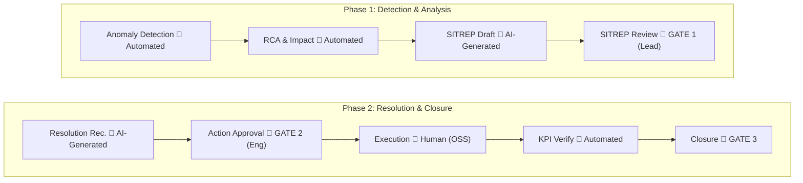

```mermaid
graph LR

    subgraph Phase 2: Resolution & Closure
    direction LR
    E["Resolution Rec. 🤖 AI-Generated"] --> F["Action Approval 🧑 GATE 2 (Eng)"] --> G["Execution 🧑 Human (OSS)"] --> H["KPI Verify 🤖 Automated"] --> I["Closure 🧑 GATE 3"]
    end

    subgraph Phase 1: Detection & Analysis
    direction LR
    A["Anomaly Detection 🤖 Automated"] --> B["RCA & Impact 🤖 Automated"] --> C["SITREP Draft 🤖 AI-Generated"] --> D["SITREP Review 🧑 GATE 1 (Lead)"]
    end

```