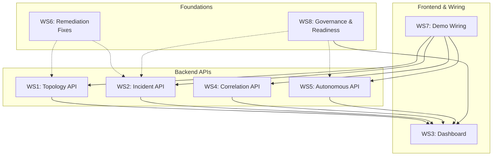

# Pedkai Vision Alignment — Implementation Plan v3

**Revision**: v3.0 — All 26 committee amendments + cloud-agnostic sovereignty rework (replaces Vertex AI/VPC)
**Approach**: Modified Backend-First (committee-directed)
**Timeline**: 4 phases, 16 weeks

---

## Objective

Bridge the gap between the current Pedkai codebase and the demo vision while embedding the governance, safety, and operational guardrails mandated by the executive committee. The committee's input supersedes the original technical vision wherever they conflict.

---

## Key Changes from v1

| v1 Decision | Committee Override | Rationale |
|:---|:---|:---|
| Demo-First approach | **Backend-First** with governance baked in | Prevents creating expectations before operational readiness |
| `execute_preventive_action()` in WS5 | **Removed from v1 scope** — detect & recommend only | No AI-initiated network changes without proven trust |
| Incident lifecycle is fully automated | **3 mandatory human gates** added | SITREP review, action approval, incident closure |
| Direct Gemini API calls | **Cloud-agnostic LLM adapter + AI Sovereignty Enforcement Module** integrated into existing telco gateway stack | Data sovereignty via operator's own firewall/gateway — zero new infrastructure, zero vendor lock-in |
| ARPU fallback for missing BSS data | **"Unpriced" flag + manual valuation** | Prevents misleading revenue-at-risk figures |
| Revenue-based customer prioritisation | **Configurable multi-factor** ranking | Revenue, SLA penalty, NPS, complaint history |
| REST-only API | **WebSocket/SSE added** for real-time push | Demos require live fault propagation, alarm wall updates |
| Single RBAC role (`OPERATOR`) | **Granular RBAC** per endpoint tier | Topology access, action approval, policy changes |

---

## AI Maturity Ladder

All features are classified on a maturity ladder. No feature advances to the next level without documented proving criteria being met.

| Level | Label | Criteria to Advance | Target Features |
|:---|:---|:---|:---|
| L1 | **AI-Assisted** | System deployed, all outputs human-reviewed | All WS1–WS5 features at launch |
| L2 | **AI-Supervised** | 95%+ accuracy over 90-day proving period, <5% false-positive rate | Alarm correlation, drift detection, SITREP generation |
| L3 | **AI-Autonomous (Governed)** | Board approval, regulatory notification, live runbook, fallback tested | Preventive actions (future scope only) |

> [!IMPORTANT]
> **WS5 launches at L1 only.** The "Autonomous Shield" branding is for market positioning — operationally, every action requires human sign-off until L3 criteria are met.

---

## Incident Lifecycle — Human Gate Model

Every incident follows this flow. Three stages require named human sign-off.

```mermaid
graph LR

    subgraph Phase 2: Resolution & Closure
    direction LR
    E["Resolution Received 🤖 AI-Generated"] --> F["Action Approval 🧑 GATE 2 (Engineer)"] --> G["Execution 🧑 Human (OSS)"] --> H["KPI Verify 🤖 Automated"] --> I["Closure 🧑 GATE 3"]
    end

    subgraph Phase 1: Detection & Analysis
    direction LR
    A["Anomaly Detection 🤖 Automated"] --> B["RCA & Impact 🤖 Automated"] --> C["SITREP Draft 🤖 AI-Generated"] --> D["SITREP Review 🧑 GATE 1 (Lead)"]
    end
```


---

## Work Streams

---

### WS1: Backend — Topology & Impact Analysis API

**Goal**: Expose graph schema and RCA as REST + WebSocket endpoints.
**Absorbs**: H-2 (Capacity + Context Graph), M-4 (Recursive CTE)
**TMF alignment**: Topology entities should carry TMF-standard identifiers where applicable.

#### [NEW] [topology.py](file:///Users/himanshu/Library/CloudStorage/GoogleDrive-himanshu@htadvisers.co.uk/My%20Drive/AI%20Learning/AntiGravity/Pedkai/backend/app/api/topology.py)

Endpoints:
- `GET /api/v1/topology/{tenant_id}` — full graph (entities + relationships), **rate-limited** (Security §2.8), **audit-logged**
- `GET /api/v1/topology/{tenant_id}/entity/{entity_id}` — single entity + immediate neighbours (preferred for normal use — data minimisation)
- `GET /api/v1/topology/{tenant_id}/impact/{entity_id}?max_hops=N` — upstream/downstream impact tree via recursive CTE
- `GET /api/v1/topology/{tenant_id}/revenue-overlay` — entities enriched with BSS data for heatmap (requires `topology:revenue` RBAC scope)
- `WS /api/v1/topology/{tenant_id}/live` — **WebSocket** for real-time topology state changes and fault propagation (CTO §2.3)

Implementation:
- Refactor `RootCauseAnalyzer.get_relationships()` to use recursive CTE for multi-hop traversal (fixes M-4)
- Add `get_full_impact_tree()` returning structured tree for frontend rendering
- Add **topology staleness detection**: each entity carries `last_synced_at`; API returns `topology_health: {stale_entities: N, completeness_pct: X}` (Network Director §2.12)
- Rate-limit full topology endpoint to 10 req/min per user (Security §2.8)
- Audit-log all topology queries with user, timestamp, scope (Security §2.8)

#### [MODIFY] [root_cause_analysis.py](file:///Users/himanshu/Library/CloudStorage/GoogleDrive-himanshu@htadvisers.co.uk/My%20Drive/AI%20Learning/AntiGravity/Pedkai/anops/root_cause_analysis.py)

- Replace N+1 `get_relationships()` with single recursive CTE/BFS (M-4)
- Add `TopologyHealthCheck` — report stale entities and completeness percentage

#### [NEW] [topology_sync.py](file:///Users/himanshu/Library/CloudStorage/GoogleDrive-himanshu@htadvisers.co.uk/My%20Drive/AI%20Learning/AntiGravity/Pedkai/data_fabric/topology_sync.py)

Topology refresh mechanism (OSS Lead §2.9):
- Event-driven: consume topology change events from Kafka (preferred)
- Scheduled fallback: periodic full sync from NMS inventory (configurable interval, default 15 min)
- Track `last_synced_at` per entity for staleness monitoring

#### [MODIFY] [main.py](file:///Users/himanshu/Library/CloudStorage/GoogleDrive-himanshu@htadvisers.co.uk/My%20Drive/AI%20Learning/AntiGravity/Pedkai/backend/app/main.py)

Register topology router + WebSocket endpoint.

---

### WS2: Backend — Incident Lifecycle & Reasoning API

**Goal**: Create the incident model with 3 mandatory human gates, grounded LLM outputs, and full audit trail.
**Absorbs**: C-2 (Closed-Loop RL), H-5 (LLM Prompt Dedup), H-1 (Memory Benchmark)
**TMF alignment**: TMF621 Trouble Ticket Management (Strategist §2.4)

#### [NEW] [incident_orm.py](file:///Users/himanshu/Library/CloudStorage/GoogleDrive-himanshu@htadvisers.co.uk/My%20Drive/AI%20Learning/AntiGravity/Pedkai/backend/app/models/incident_orm.py)

ORM model:
- `IncidentORM`: id, tenant_id, title, severity, status (enum: ANOMALY → DETECTED → RCA → SITREP_DRAFT → **SITREP_APPROVED** → RESOLVING → **RESOLUTION_APPROVED** → RESOLVED → **CLOSED** → LEARNING)
- `entity_id` (FK to topology), `decision_trace_id` (FK)
- `reasoning_chain` (JSON) — each step carries confidence score (AI Director §2.5)
- `resolution_summary`, `kpi_snapshot` (JSON)
- **Audit fields** (Legal §2.14): `sitrep_approved_by`, `sitrep_approved_at`, `action_approved_by`, `action_approved_at`, `closed_by`, `closed_at`, `llm_model_version`, `llm_prompt_hash`

#### [NEW] [incidents.py](file:///Users/himanshu/Library/CloudStorage/GoogleDrive-himanshu@htadvisers.co.uk/My%20Drive/AI%20Learning/AntiGravity/Pedkai/backend/app/api/incidents.py)

Endpoints:
- `POST /api/v1/incidents` — create incident (auto-triggered by anomaly detection)
- `GET /api/v1/incidents` — list (filterable by status, severity, tenant)
- `GET /api/v1/incidents/{id}` — detail with reasoning chain + confidence scores
- `PATCH /api/v1/incidents/{id}/advance` — advance lifecycle stage
- **`POST /api/v1/incidents/{id}/approve-sitrep`** — **Human Gate 1**: shift lead approves SITREP (requires `incident:approve_sitrep` scope, records approver name + timestamp)
- **`POST /api/v1/incidents/{id}/approve-action`** — **Human Gate 2**: engineer approves resolution action (requires `incident:approve_action` scope)
- **`POST /api/v1/incidents/{id}/close`** — **Human Gate 3**: named individual closes incident (requires `incident:close` scope)
- `GET /api/v1/incidents/{id}/reasoning` — step-by-step reasoning trace with confidence scores
- `GET /api/v1/incidents/{id}/audit-trail` — full audit chain (Legal §2.14)
- `WS /api/v1/incidents/live` — **WebSocket** for real-time incident status updates (CTO §2.3)

Implementation:
- Wire `AnomalyDetector.process_metric()` → auto-create incident on anomaly
- Each lifecycle transition is validated: cannot advance past SITREP_DRAFT without `approve-sitrep` call
- `resolve` requires KPI verification (C-2 fix: `verify_resolution_effectiveness()`)
- **Emergency service incidents are unconditional P1** — hardcoded in `create_incident()`, cannot be overridden by policy engine or revenue weighting (H&S §2.13)

#### [NEW] [prompts/](file:///Users/himanshu/Library/CloudStorage/GoogleDrive-himanshu@htadvisers.co.uk/My%20Drive/AI%20Learning/AntiGravity/Pedkai/backend/app/prompts/)

Directory of versioned prompt templates (fixes H-5):
- `sitrep_v1.txt` — SITREP generation prompt
- `resolution_v1.txt` — resolution recommendation prompt
- `explanation_v1.txt` — general explanation prompt

Each template is version-tracked; prompt hash stored in incident audit trail.

#### [MODIFY] [llm_service.py](file:///Users/himanshu/Library/CloudStorage/GoogleDrive-himanshu@htadvisers.co.uk/My%20Drive/AI%20Learning/AntiGravity/Pedkai/backend/app/services/llm_service.py)

- Refactor to use **`LLMAdapter` abstraction** — Pedkai is LLM-provider-agnostic (see WS8 sovereignty module below)
- Extract prompts into `prompts/` directory (H-5)
- Add `generate_sitrep()` and `generate_resolution_recommendation()`
- **Grounding validation** (AI Director §2.5): cross-check LLM assertions against topology graph and KPI data; reject/flag ungrounded claims
- **Confidence scoring**: each output carries a confidence score calculated from (similarity match strength × causal evidence strength × data completeness)
- **Template fallback**: if confidence < configurable threshold (default 0.6), return structured template instead of LLM free-form output
- **Local PII/sensitive-data scrubbing** before any prompt leaves Pedkai — runs inside Pedkai, not dependent on external infrastructure (Security §2.8)
- Log `model_version` and `prompt_hash` for every LLM call (Legal §2.14)

#### [NEW] [llm_adapter.py](file:///Users/himanshu/Library/CloudStorage/GoogleDrive-himanshu@htadvisers.co.uk/My%20Drive/AI%20Learning/AntiGravity/Pedkai/backend/app/services/llm_adapter.py)

**Cloud-agnostic LLM adapter** — Pedkai does not lock into any AI vendor:
- Abstract `LLMAdapter` base class with `generate(prompt, config) → LLMResponse`
- `GeminiAdapter` — current Google Gemini implementation (default for development)
- `OpenAIAdapter` — for operators preferring Azure OpenAI or direct OpenAI
- `OnPremAdapter` — for operators running local models (e.g., vLLM, Ollama, TGI)
- Adapter selection via `PEDKAI_LLM_PROVIDER` env var
- All adapters route through the local PII scrubber before egress

#### [MODIFY] [rl_evaluator.py](file:///Users/himanshu/Library/CloudStorage/GoogleDrive-himanshu@htadvisers.co.uk/My%20Drive/AI%20Learning/AntiGravity/Pedkai/backend/app/services/rl_evaluator.py)

- Implement real KPI baseline comparison (fixes C-2)
- Add `verify_resolution_effectiveness()` — checks KPIs returned to baseline before allowing incident closure
- Add **bias drift detection** (AI Director §2.5): periodic check that RLHF feedback distribution hasn't skewed >2σ from initial calibration

---

### WS3: Frontend — Dashboard Overhaul

**Goal**: Multi-view dashboard with progressive disclosure, dark/light theming, and real-time data.
**Design principle**: Default view is simplified; detail on demand (H&S §2.13).

#### [MODIFY] [page.tsx](file:///Users/himanshu/Library/CloudStorage/GoogleDrive-himanshu@htadvisers.co.uk/My%20Drive/AI%20Learning/AntiGravity/Pedkai/frontend/app/page.tsx)

Decompose into shell with sidebar navigation + route to sub-pages. Preserve existing alarm management as the default landing view.

#### [NEW] Frontend pages (under `frontend/app/`)

| Page | Demo Source | Key Components | Progressive Disclosure |
|:---|:---|:---|:---|
| `incidents/page.tsx` | `demo_showcase.html` | Timeline, stage viewer, KPI gauges | Summary list → click for timeline → click stage for detail |
| `topology/page.tsx` | `demo_core_network.html` | Layered architecture SVG, node panel | Overview layers → click layer for nodes → click node for detail |
| `impact/page.tsx` | `demo_service_impact.html` | Customer cards, alarm wall, clusters | Cluster summary → click for customer list → click for deep-dive |
| `bridge/page.tsx` | `demo_intelligence_bridge.html` | Split-pane (network + impact), reasoning | Dashboard metrics → click for detail panes |
| `autonomous/page.tsx` | Autonomous demos | Scorecard, drift alerts, value capture | Scorecard summary → drill into individual detections |
| `context-graph/page.tsx` | Context graph demos | Revenue heatmap, journey roadmap | Roadmap overview → click scenario for detail |

#### [NEW] Shared components (`frontend/app/components/`)

- `ThemeToggle.tsx` — CSS variable–based dark/light toggle
- `TopologyGraph.tsx` — SVG layered architecture renderer (connects via WebSocket for live state)
- `ReasoningChain.tsx` — Step-by-step reasoning with **confidence scores** displayed per step + **"AI-generated" watermark** (Legal §2.14)
- `TimelineView.tsx` — Horizontal timeline with **human gate indicators** (shows who approved at each gate)
- `MetricCard.tsx` — Stat card with icon, label, value, trend
- `AlarmWall.tsx` — Scrollable alarm list (connects via WebSocket for real-time updates)
- `Scorecard.tsx` — Pedkai zone vs non-Pedkai zone comparison
- `CustomerCard.tsx` — Customer card with complaint, SLA, revenue, **NPS, dispute flag**
- `ApprovalGate.tsx` — **NEW**: UI component for human approval workflow (approve/reject + reason)
- `AuditTrail.tsx` — **NEW**: expandable audit trail showing approver, timestamp, model version

#### [MODIFY] [globals.css](file:///Users/himanshu/Library/CloudStorage/GoogleDrive-himanshu@htadvisers.co.uk/My%20Drive/AI%20Learning/AntiGravity/Pedkai/frontend/app/globals.css)

- CSS custom properties for theming
- Dark-mode class definitions
- All LLM-generated content sections styled with subtle "AI-generated" visual indicator (Legal §2.14)

#### Frontend state management (CTO §2.3)

- Adopt **React Query (TanStack Query)** for server state with proper cache invalidation
- WebSocket connections managed via a shared `useWebSocket` hook
- Auth tokens managed via React context

---

### WS4: Backend — Alarm Correlation & Service Impact API

**Goal**: Alarm clustering, customer impact, and noise reduction — positioned as **complementary** to existing OSS correlation (OSS Lead §2.9), not a replacement.
**Absorbs**: C-3 (BSS Revenue Fallback), H-3 (Graph-based CX Intelligence)
**TMF alignment**: TMF656 Service Problem Management (Strategist §2.4)

#### [NEW] [alarm_correlation.py](file:///Users/himanshu/Library/CloudStorage/GoogleDrive-himanshu@htadvisers.co.uk/My%20Drive/AI%20Learning/AntiGravity/Pedkai/backend/app/services/alarm_correlation.py)

Service:
- `correlate_alarms(alarms[]) → AlarmCluster[]` — group by topology proximity, temporal clustering, symptom similarity
- `calculate_noise_reduction(raw_count, clustered_count) → float`
- `get_customer_impact(cluster_id) → CustomerImpact[]` — via topology traversal
- **Emergency service check** (H&S §2.13): if any alarm in a cluster affects an entity of type `EMERGENCY_SERVICE`, the entire cluster is unconditionally escalated to P1

Positioning note: this service consumes **pre-correlated** alarms from OSS where available and adds business context (revenue, customer, SLA impact). It does not replace vendor correlation engines.

#### [NEW] [service_impact.py](file:///Users/himanshu/Library/CloudStorage/GoogleDrive-himanshu@htadvisers.co.uk/My%20Drive/AI%20Learning/AntiGravity/Pedkai/backend/app/api/service_impact.py)

Endpoints:
- `GET /api/v1/service-impact/customers` — impacted customers with revenue-at-risk (or "unpriced" flag)
- `GET /api/v1/service-impact/clusters` — alarm clusters with correlation metadata
- `GET /api/v1/service-impact/noise-wall` — raw alarm wall data
- `GET /api/v1/service-impact/deep-dive/{cluster_id}` — reasoning chain for a cluster
- `WS /api/v1/service-impact/live` — real-time alarm wall updates

#### [MODIFY] [bss_service.py](file:///Users/himanshu/Library/CloudStorage/GoogleDrive-himanshu@htadvisers.co.uk/My%20Drive/AI%20Learning/AntiGravity/Pedkai/backend/app/services/bss_service.py)

- **Replace ARPU fallback with "unpriced" flag** (BSS Lead §2.10): when billing data is unavailable, return `{"revenue_at_risk": null, "pricing_status": "unpriced", "requires_manual_valuation": true}` instead of a guessed number
- Add `get_customers_by_entity()` to find customers served by a network entity
- Add configurable thresholds for billing dispute escalation (BSS Lead §2.10)

#### [NEW] [bss_adapter.py](file:///Users/himanshu/Library/CloudStorage/GoogleDrive-himanshu@htadvisers.co.uk/My%20Drive/AI%20Learning/AntiGravity/Pedkai/backend/app/services/bss_adapter.py)

**BSS adapter abstraction layer** (BSS Lead §2.10) — analogous to existing `alarm_normalizer.py`:
- Abstract `BSSAdapter` base class with `get_billing_account()`, `get_revenue()`, `check_disputes()`
- `LocalBSSAdapter` — current SQLAlchemy ORM implementation (default)
- Designed for future `AmdocsBSSAdapter`, `CerillionBSSAdapter`, `CSGBSSAdapter` implementations

#### [MODIFY] [cx_intelligence.py](file:///Users/himanshu/Library/CloudStorage/GoogleDrive-himanshu@htadvisers.co.uk/My%20Drive/AI%20Learning/AntiGravity/Pedkai/backend/app/services/cx_intelligence.py)

- Graph-based CX intelligence (H-3): link complaints to network entities via graph traversal
- **Customer prioritisation made configurable** (CSD §2.11): ranking algorithm accepts weights for `revenue`, `sla_penalty`, `nps_score`, `complaint_count`, `dispute_flag` — configurable per operator via policy engine parameters

#### [NEW] [proactive_comms.py](file:///Users/himanshu/Library/CloudStorage/GoogleDrive-himanshu@htadvisers.co.uk/My%20Drive/AI%20Learning/AntiGravity/Pedkai/backend/app/services/proactive_comms.py)

Proactive communication rules (CSD §2.11):
- Only send if: (a) customer is actively affected AND (b) estimated TTR exceeds SLA threshold
- Requires customer consent opt-in flag (checked before dispatch)
- All communications are **drafted for human review** — not sent automatically (L1 maturity)

---

### WS5: Backend — Autonomous Shield API (Detection & Recommendation Only)

**Goal**: Drift detection and preventive *recommendations*. **No autonomous execution in v1** (Network Director §2.12).
**TMF alignment**: TMF921 AI Management & Orchestration (Strategist §2.4)

#### [NEW] [autonomous_shield.py](file:///Users/himanshu/Library/CloudStorage/GoogleDrive-himanshu@htadvisers.co.uk/My%20Drive/AI%20Learning/AntiGravity/Pedkai/backend/app/services/autonomous_shield.py)

Service:
- `detect_drift(entity_id, metric_name) → DriftPrediction` — detect KPI drift before anomaly threshold
- `evaluate_preventive_action(drift, policy_context) → PreventiveRecommendation` — determine what action *could* be taken (uses policy engine)
- ~~`execute_preventive_action()`~~ — **REMOVED from v1** (Network Director §2.12). Replaced with:
- `generate_change_request(recommendation) → ChangeRequest` — outputs a structured change request that a human engineer can execute via their existing OSS change management tools
- `calculate_value_protected(action_result) → ValueProtected` — compute counterfactual value metrics using **documented, auditable methodology** (CFO §2.2)

Drift detection calibration (Network Director §2.12):
- Configurable sensitivity threshold per entity/metric type
- Mandatory 30-day calibration period on deployment before alerts are surfaced to operators
- Target: **<5% false-positive rate** before advancing to L2

#### [NEW] [autonomous.py](file:///Users/himanshu/Library/CloudStorage/GoogleDrive-himanshu@htadvisers.co.uk/My%20Drive/AI%20Learning/AntiGravity/Pedkai/backend/app/api/autonomous.py)

Endpoints:
- `GET /api/v1/autonomous/scorecard` — Pedkai zone vs non-Pedkai zone comparison (shadow mode data)
- `GET /api/v1/autonomous/detections` — list drift detections with recommendations (renamed from "actions")
- `GET /api/v1/autonomous/value-capture` — revenue protected, incidents prevented — with **methodology documentation link** visible in response (CFO §2.2)
- `POST /api/v1/autonomous/simulate` — trigger simulated drift for demo purposes only

#### [NEW] [value_methodology.md](file:///Users/himanshu/Library/CloudStorage/GoogleDrive-himanshu@htadvisers.co.uk/My%20Drive/AI%20Learning/AntiGravity/Pedkai/docs/value_methodology.md)

Auditable methodology document for counterfactual metrics (CFO §2.2):
- How "revenue protected" is calculated (baseline revenue path vs. degraded path estimation)
- How "incidents prevented" is counted (drift detection that would have breached anomaly threshold within N hours)
- Confidence intervals on all counterfactual estimates
- Board-presentable format

---

### WS6: Backend — Remediation Fixes & Code Quality

**Absorbs**: M-1, M-2, M-3, H-1

#### [MODIFY] [policy_engine.py](file:///Users/himanshu/Library/CloudStorage/GoogleDrive-himanshu@htadvisers.co.uk/My%20Drive/AI%20Learning/AntiGravity/Pedkai/backend/app/services/policy_engine.py)

- M-2: Add policy versioning (version in metadata, support loading specific versions)
- M-3: Fix path config to use `PEDKAI_POLICY_PATH` env var consistently
- **Add emergency service protection rule**: hardcoded policy that cannot be overridden — any incident affecting `EMERGENCY_SERVICE` entity type = unconditional P1 (H&S §2.13)

#### [MODIFY] [seed_golden_decision.py](file:///Users/himanshu/Library/CloudStorage/GoogleDrive-himanshu@htadvisers.co.uk/My%20Drive/AI%20Learning/AntiGravity/Pedkai/anops/seed_golden_decision.py)

- H-1: Expand to 25+ gold standard test cases with distractors

#### [NEW] Integration tests

- `tests/integration/test_cx_bss_integration.py` — anomaly → CX → BSS revenue flow (M-1)
- `tests/integration/test_capacity_context_graph.py` — capacity engine + context graph (M-1)
- `tests/integration/test_multi_tenant_isolation.py` — verify tenant data isolation (Strategist §2.4)

---

### WS7: Demo-to-API Wiring

**Goal**: Bridge demo HTML files to real backend APIs with a live-mode toggle.

#### [MODIFY] All `demo_*.html` files

- Add `const USE_LIVE_API = false;` toggle
- When `true`, replace hardcoded data with `fetch()` calls to real backend
- Preserve all hardcoded data as fallback
- Add **"AI-generated content" labels** on any section that would be LLM-generated in live mode (Legal §2.14)

---

### WS8: Governance & Operational Readiness (NEW)

**Goal**: Address all governance, regulatory, and operational gaps identified by the committee. This stream runs in parallel with backend work and must complete before frontend goes live.

#### AI Sovereignty Enforcement Module

> [!IMPORTANT]
> Data sovereignty is **not Pedkai's problem to solve in isolation**. It is an extension of the operator's existing network security controls. Pedkai provides the AI traffic classification and policy rules; the operator's carrier-grade firewalls, gateways, and network segmentation enforce them.

**Core principle**: Instead of building a new VPC/service-control platform inside Pedkai (expensive, vendor-locked, duplicative), position sovereignty as a **policy extension module** that plugs into the telco's existing infrastructure:

```
Pedkai Application Layer
        ↓
Local PII Scrubber (inside Pedkai — strips sensitive fields before egress)
        ↓
Existing carrier firewalls & edge gateways (already trusted for sovereignty)
        ↓
AI Sovereignty Policy Rules (extension of existing firewall/gateway policies)
        ↓
Controlled AI egress (only to operator-approved LLM endpoints)
```

**What Pedkai provides** (lightweight, no new infrastructure):

| Component | Implementation | Where It Runs |
|:---|:---|:---|
| PII/sensitive-data scrubber | `pii_scrubber.py` — regex + NER-based field detection, strips subscriber names, IMSIs, CDRs, billing amounts before any LLM prompt leaves Pedkai | Inside Pedkai (local) |
| AI traffic classifier | Tags every outbound LLM request with metadata: `data_classification`, `source_region`, `tenant_id`, `content_category` | Inside Pedkai (local) |
| Egress policy config | `sovereignty_policy.yaml` — configurable per operator: approved LLM endpoints, geographic restrictions, content rules | Pedkai config (operator-editable) |
| Audit logger | Every LLM request/response logged with classification tags, prompt hash, model version, egress destination | Inside Pedkai (local) |

**What the operator's existing infrastructure enforces** (zero new build):

| Enforcement | Provided By | Pedkai's Role |
|:---|:---|:---|
| Geographic data residency | Existing firewall routing rules per region | Provides `source_region` tag for gateway to route/block |
| Egress whitelisting | Existing gateway outbound rules | Provides approved vendor endpoint list in `sovereignty_policy.yaml` |
| Content inspection | Existing application-level gateways / DPI | PII scrubber handles this locally; gateway is a second line of defence |
| Network segmentation | Existing NFV/CNF security zones | AI traffic routed through existing service chain; Pedkai adds policy sets, not segments |
| Audit trail | Existing logging pipelines (Splunk, ELK, etc.) | Pedkai emits structured AI audit logs that feed into existing pipeline |

**Positioning for sales**: _"Enhancing existing carrier firewall and gateway policy stacks to enforce AI-specific sovereignty and compliance controls — zero new infrastructure, minimal cost, deployable within normal change cycles."_

#### [NEW] [pii_scrubber.py](file:///Users/himanshu/Library/CloudStorage/GoogleDrive-himanshu@htadvisers.co.uk/My%20Drive/AI%20Learning/AntiGravity/Pedkai/backend/app/services/pii_scrubber.py)

Local PII scrubbing service (runs inside Pedkai, not dependent on external infrastructure):
- Regex-based detection of: phone numbers, IMSIs, subscriber names, billing amounts, account numbers, IP addresses
- NER-based detection (using lightweight local model, e.g., spaCy `en_core_web_sm`) for entity names and locations
- Configurable per operator: which fields to scrub, which to mask, which to pass through
- Returns scrubbed prompt + a `scrub_manifest` recording what was removed (for audit)

#### [NEW] [sovereignty_policy.yaml](file:///Users/himanshu/Library/CloudStorage/GoogleDrive-himanshu@htadvisers.co.uk/My%20Drive/AI%20Learning/AntiGravity/Pedkai/backend/app/config/sovereignty_policy.yaml)

Operator-editable sovereignty configuration:
```yaml
ai_sovereignty:
  approved_endpoints:
    - name: google-gemini
      url: https://generativelanguage.googleapis.com
      regions: [us, eu, uk]
    - name: azure-openai
      url: https://{deployment}.openai.azure.com
      regions: [eu, uk]
    - name: on-prem-vllm
      url: http://internal-llm.operator.local:8000
      regions: [all]
  geographic_rules:
    eu_subscribers: [azure-openai, on-prem-vllm]  # EU data stays EU
    uk_subscribers: [google-gemini, azure-openai, on-prem-vllm]
    default: [on-prem-vllm]  # fallback to on-prem
  content_rules:
    strip_pii: true
    strip_cdrs: true
    strip_billing: true
    allow_topology_metadata: true  # non-PII, needed for RCA context
  audit:
    log_prompts: true  # hash-only in production
    log_responses: true
    retention_days: 90
```

#### [NEW] [security.py updates](file:///Users/himanshu/Library/CloudStorage/GoogleDrive-himanshu@htadvisers.co.uk/My%20Drive/AI%20Learning/AntiGravity/Pedkai/backend/app/core/security.py)

**Granular RBAC model** (Security §2.8):

| Scope | Description | Required For |
|:---|:---|:---|
| `topology:read` | View topology summary (entity + neighbours) | All authenticated users |
| `topology:read_full` | View full topology graph | Senior engineers only |
| `topology:revenue` | View revenue overlay with BSS data | Finance + senior engineers |
| `incident:read` | View incidents | All authenticated users |
| `incident:approve_sitrep` | Approve SITREP (Human Gate 1) | Shift leads |
| `incident:approve_action` | Approve resolution action (Human Gate 2) | Authorised engineers |
| `incident:close` | Close incident (Human Gate 3) | Named individuals |
| `autonomous:read` | View drift detections & scorecard | All authenticated users |
| `policy:read` | View active policies | All authenticated users |
| `policy:write` | Modify policy rules | Change board members only |

#### [NEW] [docs/noc_runbook.md](file:///Users/himanshu/Library/CloudStorage/GoogleDrive-himanshu@htadvisers.co.uk/My%20Drive/AI%20Learning/AntiGravity/Pedkai/docs/noc_runbook.md)

**NOC operational runbook** (Ops Director §2.7):
- Pedkai-assisted alarm triage workflow (step-by-step)
- Incident lifecycle workflow with human gate procedures
- Escalation matrix (severity → notification list → response SLA)
- **Degraded-mode procedures**: what to do when Pedkai backend is unavailable (manual alarm triage, fallback to existing OSS tools, no dependency on Pedkai for incident tracking)

#### [NEW] [docs/training_curriculum.md](file:///Users/himanshu/Library/CloudStorage/GoogleDrive-himanshu@htadvisers.co.uk/My%20Drive/AI%20Learning/AntiGravity/Pedkai/docs/training_curriculum.md)

**NOC training curriculum** (Ops Director §2.7):
- Module 1: Understanding Pedkai's reasoning chains and confidence scores
- Module 2: When and how to override AI recommendations
- Module 3: Providing effective feedback (upvote/downvote with context)
- Module 4: Degraded-mode operations

#### [NEW] [docs/dpia_scope.md](file:///Users/himanshu/Library/CloudStorage/GoogleDrive-himanshu@htadvisers.co.uk/My%20Drive/AI%20Learning/AntiGravity/Pedkai/docs/dpia_scope.md)

**DPIA scoping document** (Legal §2.14):
- Data categories processed (customer PII, billing, network topology, KPI streams)
- Lawful basis: legitimate interest for network management
- Data retention policies:
  - KPI metrics: 30 days (existing TimescaleDB policy)
  - Decision memory: indefinite (core IP, backup required)
  - Incident records: 7 years (regulatory audit)
  - LLM prompts/responses: 90 days (debugging), then hashed summaries only
- Customer right-to-erasure pathway
- EU AI Act risk categorisation (critical infrastructure → high-risk system → requires technical documentation, human oversight, logging)

#### [NEW] [docs/data_architecture_adr.md](file:///Users/himanshu/Library/CloudStorage/GoogleDrive-himanshu@htadvisers.co.uk/My%20Drive/AI%20Learning/AntiGravity/Pedkai/docs/data_architecture_adr.md)

**Architecture Decision Record** (IT Director §2.6):
- Database topology: PostgreSQL (pgvector) for decision memory + graph, TimescaleDB for KPI metrics, SQLite for tests only
- Backup strategy: daily pg_dump of decision memory, streaming replication for HA
- Disaster recovery: RPO 1 hour, RTO 4 hours

#### [NEW] [docker-compose.dev.yml](file:///Users/himanshu/Library/CloudStorage/GoogleDrive-himanshu@htadvisers.co.uk/My%20Drive/AI%20Learning/AntiGravity/Pedkai/docker-compose.dev.yml)

Reliable containerised dev environment (IT Director §2.6).

#### [NEW] [docs/shadow_mode.md](file:///Users/himanshu/Library/CloudStorage/GoogleDrive-himanshu@htadvisers.co.uk/My%20Drive/AI%20Learning/AntiGravity/Pedkai/docs/shadow_mode.md)

**Shadow-mode pilot architecture** (Strategist §2.4):
- Pedkai runs alongside existing NOC tooling, consuming same alarm feed
- Outputs are logged but not displayed to operators initially
- After 30 days: compare Pedkai detection/correlation against operator actions
- After 90 days: present accuracy report to committee for L2 decision

---

## Dependency Graph



---

## Phased Execution Timeline

Committee-directed Backend-First approach.

### Phase 1 — Foundations & Governance (Weeks 1–4)

| Stream | Scope | Demo Milestone |
|:---|:---|:---|
| WS1 | Topology API + topology sync + staleness monitoring | Can show live topology graph with impact tree |
| WS2 | Incident lifecycle ORM + API + human gates + prompt extraction | Can demonstrate full incident flow with approval gates |
| WS6 | All remediation fixes (M-1 to M-4, H-1) | Tests pass, policy engine hardened |
| WS8 | RBAC model, DPIA scope, NOC runbook draft, data architecture ADR, `docker-compose.dev.yml` | Governance docs available for committee sign-off |

### Phase 2 — Intelligence Layer (Weeks 5–8)

| Stream | Scope | Demo Milestone |
|:---|:---|:---|
| WS4 | Alarm correlation + BSS adapter + customer impact + proactive comms rules | Can show noise reduction, customer cards, cluster view |
| WS3 | Frontend scaffolding with mock data — all 6 pages + shared components + theming | Can navigate all dashboard views with mock data |
| WS8 | LLM adapter abstraction, PII scrubber, sovereignty policy config, training curriculum, shadow mode architecture | LLM calls cloud-agnostic and sovereignty-compliant; training materials ready |

### Phase 3 — Live Wiring & Shadow Mode (Weeks 9–12)

| Stream | Scope | Demo Milestone |
|:---|:---|:---|
| WS3 | Wire frontend to real APIs via React Query + WebSocket | Fully functional dashboard against live backend |
| WS5 | Drift detection + recommendation generation + value methodology + calibration | Can show drift detection alerts, scorecard, change request output |
| WS8 | Shadow mode deployment, begin 90-day proving period | Pedkai running alongside existing NOC, logging outputs |

### Phase 4 — Integration & Proving (Weeks 13–16)

| Stream | Scope | Demo Milestone |
|:---|:---|:---|
| WS7 | Wire demo HTML files to real APIs with `USE_LIVE_API` toggle | All demos work in live mode |
| WS8 | NOC training rollout, proving period data collection, L2 readiness assessment | Staff trained, accuracy data accumulating |

---

## Verification Plan

### Automated Tests

**Existing (preserve)**: `tests/conftest.py`, `tests/integration/test_tmf642.py`, `test_capacity.py`, `test_cx_intelligence.py`, `test_rl_evaluator.py`, `test_policy_security.py`, `test_cumulative_risk.py`, `tests/validation/*`

**New tests**:

| Test File | Covers |
|:---|:---|
| `test_topology_api.py` | WS1: topology CRUD, impact tree, revenue overlay, staleness, rate limiting |
| `test_incident_lifecycle.py` | WS2: creation, stage advancement, **human gate enforcement** (cannot skip approval), audit trail |
| `test_alarm_correlation.py` | WS4: clustering, noise reduction, customer impact, **emergency service P1 escalation** |
| `test_autonomous_shield.py` | WS5: drift detection, recommendation (NOT execution), scorecard |
| `test_cx_bss_integration.py` | WS6/M-1: CX → BSS flow, **"unpriced" flag** when BSS unavailable |
| `test_multi_tenant_isolation.py` | Tenant A cannot see Tenant B's topology/incidents/decisions |
| `test_rbac_granularity.py` | WS8: scope enforcement — operator cannot approve SITREP, only shift lead can |
| `test_llm_grounding.py` | WS2: LLM output grounding validation, confidence scoring, template fallback |

**Load testing** (OSS Lead §2.9):
- 200K alarms/day through Kafka → correlation → PostgreSQL pipeline
- Run via Locust: `locust -f tests/load/locustfile.py --host=http://localhost:8000`

**Security testing** (Security §2.8):
- OWASP API Security Top 10 scan against all new endpoints
- Penetration test on topology endpoints (data exposure risk)

### Manual Verification

1. **Backend**: `http://localhost:8000/docs` shows all endpoints with correct RBAC scopes
2. **Frontend**: Each page renders with progressive disclosure; approval gates block unauthorised users
3. **Human gates**: Attempt to advance incident past SITREP_DRAFT without approval → must fail
4. **Emergency P1**: Create alarm affecting `EMERGENCY_SERVICE` entity → must be unconditional P1
5. **LLM grounding**: Trigger incident → check SITREP for "AI-generated" watermark and confidence score
6. **Shadow mode**: Verify Pedkai processes alarms in parallel with existing tools without interfering

---

## Amendment Traceability

Every committee amendment is tracked to its implementation location.

| # | Amendment | Implemented In |
|:---|:---|:---|
| 1 | Remove `execute_preventive_action()` | WS5 `autonomous_shield.py` — replaced with `generate_change_request()` |
| 2 | 3 human gates | WS2 `incidents.py` — `approve-sitrep`, `approve-action`, `close` endpoints |
| 3 | LLM data classification | WS2 `llm_adapter.py` (cloud-agnostic) + WS8 `pii_scrubber.py` (local) + `sovereignty_policy.yaml` (operator-configured) — sovereignty enforcement delegated to existing telco gateways |
| 4 | DPIA | WS8 `docs/dpia_scope.md` |
| 5 | NOC runbook + degraded mode | WS8 `docs/noc_runbook.md` |
| 6 | Emergency P1 hardcode | WS2 `incidents.py` + WS4 `alarm_correlation.py` + WS6 `policy_engine.py` |
| 7 | Audit trail | WS2 `incident_orm.py` audit fields + `audit-trail` endpoint |
| 8 | LLM grounding + confidence | WS2 `llm_service.py` — grounding validation + confidence scoring |
| 9 | Topology accuracy monitoring | WS1 `topology.py` health endpoint + `topology_sync.py` |
| 10 | BSS adapter abstraction | WS4 `bss_adapter.py` |
| 11 | ARPU → "unpriced" flag | WS4 `bss_service.py` |
| 12 | Multi-tenant isolation test | WS6 `test_multi_tenant_isolation.py` |
| 13 | WebSocket/SSE | WS1 + WS2 + WS4 — WebSocket endpoints on topology, incidents, alarm wall |
| 14 | Load test 200K/day | Verification plan — Locust load test |
| 15 | AI maturity ladder | Top-level section in this plan |
| 16 | TMF mapping (621, 656, 921) | WS2, WS4, WS5 headers |
| 17 | Shadow-mode pilot | WS8 `docs/shadow_mode.md` |
| 18 | Training curriculum | WS8 `docs/training_curriculum.md` |
| 19 | Demo milestones | Phased execution timeline — "Demo Milestone" column |
| 20 | LLM cost model | WS2 `llm_service.py` — sampling rate + monthly cap in config |
| 21 | Configurable customer prioritisation | WS4 `cx_intelligence.py` — weighted ranking |
| 22 | RBAC granularity | WS8 `security.py` — 10 scopes defined |
| 23 | Bias drift detection | WS2 `rl_evaluator.py` — periodic distribution check |
| 24 | Drift calibration protocol | WS5 `autonomous_shield.py` — 30-day calibration, <5% FP target |
| 25 | Progressive disclosure | WS3 — page designs follow summary → detail pattern |
| 26 | Data retention policies | WS8 `docs/dpia_scope.md` — per-category retention |
