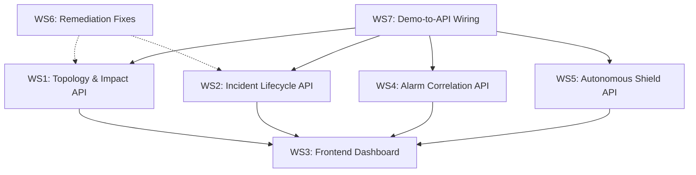

# Pedkai Vision Alignment — Implementation Plan

## Objective

Bridge the gap between the current Pedkai codebase and the vision demonstrated in the 8 `demo_*.html` files, while preserving all existing functionality and resolving outstanding task.md remediations. The plan is designed so that each work stream can be implemented in parallel by separate agents.

---

## Executive Summary

| Area | Demo Vision | Current State | Gap Severity |
|------|------------|---------------|-------------|
| **Layered Architecture Visualisation** | 7-layer interactive topology (RAN → Transport → Core → Service → BSS → Orchestration → Customer) with animated fault propagation | Single-page alarm list with basic stat cards | 🔴 Critical |
| **Incident Lifecycle Timeline** | Animated 7-stage timeline (Normal → Anomaly → Detection → RCA → SITREP → Resolution → Learning) with autoplay | None — alarm table only | 🔴 Critical |
| **Service Impact & Alarm Correlation** | Customer cards, noise wall, cluster grouping, deep-dive reasoning chain, resolution cascade | TMF642 alarm CRUD list | 🔴 Critical |
| **Autonomous/Proactive Shield** | Drift prediction, preventive action, Pedkai-vs-Non-Pedkai scorecard, value capture loop | No autonomous/proactive features in backend or frontend | 🔴 Critical |
| **Context Graph Revenue Topology** | SVG topology with revenue heatmap, enterprise financial overlay, fibre-cut/sleeping-cell RCA tracing | Graph schema + RCA exist in backend, but no visualisation or revenue overlay in frontend | 🟡 High |
| **Intelligence Bridge Dashboard** | Split-pane (network + impact), metric cards, alarm wall, scorecard, reasoning panel | Basic alarm panel, no reasoning or scorecard | 🟡 High |
| **Decision Memory + Reasoning Display** | Reasoning chain with step-by-step trace, confidence scores, causal evidence | Backend has decision repository + LLM service, but no frontend rendering | 🟡 High |
| **Dark/Light Theme Toggle** | CSS variable–based theming in every demo | None in frontend | 🟢 Medium |
| **API Completeness** | Demos assume endpoints for topology, incidents, impact analysis, autonomous actions | Backend has decisions, TMF642, TMF628, capacity, CX, auth, health — missing topology API, incident lifecycle API, impact analysis API, autonomous shield API | 🟡 High |

---

## User Review Required

> [!IMPORTANT]
> **Scope Decision**: This plan identifies ~7 work streams. You should decide whether to:
> 1. **Full Build** — implement all streams to bring the app to full demo parity
> 2. **Demo-First** — enhance the existing demo HTML files to work with the real backend (API-ify them) while building backend endpoints incrementally
> 3. **Backend-First** — build all missing APIs first, then rebuild the frontend later
>
> My recommendation is **(2) Demo-First** — it gives the fastest visible results and validates APIs against real UI expectations.

> [!WARNING]
> **Breaking Change Potential**: Work Streams 1 and 3 will significantly restructure the frontend. The current [frontend/app/page.tsx](file:///Users/himanshu/Library/CloudStorage/GoogleDrive-himanshu@htadvisers.co.uk/My%20Drive/AI%20Learning/AntiGravity/Pedkai/frontend/app/page.tsx) (564 lines, single component) will either need to be decomposed into route-based pages or replaced entirely. Existing alarm management functionality must be preserved during this transition.

> [!IMPORTANT]
> **Outstanding Remediations**: The existing [task.md](file:///Users/himanshu/.gemini/antigravity/brain/87490d52-68cc-4280-a247-08610ad4d36c/task.md) has 12 unfinished items from earlier phases. These are incorporated into the appropriate work streams below rather than treated separately. They are:
> - **C-2**: Implement Real Closed-Loop RL (KPI checks)
> - **C-3**: Fix BSS Revenue Fallback & Heuristics
> - **H-1**: Expand Memory Benchmark (25+ cases, distractors)
> - **H-2**: Real-world Capacity Engine (Context Graph integration)
> - **H-3**: Graph-based CX Intelligence
> - **H-5**: Fix LLM Prompt Duplication
> - **M-1**: Implement Integration Tests for Phases 14/15
> - **M-2**: Policy Engine Enhancements (Versioning, ALLOW handler)
> - **M-3**: Fix Policy Engine Path config
> - **M-4**: Optimize Recursive CTE (Remove N+1)
> - **Phase 9**: Executive Reviews (5 audits)

---

## Work Streams

Each stream is self-contained and can be worked on in parallel. Dependencies between streams are noted.

---

### Work Stream 1: Backend — Topology & Impact Analysis API

**Goal**: Expose the existing [decision_memory/graph_schema.py](file:///Users/himanshu/Library/CloudStorage/GoogleDrive-himanshu@htadvisers.co.uk/My%20Drive/AI%20Learning/AntiGravity/Pedkai/decision_memory/graph_schema.py) + [anops/root_cause_analysis.py](file:///Users/himanshu/Library/CloudStorage/GoogleDrive-himanshu@htadvisers.co.uk/My%20Drive/AI%20Learning/AntiGravity/Pedkai/anops/root_cause_analysis.py) as REST endpoints so the frontend can render interactive topology and impact views.

**Outstanding items absorbed**: H-2 (Capacity + Context Graph integration), M-4 (Optimize Recursive CTE)

#### [NEW] [topology.py](file:///Users/himanshu/Library/CloudStorage/GoogleDrive-himanshu@htadvisers.co.uk/My%20Drive/AI%20Learning/AntiGravity/Pedkai/backend/app/api/topology.py)

New API router with endpoints:
- `GET /api/v1/topology/{tenant_id}` — return full topology graph (entities + relationships) for frontend rendering
- `GET /api/v1/topology/{tenant_id}/entity/{entity_id}` — single entity with immediate neighbours
- `GET /api/v1/topology/{tenant_id}/impact/{entity_id}` — run RCA [analyze_incident](file:///Users/himanshu/Library/CloudStorage/GoogleDrive-himanshu@htadvisers.co.uk/My%20Drive/AI%20Learning/AntiGravity/Pedkai/anops/root_cause_analysis.py#77-128) and return upstream/downstream impact tree
- `GET /api/v1/topology/{tenant_id}/revenue-overlay` — return entities enriched with BSS revenue data (for heatmap)

Implementation notes:
- Reuse `RootCauseAnalyzer.analyze_incident()` for impact endpoint
- Reuse `BSSService.calculate_revenue_at_risk()` for revenue overlay
- Add `max_hops` query parameter using [ImpactQuery](file:///Users/himanshu/Library/CloudStorage/GoogleDrive-himanshu@htadvisers.co.uk/My%20Drive/AI%20Learning/AntiGravity/Pedkai/decision_memory/graph_schema.py#215-221) schema
- Fix M-4: Replace current N+1 relationship queries with a single recursive CTE or BFS in `RootCauseAnalyzer.get_relationships()`

#### [MODIFY] [main.py](file:///Users/himanshu/Library/CloudStorage/GoogleDrive-himanshu@htadvisers.co.uk/My%20Drive/AI%20Learning/AntiGravity/Pedkai/backend/app/main.py)

Register the new [topology](file:///Users/himanshu/Library/CloudStorage/GoogleDrive-himanshu@htadvisers.co.uk/My%20Drive/AI%20Learning/AntiGravity/Pedkai/decision_memory/graph_schema.py#237-332) router.

#### [MODIFY] [root_cause_analysis.py](file:///Users/himanshu/Library/CloudStorage/GoogleDrive-himanshu@htadvisers.co.uk/My%20Drive/AI%20Learning/AntiGravity/Pedkai/anops/root_cause_analysis.py)

- Refactor [get_relationships()](file:///Users/himanshu/Library/CloudStorage/GoogleDrive-himanshu@htadvisers.co.uk/My%20Drive/AI%20Learning/AntiGravity/Pedkai/anops/root_cause_analysis.py#32-76) to use a recursive CTE for multi-hop traversal (fixes M-4)
- Add method `get_full_impact_tree()` that returns a structured tree (not flat list) for frontend rendering

---

### Work Stream 2: Backend — Incident Lifecycle & Reasoning API

**Goal**: Create the "incident" concept that ties together anomaly → detection → RCA → SITREP → resolution, matching the [demo_showcase.html](file:///Users/himanshu/Library/CloudStorage/GoogleDrive-himanshu@htadvisers.co.uk/My%20Drive/AI%20Learning/AntiGravity/Pedkai/demo_showcase.html) timeline.

**Outstanding items absorbed**: C-2 (Closed-Loop RL KPI checks), H-5 (Fix LLM Prompt Duplication), H-1 (Expand Memory Benchmark)

#### [NEW] [incident_orm.py](file:///Users/himanshu/Library/CloudStorage/GoogleDrive-himanshu@htadvisers.co.uk/My%20Drive/AI%20Learning/AntiGravity/Pedkai/backend/app/models/incident_orm.py)

New ORM model:
- `IncidentORM`: id, tenant_id, title, severity, status (enum: NORMAL → ANOMALY → DETECTED → RCA → SITREP → RESOLVING → RESOLVED → LEARNING), created_at, updated_at, entity_id (FK to topology), decision_trace_id (FK), reasoning_chain (JSON), resolution_summary, kpi_snapshot (JSON)

#### [NEW] [incidents.py](file:///Users/himanshu/Library/CloudStorage/GoogleDrive-himanshu@htadvisers.co.uk/My%20Drive/AI%20Learning/AntiGravity/Pedkai/backend/app/api/incidents.py)

New API router:
- `POST /api/v1/incidents` — create incident (from anomaly detection trigger)
- `GET /api/v1/incidents` — list incidents (filterable by status, severity, tenant)
- `GET /api/v1/incidents/{id}` — get incident detail with full reasoning chain
- `PATCH /api/v1/incidents/{id}/advance` — advance incident to next lifecycle stage
- `GET /api/v1/incidents/{id}/reasoning` — get step-by-step reasoning trace
- `POST /api/v1/incidents/{id}/resolve` — mark resolved with resolution summary

Implementation notes:
- Wire `AnomalyDetector.process_metric()` → auto-create incident when anomaly detected
- Wire `RootCauseAnalyzer.analyze_incident()` output into incident reasoning_chain
- Wire `LLMService.generate_explanation()` to produce SITREP and attach to incident
- Fix H-5: Deduplicate LLM prompts in [llm_service.py](file:///Users/himanshu/Library/CloudStorage/GoogleDrive-himanshu@htadvisers.co.uk/My%20Drive/AI%20Learning/AntiGravity/Pedkai/backend/app/services/llm_service.py) — extract prompt templates into a `prompts/` directory
- Fix C-2: Add RL evaluator check during RESOLVING → RESOLVED transition (verify KPIs returned to baseline)

#### [MODIFY] [llm_service.py](file:///Users/himanshu/Library/CloudStorage/GoogleDrive-himanshu@htadvisers.co.uk/My%20Drive/AI%20Learning/AntiGravity/Pedkai/backend/app/services/llm_service.py)

- Extract prompt templates into separate files (fixes H-5)
- Add `generate_sitrep()` method specifically for SITREP stage
- Add `generate_resolution_recommendation()` for resolution stage

#### [MODIFY] [rl_evaluator.py](file:///Users/himanshu/Library/CloudStorage/GoogleDrive-himanshu@htadvisers.co.uk/My%20Drive/AI%20Learning/AntiGravity/Pedkai/backend/app/services/rl_evaluator.py)

- Implement real KPI baseline comparison (fixes C-2)
- Add `verify_resolution_effectiveness()` method that checks if KPIs returned to normal after action

---

### Work Stream 3: Frontend — Dashboard Overhaul

**Goal**: Transform the single-page [page.tsx](file:///Users/himanshu/Library/CloudStorage/GoogleDrive-himanshu@htadvisers.co.uk/My%20Drive/AI%20Learning/AntiGravity/Pedkai/frontend/app/page.tsx) alarm table into a multi-view dashboard matching the demo files' visual richness.

#### [MODIFY] [page.tsx](file:///Users/himanshu/Library/CloudStorage/GoogleDrive-himanshu@htadvisers.co.uk/My%20Drive/AI%20Learning/AntiGravity/Pedkai/frontend/app/page.tsx)

Decompose into a shell with sidebar navigation, then route to sub-pages.

#### [NEW] Frontend pages (all under `frontend/app/`)

| Page | Demo Source | Key Components |
|------|-----------|----------------|
| `incidents/page.tsx` | `demo_showcase.html` | Timeline component, stage viewer, autoplay controls, KPI gauges |
| `topology/page.tsx` | `demo_core_network.html` + `demo_context_graph.html` | Layered architecture SVG, node detail panel, scenario selector |
| `impact/page.tsx` | `demo_service_impact.html` | Customer cards, alarm wall, cluster view, deep-dive panel |
| `bridge/page.tsx` | `demo_intelligence_bridge.html` | Split-pane layout (network + impact), metric cards, reasoning chain |
| `autonomous/page.tsx` | `demo_bridge_autonomous.html` + `demo_showcase_autonomous.html` | Scorecard, drift timeline, value capture metrics |
| `context-graph/page.tsx` | `demo_context_graph.html` + `demo_context_graph_autonomous.html` | Revenue heatmap topology, journey roadmap, scenario sections |

#### [NEW] Shared components (`frontend/app/components/`)

- `ThemeToggle.tsx` — CSS variable–based dark/light toggle (all demos have this)
- `TopologyGraph.tsx` — SVG layered architecture renderer (reusable across topology, bridge, context-graph)
- `ReasoningChain.tsx` — Step-by-step reasoning display (reusable across incidents, bridge, impact)
- `TimelineView.tsx` — Horizontal timeline with stage indicators (reusable across incidents, autonomous)
- `MetricCard.tsx` — Stat card with icon, label, value, trend (reusable everywhere)
- `AlarmWall.tsx` — Scrollable alarm list with severity colors (reusable across impact, bridge)
- `Scorecard.tsx` — Pedkai vs Non-Pedkai comparison table (for autonomous/bridge pages)
- `CustomerCard.tsx` — Customer issue card with complaint, SLA, revenue (for impact page)

#### [NEW] [globals.css](file:///Users/himanshu/Library/CloudStorage/GoogleDrive-himanshu@htadvisers.co.uk/My%20Drive/AI%20Learning/AntiGravity/Pedkai/frontend/app/globals.css)

- Add CSS custom properties for theming (`--bg-primary`, `--text-primary`, `--accent`, etc.)
- Add dark-mode class definitions matching demo CSS patterns
- Add component-level styles extracted from demo files

---

### Work Stream 4: Backend — Alarm Correlation & Service Impact API

**Goal**: Expose the alarm correlation, customer impact, and cluster analysis that `demo_service_impact.html` demonstrates.

**Outstanding items absorbed**: C-3 (BSS Revenue Fallback), H-3 (Graph-based CX Intelligence)

#### [NEW] [alarm_correlation.py](file:///Users/himanshu/Library/CloudStorage/GoogleDrive-himanshu@htadvisers.co.uk/My%20Drive/AI%20Learning/AntiGravity/Pedkai/backend/app/services/alarm_correlation.py)

New service:
- `correlate_alarms(alarms[]) → AlarmCluster[]` — group related alarms by topology proximity, temporal clustering, and symptom similarity
- `calculate_noise_reduction(raw_count, clustered_count) → float` — compute noise reduction percentage
- `get_customer_impact(cluster_id) → CustomerImpact[]` — for each cluster, find impacted customers via topology traversal

#### [NEW] [service_impact.py](file:///Users/himanshu/Library/CloudStorage/GoogleDrive-himanshu@htadvisers.co.uk/My%20Drive/AI%20Learning/AntiGravity/Pedkai/backend/app/api/service_impact.py)

New API router:
- `GET /api/v1/service-impact/customers` — list impacted customers with revenue-at-risk
- `GET /api/v1/service-impact/clusters` — get alarm clusters with correlation metadata
- `GET /api/v1/service-impact/noise-wall` — get raw alarm wall data
- `GET /api/v1/service-impact/deep-dive/{cluster_id}` — get reasoning chain for a cluster

Implementation notes:
- Fix C-3: Add fallback heuristics in `BSSService.calculate_revenue_at_risk()` when BSS data is missing (use average ARPU per customer tier)
- Fix H-3: Use `RootCauseAnalyzer` graph traversal to link CX complaints to network topology entities

#### [MODIFY] [bss_service.py](file:///Users/himanshu/Library/CloudStorage/GoogleDrive-himanshu@htadvisers.co.uk/My%20Drive/AI%20Learning/AntiGravity/Pedkai/backend/app/services/bss_service.py)

- Add tier-based ARPU fallback when billing data is unavailable (fixes C-3)
- Add `get_customers_by_entity()` to find customers served by a specific network entity

#### [MODIFY] [cx_intelligence.py](file:///Users/himanshu/Library/CloudStorage/GoogleDrive-himanshu@htadvisers.co.uk/My%20Drive/AI%20Learning/AntiGravity/Pedkai/backend/app/services/cx_intelligence.py)

- Add graph-based CX intelligence (fixes H-3): link customer complaints to network entities via graph traversal rather than just table joins

---

### Work Stream 5: Backend — Autonomous Shield API

**Goal**: Create the proactive/autonomous capabilities shown in `demo_bridge_autonomous.html`, `demo_showcase_autonomous.html`, and `demo_context_graph_autonomous.html`.

#### [NEW] [autonomous_shield.py](file:///Users/himanshu/Library/CloudStorage/GoogleDrive-himanshu@htadvisers.co.uk/My%20Drive/AI%20Learning/AntiGravity/Pedkai/backend/app/services/autonomous_shield.py)

New service:
- `detect_drift(entity_id, metric_name) → DriftPrediction` — detect KPI drift before anomaly threshold is breached
- `evaluate_preventive_action(drift, policy_context) → PreventiveAction` — determine if autonomous action should be taken (uses policy engine)
- `execute_preventive_action(action) → ActionResult` — simulate/execute the action and record in decision memory
- `calculate_value_protected(action_result) → float` — compute revenue protected by preventive action

#### [NEW] [autonomous.py](file:///Users/himanshu/Library/CloudStorage/GoogleDrive-himanshu@htadvisers.co.uk/My%20Drive/AI%20Learning/AntiGravity/Pedkai/backend/app/api/autonomous.py)

New API router:
- `GET /api/v1/autonomous/scorecard` — Pedkai zone vs non-Pedkai zone comparison metrics
- `GET /api/v1/autonomous/actions` — list preventive actions taken
- `GET /api/v1/autonomous/value-capture` — revenue protected, incidents prevented, uptime gained
- `POST /api/v1/autonomous/simulate` — trigger a simulated autonomous action for demo

---

### Work Stream 6: Backend — Remediation Fixes (Non-Demo)

**Goal**: Close out the remaining task.md items that don't directly relate to demo features but are important for code quality and robustness.

**Outstanding items absorbed**: M-1, M-2, M-3

#### [MODIFY] [policy_engine.py](file:///Users/himanshu/Library/CloudStorage/GoogleDrive-himanshu@htadvisers.co.uk/My%20Drive/AI%20Learning/AntiGravity/Pedkai/backend/app/services/policy_engine.py)

- M-2: Add policy versioning (track version in policy metadata, support loading specific versions)
- M-3: Fix path config to use `PEDKAI_POLICY_PATH` env var consistently

#### [NEW] Integration tests for Phases 14/15

- M-1: Add `tests/integration/test_cx_bss_integration.py` — test the full flow from anomaly → CX → BSS revenue calculation
- M-1: Add `tests/integration/test_capacity_context_graph.py` — test capacity engine interaction with context graph

#### [MODIFY] [decision_repository.py](file:///Users/himanshu/Library/CloudStorage/GoogleDrive-himanshu@htadvisers.co.uk/My%20Drive/AI%20Learning/AntiGravity/Pedkai/backend/app/services/decision_repository.py)

- H-1: Expand gold standard test cases in `seed_golden_decision.py` to 25+ cases with distractors

---

### Work Stream 7: Demo-to-API Wiring

**Goal**: Update the demo HTML files to optionally fetch data from the real backend APIs instead of using hardcoded data, creating a "live demo" mode.

#### [MODIFY] All `demo_*.html` files

For each demo file, add:
1. A `const USE_LIVE_API = false;` toggle at the top
2. When `true`, replace hardcoded scenario data with `fetch()` calls to the real backend
3. Preserve all existing hardcoded data as fallback when `USE_LIVE_API = false`

This allows the demos to work standalone (as today) or connected to a running Pedkai backend.

---

## Dependency Graph



**Parallelisation**: WS1, WS2, WS4, WS5, WS6 can all start in parallel. WS3 depends on WS1+WS2+WS4+WS5 for API contracts (but can start scaffolding immediately with mock data). WS7 depends on all backend streams.

---

## Recommended Execution Order

| Priority | Stream | Rationale | Est. Effort |
|----------|--------|-----------|-------------|
| **P0** | WS1 (Topology API) | Foundation for all visualisation | Medium |
| **P0** | WS2 (Incident Lifecycle) | Core value proposition | Medium–Large |
| **P1** | WS4 (Alarm Correlation) | High-impact demo feature | Medium |
| **P1** | WS6 (Remediation Fixes) | Code quality debt | Small |
| **P1** | WS3 (Frontend — scaffolding) | Can start with mock data | Large |
| **P2** | WS5 (Autonomous Shield) | Differentiator feature | Medium |
| **P3** | WS3 (Frontend — live wiring) | After APIs are stable | Medium |
| **P3** | WS7 (Demo-to-API Wiring) | After all APIs exist | Small |

---

## Verification Plan

### Automated Tests

**Existing tests to preserve and extend:**
- `tests/conftest.py` — SQLite in-memory test harness with auth overrides (already working)
- `tests/integration/test_tmf642.py` — TMF642 alarm API tests
- `tests/integration/test_capacity.py` — capacity API tests
- `tests/integration/test_cx_intelligence.py` — CX service tests
- `tests/integration/test_rl_evaluator.py` — RL evaluator tests
- `tests/integration/test_policy_security.py` — policy engine security tests
- `tests/integration/test_cumulative_risk.py` — BSS risk calculation tests
- `tests/validation/` — 9 live data validation tests

**New tests to create (one per work stream):**

| Test File | Covers | Run Command |
|-----------|--------|-------------|
| `tests/integration/test_topology_api.py` | WS1: topology CRUD, impact tree, revenue overlay | `cd Pedkai && python -m pytest tests/integration/test_topology_api.py -v` |
| `tests/integration/test_incident_lifecycle.py` | WS2: incident creation, stage advancement, reasoning | `cd Pedkai && python -m pytest tests/integration/test_incident_lifecycle.py -v` |
| `tests/integration/test_alarm_correlation.py` | WS4: alarm clustering, noise reduction, customer impact | `cd Pedkai && python -m pytest tests/integration/test_alarm_correlation.py -v` |
| `tests/integration/test_autonomous_shield.py` | WS5: drift detection, preventive action, scorecard | `cd Pedkai && python -m pytest tests/integration/test_autonomous_shield.py -v` |
| `tests/integration/test_cx_bss_integration.py` | WS6/M-1: CX→BSS integration flow | `cd Pedkai && python -m pytest tests/integration/test_cx_bss_integration.py -v` |

**Run all tests:**
```bash
cd /Users/himanshu/Library/CloudStorage/GoogleDrive-himanshu@htadvisers.co.uk/My\ Drive/AI\ Learning/AntiGravity/Pedkai
python -m pytest tests/ -v --tb=short
```

### Manual Verification

1. **Backend health**: Start the backend with `python -m uvicorn backend.app.main:app --reload` and verify `http://localhost:8000/docs` shows all new endpoints
2. **Frontend**: Start with `cd frontend && npm run dev` and verify each new page renders at `http://localhost:3000`
3. **Demo-to-API wiring**: Open any `demo_*.html` in a browser, toggle `USE_LIVE_API = true`, and verify it fetches from the running backend

> [!TIP]
> The user should validate the overall UI/UX against the demo HTML files by opening them side-by-side with the new frontend pages. This is the ultimate acceptance test.
